### **PRD Hodei Pipelines**

## 1. Visión y Estrategia

### 1.1 Resumen Ejecutivo

Este documento define los requisitos para un sistema de orquestación de jobs distribuidos de nivel empresarial, **Hodei Pipelines**. El sistema se materializará como una **aplicación monolítica modular** robusta, diseñada para ser fácil de desplegar, operar y escalar como un único binario (`standalone`). Su propósito es abstraer la complejidad de la ejecución de tareas computacionales sobre infraestructuras heterogéneas (Kubernetes, Docker, Cloud VMs), proporcionando una experiencia unificada y potente a través de una **API REST completa y bien definida**.

El núcleo de la arquitectura se basa en dos pilares:

1. **Un modelo de comunicación interno resiliente**: Los **Workers** (agentes de ejecución efímeros) actúan siempre como **clientes gRPC**, iniciando la conexión hacia el **Orquestador** (servidor). Sobre esta única conexión segura se multiplexan streams de control, logs (`stdout`/`stderr`), eventos y artefactos, garantizando un flujo de datos en tiempo real, eficiente y amigable con las redes complejas.
2. **Una filosofía API-First**: La especificación OpenAPI es el contrato y la fuente de verdad para toda la funcionalidad del sistema, desde la gestión del ciclo de vida de jobs y plantillas hasta la observabilidad avanzada y la seguridad granular.

### 1.2 Personas y Casos de Uso

- **Elena, Ingeniera de DevOps:** Define `Templates` de pipeline reutilizables. Usa la API para automatizar la creación de `ResourcePools` y establecer `Quotas` por equipo. Monitoriza la salud del sistema a través de los endpoints de `/health` y `/metrics`.
- **Carlos, Científico de Datos:** Envía jobs de entrenamiento a través del endpoint `POST /jobs/from-template` utilizando un `Template` que ejecuta un DSL de Kotlin. Durante la ejecución, se conecta al stream de WebSocket para ver los logs y las etapas (`stages`) en tiempo real.
- **Ana, Administradora de Sistemas:** Gestiona la infraestructura, los costes y la seguridad. Utiliza los endpoints de `/pools` para poner nodos en mantenimiento (`drain`). Crea roles personalizados y asigna permisos a los equipos de Carlos y Elena usando el sistema IAM/RBAC. Revisa los `AuditLogs` para controlar las acciones realizadas en el sistema.
- **Sistema Externo (ej. GitLab CI):** Un sistema de CI/CD se integra con el orquestador. Tras un `push`, utiliza un token de API de un `ServiceAccount` para hacer una llamada a `POST /jobs/from-template` y lanzar un pipeline. El orquestador notifica el resultado de vuelta a través de un `webhook`.

### 1.3 Objetivos Estratégicos

- **Productividad del Desarrollador:** Abstraer la infraestructura para que los equipos se centren en la lógica de sus jobs.
- **Eficiencia Operacional:** Centralizar la gestión, monitorización y gobernanza de todos los trabajos distribuidos.
- **Fiabilidad y Depuración:** Proporcionar herramientas de observabilidad que reduzcan drásticamente el tiempo de depuración (MTTR).
- **Gobernanza y Seguridad:** Ofrecer un control granular sobre quién puede ejecutar qué, dónde y con qué recursos.
- **Extensibilidad:** Permitir la integración con otras herramientas a través de una API REST completa y webhooks.

## 2. Arquitectura y Metodología

### 2.1 Principios Arquitectónicos y de Desarrollo

La construcción de Hodei Pipelines se rige por un conjunto de principios estrictos diseñados para garantizar la máxima calidad, flexibilidad y mantenibilidad.

1. **Contrato Primero (Contract-First Design):** El desarrollo comienza con la definición de las interfaces. Los documentos de **OpenAPI** (para la API REST pública) y los ficheros **`.proto`** (para la comunicación gRPC interna) son la fuente de verdad. Se definen, revisan y acuerdan _antes_ de escribir una sola línea de código de implementación.
2. **Arquitectura Limpia / Hexagonal (Puertos y Adaptadores):** El sistema se estructura siguiendo los patrones de la Arquitectura Limpia y Hexagonal.

   - **El Núcleo (Dominio y Aplicación):** En el centro se encuentra la lógica de negocio pura, completamente aislada de detalles externos.
   - **Los Puertos (Ports):** El núcleo define interfaces (Puertos) para todo lo que necesita del mundo exterior (ej. `IJobRepository`, `IInstanceManager`, `IResourceMonitor`).
   - **Los Adaptadores (Adapters):** La comunicación con tecnologías concretas (una base de datos PostgreSQL, la API de Kubernetes) se realiza a través de Adaptadores que **implementan** los Puertos.
3. **Desarrollo Guiado por el Dominio y las Pruebas (DDD & TDD):** El proceso de desarrollo sigue un enfoque TDD. Se modela el dominio, se escriben tests que verifican el comportamiento a través de los Puertos, y finalmente se escribe la implementación.
4. **Abstracción Total del Planificador y la Infraestructura:** El `Planificador` es el componente más inteligente, pero también el más "ignorante" de la tecnología. **Nunca** debe tener conocimiento directo de Kubernetes, Docker o cualquier proveedor de nube. Su lógica opera exclusivamente sobre las abstracciones definidas por los Puertos.
5. **Monolito Modular y Estado Inmutable:** Se mantienen los principios de un único binario desplegable con fuerte separación lógica interna y el uso de Event Sourcing para el registro inmutable de los eventos de una `Execution`.

Tenemos que implementar  IInstanceManager Su propósito es abstraer la complejidad de instanciar y liberarlos recursos computacionales sobre infraestructuras heterogéneas (Kubernetes, Docker, Cloud VMs)
Y IResourceMonitor que igualmente se encarga de abstraer la complejidad de monitorizar los recursos disponibles en infrastructuras heterogeneas (Kubernetes, Docker, Cloud Container etc..) trabaja para tener una vision de los recursos disponibles y ayudar a la planificacion de las ejecuciones.

### 2.2 Módulos Principales (Según Puertos y Adaptadores)

- **Núcleo de la Aplicación (Dominio y Casos de Uso):**

  - **Dominio:** Entidades puras (`Job`, `Template`, `Execution`, `ResourcePool`).
  - **Capa de Aplicación:** Orquesta los casos de uso (`JobSubmissionService`, `SchedulerService`) y define los **Puertos**.
- **Adaptadores de Infraestructura (Implementaciones de Puertos):**

  - **Adaptadores Impulsores (Driving Adapters):** Inician la interacción con el núcleo (`REST API Adapter`, `gRPC Server Adapter`).
  - **Adaptadores Impulsados (Driven Adapters):** Son invocados por el núcleo (`Persistence Adapter`, `Provisioner Adapters`, `Resource Monitor Adapters`).

## 3. Requisitos Funcionales Detallados

### 3.1 Gestión de Entidades: El Modelo Conceptual

- **`Template` (Plantilla):** Definición reutilizable y versionada de un job. El "molde".
- **`Job` (Trabajo):** Solicitud o instancia de un trabajo que debe ser ejecutado. La "intención".
- **`Execution` (Ejecución):** El intento real y único de ejecutar un `Job`. La "evidencia".
- **`ResourcePool` (Pool de Recursos):** Agrupación lógica de recursos computacionales.
- **`Worker` (Trabajador):** Instancia computacional efímera que ejecuta una `Execution`.

### 3.2 Gestión de Templates (`Tag: Templates`)

- **CRUD y Versionado:** API REST completa para el ciclo de vida de los templates.
- **Ciclo de Vida:** `draft` -> `published` -> `deprecated` -> `archived`.
- **Validación:** Endpoint `POST /templates/validate` para validar la sintaxis antes de guardar.

### 3.3 Gestión de Jobs y Ejecuciones (`Tags: Jobs, Executions`)

- **Creación de un Job:** Desde un `Template` (`POST /jobs/from-template`) o Ad-hoc (`POST /jobs`).
- **Ciclo de Vida:** Siguen los diagramas de estado definidos en el Apéndice A.

#### 3.3.1 Pipeline como Código: El Enfoque DSL de Kotlin

El enfoque principal para definir la lógica de las ejecuciones es un DSL de Kotlin, que ofrece máxima flexibilidad y potencia. Para que este enfoque sea robusto y desacoplado, se sigue un estricto principio de separación de intereses.

**Principio de Separación de Intereses (Contrato gRPC vs. Runtime del Worker):**

1. **El Orquestador es Agnóstico al Contenido:** El Orquestador no conoce la semántica interna del script de Kotlin. No sabe de `stages`, `steps` ni de la lógica del DSL. Su única responsabilidad es entregar al Worker la tarea a realizar de la forma más simple posible: el contenido del script y un conjunto de parámetros iniciales.
2. **El Worker Posee la Inteligencia del Runtime:** Toda la lógica para interpretar y ejecutar el DSL reside en el Worker.

   - **Motor de Ejecución de DSL:** El Worker contiene un "Motor de Ejecución" que recibe el script y los parámetros.
   - **Inyección de Contexto:** Este motor proporciona al script un entorno de ejecución (un "contexto") que le da acceso a los parámetros de entrada y a funciones especiales (ej. `stage`, `step`, `sh`).
   - **Comunicación Ascendente:** Cuando el script ejecutado en el Worker invoca una función del DSL como `stage("Build") { ... }`, es el **runtime del Worker** el que se encarga de enviar el mensaje gRPC `StatusUpdate` correspondiente (`event_type: STAGE_STARTED`) de vuelta al Orquestador.

De esta manera, el contrato gRPC permanece limpio y estable, centrado únicamente en el transporte de la tarea, mientras que toda la complejidad y la evolución del DSL se encapsulan dentro del Worker.

### 3.4 Gestión de Pools de Recursos (`Tag: Pools`)

- **CRUD y Ciclo de Vida:** Gestión completa de los `ResourcePools` (`active`, `draining`, etc.).
- **Cuotas (Quotas):** Definición de cuotas de recursos por `namespace` dentro de un pool.

#### 3.4.1 Abstracción de la Monitorización de Recursos

- **Requisito:** El `Planificador` debe conocer el uso de recursos en tiempo real de cada `ResourcePool`.
- **Diseño Arquitectónico:** Se definirá un puerto `interface IResourceMonitor`.
- **Implementación:** Se crearán adaptadores (`KubernetesResourceMonitor`, `DockerResourceMonitor`, etc.) que implementen dicho puerto consultando las APIs nativas de cada plataforma.
- **Flujo:** El `Planificador` usa la abstracción `IResourceMonitor` para obtener datos y decidir dónde aprovisionar workers, sin conocer la tecnología subyacente.

#### 3.4.2 Estrategias de Scheduling

El Scheduler soporta múltiples estrategias de asignación de recursos mediante el patrón Strategy:

**Interface SchedulingStrategy:**
```kotlin
interface SchedulingStrategy {
    suspend fun selectPool(
        job: Job,
        candidatePools: List<PoolCandidate>
    ): Either<String, ResourcePool>
}
```

**Estrategias Implementadas:**

| Estrategia | Descripción | Caso de Uso |
|------------|-------------|--------------|
| **Round Robin** | Distribuye jobs en orden circular entre pools | Cargas homogéneas, distribución equitativa |
| **Greedy Best Fit** | Selecciona el pool con menor utilización | Balance de carga, maximizar throughput |
| **Least Loaded** | Considera CPU, memoria y jobs activos | Uso general, mejor experiencia |
| **Bin Packing** | Consolida jobs en menos pools | Optimización de costos, reducir fragmentación |

**Configuración:**
- Por defecto: `LeastLoaded`
- Por job: Campo opcional `schedulingStrategy` en la definición del job
- Global: Configuración del sistema en `application.yml`

### 3.5 Observabilidad y Monitorización (`Tags: Executions, Admin`)

- **Streaming en Tiempo Real:** WebSockets y SSE para logs y eventos.
- **Consulta Histórica:** Endpoints paginados para logs y eventos.
- **Reconstrucción Post-Mortem (Replay):** Endpoint `GET /executions/{id}/replay` para obtener un volcado completo de una ejecución.
- **Métricas:** Endpoints en formato Prometheus para el sistema (`/metrics`) y para los pools (`/pools/{id}/metrics`).

### 3.6 Integraciones Salientes (Webhooks)

- **Configuración:** Webhooks para notificar a sistemas externos sobre eventos del ciclo de vida de los jobs.

## 4. Interfaces del Sistema

### 4.1 API REST Pública (OpenAPI)

- **Definición:** La especificación OpenAPI 3.0.3 es la fuente de verdad.
- **Autenticación:** Requiere `Authorization: Bearer <token>`.
- **Tags Principales:** `Jobs`, `Templates`, `Executions`, `Pools`, `Workers`, `Admin`, `Security`.

### 4.2 Interfaz gRPC Interna

- **Roles:** Orquestador (Servidor), Worker (Cliente).
- **Propósito:** Canal de comunicación desacoplado para el control de la ejecución.
- **Contrato gRPC (`hodei.v1.proto`):** Para cumplir con el principio de separación de intereses, el contrato es deliberadamente simple. El mensaje `KotlinScriptTask` solo transporta el script y sus parámetros; la interpretación del DSL es responsabilidad exclusiva del Worker.

Protocol Buffers

```
syntax = "proto3";

package hodei.v1;

import "google/protobuf/struct.proto"; // Para permitir parámetros complejos y estructurados.

service WorkerService {
  rpc Connect(stream WorkerMessage) returns (stream OrchestratorMessage);
}

// Mensajes que el Worker (cliente) envía al Orquestador (servidor)
message WorkerMessage {
  oneof payload {
    RegisterRequest register_request = 1;
    StatusUpdate status_update = 2;
    LogChunk log_chunk = 3;
    ExecutionResult execution_result = 4;
  }
}

// Mensajes que el Orquestador (servidor) envía al Worker (cliente)
message OrchestratorMessage {
  oneof payload {
    ExecutionAssignment execution_assignment = 1;
    CancelSignal cancel_signal = 2;
    Artifact artifact = 3;
  }
}

// --- Definiciones de Mensajes ---

message RegisterRequest {
  string worker_id = 1;
}

message ExecutionAssignment {
  string execution_id = 1;
  ExecutionDefinition definition = 2;
  repeated ArtifactMetadata required_artifacts = 3;
}

// Define la tarea a ejecutar por el worker.
// Es un contenedor para una tarea de shell o una tarea de script Kotlin.
message ExecutionDefinition {
  map<string, string> env_vars = 1;

  // La lógica de ejecución a realizar. Solo uno puede ser establecido.
  oneof task {
    ShellTask shell = 2;
    KotlinScriptTask kotlin_script = 3;
  }
}

// Define una tarea simple de ejecución de comandos de shell.
message ShellTask {
  repeated string commands = 1;
}

// Define una tarea de script Kotlin.
// Contiene el código y los parámetros de entrada, nada más.
message KotlinScriptTask {
  string script_content = 1;
  google.protobuf.Struct parameters = 2;
}


message StatusUpdate {
  EventType event_type = 1;
  string message = 2;
  int64 timestamp = 3;
}

enum EventType {
  EVENT_TYPE_UNSPECIFIED = 0;
  STAGE_STARTED = 1;
  STEP_STARTED = 2;
  STEP_COMPLETED = 3;
  STAGE_COMPLETED = 4;
}

message LogChunk {
  LogStream stream = 1;
  bytes content = 2;
}

enum LogStream {
  LOG_STREAM_UNSPECIFIED = 0;
  STDOUT = 1;
  STDERR = 2;
}

message ExecutionResult {
    bool success = 1;
    int32 exit_code = 2;
    string details = 3;
}

message CancelSignal {
  string reason = 1;
}

message ArtifactMetadata {
  string artifact_id = 1;
  string destination_path = 2;
}

message Artifact {
  string artifact_id = 1;
  bytes content = 2;
}
```

### 4.3 CLI y UI

- **CLI:** Cliente de la API REST para la interacción desde la terminal.
- **UI:** Single Page Application (SPA) que consume la API REST y WebSockets.

## 5. Modelo de Datos y Persistencia

Las entidades principales a persistir son:

- **Entidades de Ejecución:** `templates`, `jobs`, `executions`, `execution_events`, `execution_logs`.
- **Entidades de Recursos:** `resource_pools`, `pool_quotas`.
- **Entidades de IAM/RBAC:** `users`, `groups`, `group_memberships`, `service_accounts`, `api_tokens`, `roles`, `permissions`, `role_permissions`, `role_bindings`.
- **Auditoría:** `audit_logs`.

## 6. Gestión de Identidad y Acceso (IAM) con RBAC

### 6.1 Visión y Principios

- **Principio de Mínimo Privilegio.**
- **Separación de Responsabilidades.**
- **Auditabilidad Completa.**
- **Soporte Multi-Tenancy.**

### 6.2 Modelo Conceptual de IAM


| Componente          | Descripción                                                             | Ejemplo                                                           |
| ------------------- | ------------------------------------------------------------------------ | ----------------------------------------------------------------- |
| **Identidad**       | Representa a un "actor" en el sistema:`User`, `Group`, `ServiceAccount`. | `elena@empresa.com`, `devops-team`                                |
| **Permiso**         | La unidad más granular de autorización.                                | `job:create`, `template:delete`                                   |
| **Rol**             | Una colección de`Permisos`.                                             | `Job Executor`, `Pool Admin`                                      |
| **Ámbito (Scope)** | El contexto en el que se aplican los permisos:`Global` o `Project`.      | `Project: "atenea"`                                               |
| **RoleBinding**     | Asigna un`Rol` a una `Identidad` dentro de un `Ámbito`.                 | "Asignar`Editor` al grupo `devops-team` en el proyecto `atenea`". |

### 6.3 Roles Predefinidos (Built-in)

- **`System Admin` (Global):** Permisos completos sobre todo el sistema.
- **`Project Owner` (Proyecto):** Permisos completos dentro de un proyecto, incluyendo la gestión de `RoleBindings`.
- **`Editor` (Proyecto):** Puede crear, leer, actualizar y eliminar recursos en un proyecto.
- **`Viewer` (Proyecto):** Permisos de solo lectura en un proyecto.

### 6.4 Flujo de Autorización

1. **Autenticación:** Validación del token (JWT OIDC o token de API).
2. **Identificación de Permiso:** El sistema determina el permiso requerido para la acción.
3. **Recopilación de Roles:** Búsqueda de `RoleBindings` para la identidad en el ámbito del recurso.
4. **Verificación y Decisión:** Se comprueba si alguno de los roles contiene el permiso requerido para permitir (2xx) o denegar (403) la petición.

### 6.5 Requisitos para la API REST (`Tag: Security`)

La API debe exponer endpoints para la gestión completa de Roles, Role Bindings, Service Accounts y Grupos.

## 7. Requisitos No Funcionales

- **Rendimiento:** API P95 < 200ms; Planificador >100 jobs/s; Ingesta de logs >50,000 entradas/s.
- **Escalabilidad:** Despliegue en alta disponibilidad para gestionar 10,000+ workers concurrentes.
- **Disponibilidad:** Uptime del 99.95% para el plano de control.
- **Rate Limiting:** Límite de peticiones por usuario/token.

## 8. Riesgos y Mitigaciones

- **Riesgo:** Crecimiento desmedido de las tablas de logs y eventos.

  - **Mitigación:** Políticas de retención y archivado en almacenamiento en frío.
- **Riesgo:** Template malicioso.

  - **Mitigación:** `SecurityContext` estrictos y análisis estático de seguridad de los templates.

## 9. Estrategia de Testing

- **Testing de Contrato:** Validar que la implementación cumple con la especificación OpenAPI.
- **Testing de Caos:** Validar la resiliencia del sistema.
- **Testing de Carga:** Escenarios de estrés para jobs, workers y logs.
- **Testing E2E:** Suites automatizadas que validen flujos completos.

---

## Apéndice A: Diagramas de Estado (Mermaid)

#### **Ciclo de Vida de `Job` (`JobStatus`)**

Fragmento de código

```
stateDiagram-v2
    [*] --> pending: createJob
    pending --> queued: schedule
    queued --> running: startExecution
    running --> completed: executionSuccess
    running --> failed: executionFailed (no retries)
    running --> queued: executionFailed (with retries)
    pending --> cancelled: cancelJob
    queued --> cancelled: cancelJob
    running --> cancelled: cancelJob
    failed --> queued: retryJob
```

#### **Ciclo de Vida de `Execution` (`ExecutionStatus`)**

Fragmento de código

```
stateDiagram-v2
    [*] --> pending: createExecution
    pending --> running: workerRegistered
    running --> success: allStepsSuccess
    running --> failed: stepFailed (unrecoverable)
    running --> cancelled: cancelExecution
    pending --> cancelled: cancelExecution
```

#### **Ciclo de Vida de `ResourcePool` (`PoolStatus`)**

Fragmento de código

```
stateDiagram-v2
    [*] --> provisioning
    provisioning --> active: healthCheckOK
    provisioning --> error: provisioningFailed
    active --> draining: drainPool
    active --> maintenance: setMaintenance
    active --> error: healthCheckFailed
    draining --> active: resumePool
    maintenance --> active: resumePool
    error --> active: healthCheckOK
```

---

A tener en cuenta en la implementacion kotlin grpc

- Usa como paquete base 'dev.rubentxu.hodei.pipelines'
- Usa gradle instalado en la maquina para la compilacion y el despliegue.
- **Centraliza las Dependencias:** Desde el primer día, utiliza el **Catálogo de Versiones de Gradle (`libs.versions.toml`)** y busca y usa las ultimas librerias estables de kotlin y ktor  etc...
- **Serialización Multiplataforma:** Usa **`kotlinx.serialization`** para todo el manejo de JSON (y otros formatos). Funciona perfectamente en KMP y te evita los problemas de librerías dependientes de reflexión como Jackson o Gson.
- **Prioriza Librerías KMP:** Antes de añadir una dependencia, comprueba si es compatible con Kotlin Multiplatform. Busca en repositorios como KMP Awesome. Librerías clave como **Ktor** (cliente HTTP), **SQLDelight** (acceso a BBDD) y **Koin** (inyección de dependencias) son tus mejores opciones.
- Para el MVP no te molestes en implementar persistencia complicada, hazlo en memoria o en SQLLight
- **Haz una Prueba de Concepto (PoC) para Dependencias Críticas:** Para Hodei Pipelines, la librería gRPC es crítica. Antes de avanzar mucho, crea un pequeño proyecto de prueba para verificar que el cliente `grpc-kotlin` funciona correctamente en el target nativo. Esto te permitirá identificar posibles obstáculos de forma temprana.
- #### **D. Flujo de Desarrollo y Pruebas**

**Activa la Compilación Incremental:** Asegúrate de que la compilación incremental nativa está activada en tu fichero `gradle.properties` para acelerar las compilaciones durante el desarrollo:

13. #### **Concurrencia y Gestión de Memoria**
14. **Adopta el Nuevo Gestor de Memoria:** Las versiones recientes de Kotlin/Native usan por defecto un nuevo GC que hace la concurrencia mucho más sencilla y similar a la JVM. Asegúrate de estar en una versión de Kotlin que lo soporte y no te preocupes por el antiguo modelo de `freeze()`, que ya es legado.
15. **Usa Coroutines Estructuradas:** La librería `kotlinx.coroutines` es la forma estándar y recomendada de manejar la concurrencia. Usa `CoroutineScope`, `launch`, `async` y `Dispatchers` para gestionar tus hilos y tareas asíncronas de forma segura.

#### **F. Despliegue y Optimización**

16. **Entiende la Diferencia entre `debug` y `release`:**

    - Las compilaciones de `debug` (ej. `linkDebugExecutableNative`) son más rápidas de compilar pero producen binarios más grandes y lentos. Úsalas para desarrollo.
    - Las compilaciones de `release` (ej. `linkReleaseExecutableNative`) aplican optimizaciones agresivas. Tardan más en compilar, pero el ejecutable final es mucho más pequeño y rápido. Úsalas para producción.
17. **Optimiza el Tamaño del Binario:** Para producción, compila en modo `release` y considera usar la opción para eliminar los símbolos de depuración (`strip`), lo que reducirá aún más el tamaño del ejecutable.

    Kotlin

    ```
    // En build.gradle.kts
    binaries.executable {
        binaryOptions["strip"] = "true"
        // Opciones de optimización
        freeCompilerArgs += "-opt"
    }
    ```
18. **Prueba en un Entorno Limpio:** Un binario nativo puede tener dependencias dinámicas con librerías del sistema operativo (`libc`, `zlib`, etc.).
19. Prueba siempre tu ejecutable final en un contenedor Docker limpio o una máquina virtual que simule tu entorno de producción para asegurarte de que no faltan dependencias.

---

## 10. Arquitectura del Flujo de Ejecución Principal

### 10.1 Separación de Responsabilidades

El sistema sigue una arquitectura de responsabilidades claramente delimitadas, donde cada servicio tiene un propósito único y bien definido:

#### **Orquestador (Orchestrator)**

- **Responsabilidad principal**: Gestión de colas de jobs
- **Funciones**:
  - Aceptar jobs del API REST
  - Encolar jobs pendientes
  - Solicitar al Scheduler decisiones de placement
  - Delegar al ExecutionEngine cuando hay decisión
  - Desencolar y olvidar el job una vez delegado
- **NO hace**: Gestión de workers, seguimiento de ejecución, decisiones de recursos

#### **Planificador (Scheduler)**

- **Responsabilidad principal**: Decidir el ResourcePool óptimo para cada job
- **Funciones**:
  - Mantener registro de todos los ResourcePools disponibles
  - Consultar IResourceMonitor de cada pool para obtener métricas
  - Evaluar carga, capacidad y requisitos del job
  - Aplicar estrategias de scheduling intercambiables
  - Devolver decisión de pool al Orchestrator (`findPlacement(job, strategy?) -> ResourcePool`)
- **NO hace**: Ejecutar jobs, conocer workers o ExecutionEngine
- **Ventaja**: Servicio puro, sin estado, altamente testeable y reemplazable

##### **Estrategias de Scheduling Soportadas**

El Scheduler implementa el patrón Strategy para permitir diferentes algoritmos de asignación de recursos:

1. **Round Robin**
   - Distribuye jobs equitativamente entre todos los pools disponibles
   - Garantiza distribución justa de carga
   - Ideal para cargas de trabajo homogéneas

2. **Greedy Best Fit**
   - Selecciona el pool con menor utilización actual
   - Tiende a balancear la carga entre pools
   - Optimiza el uso de recursos disponibles

3. **Least Loaded** (Por defecto)
   - Considera múltiples métricas: CPU, memoria, jobs activos
   - Maximiza la disponibilidad de recursos para futuros jobs
   - Proporciona la mejor experiencia general

4. **Bin Packing First Fit**
   - Consolida trabajos en el menor número de pools posible
   - Minimiza la fragmentación de recursos
   - Ideal para optimización de costos en entornos cloud

La estrategia se puede especificar por job o configurar una por defecto para el sistema.

#### **Motor de Ejecución (ExecutionEngine)**

- **Responsabilidad principal**: Gestión completa del ciclo de vida de ejecución
- **Funciones**:
  - Recibir job + ResourcePool del Orchestrator
  - Usar WorkerFactory + IInstanceManager para provisionar workers
  - Gestionar registro y comunicación bidireccional con workers
  - Mantener el estado de las ejecuciones activas
  - Gestionar listeners/suscriptores de eventos
  - Reenviar eventos a clientes registrados vía REST/WebSocket
- **NO hace**: Decidir dónde ejecutar, gestionar colas

### 10.2 Flujo de Ejecución Detallado

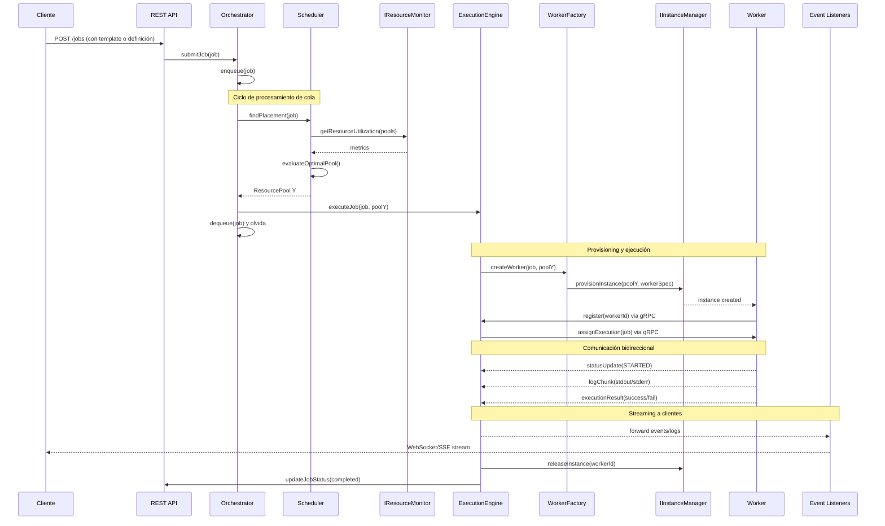

### 10.3 API de Suscripción a Eventos

El ExecutionEngine expone una API REST para que los clientes se suscriban a eventos de ejecución:

```yaml
# Nuevos endpoints en OpenAPI
/executions/{executionId}/subscribe:
  post:
    summary: Subscribe to execution events
    parameters:
      - name: executionId
        in: path
        required: true
    requestBody:
      content:
        application/json:
          schema:
            type: object
            properties:
              eventTypes:
                type: array
                items:
                  $ref: '#/components/schemas/EventType'
              deliveryMethod:
                type: string
                enum: [SSE, WebSocket, Webhook]
              webhookUrl:
                type: string
                format: uri
    responses:
      200:
        description: Subscription created
        content:
          application/json:
            schema:
              type: object
              properties:
                subscriptionId:
                  type: string
                streamUrl:
                  type: string
                  format: uri

/executions/{executionId}/events:
  get:
    summary: Stream execution events via SSE
    parameters:
      - name: executionId
        in: path
        required: true
    responses:
      200:
        description: Event stream
        content:
          text/event-stream:
            schema:
              type: string

/ws/executions/{executionId}/stream:
  get:
    summary: WebSocket endpoint for real-time execution streaming
    parameters:
      - name: executionId
        in: path
        required: true
```

### 10.4 Ventajas de esta Arquitectura

1. **Separación clara de concerns**: Cada servicio tiene una responsabilidad única
2. **Desacoplamiento total**: El Scheduler no conoce ExecutionEngine, solo ResourcePools
3. **Escalabilidad horizontal**: Cada componente puede escalar independientemente
4. **Observabilidad separada**: Los clientes se suscriben directamente al ExecutionEngine
5. **Resiliencia**: Si falla el Orchestrator, las ejecuciones en curso continúan
6. **Testabilidad**: Cada servicio puede testearse en aislamiento

### 10.5 Consideraciones de Implementación

- **Estado del Job**: ExecutionEngine actualiza el estado del job en la BD
- **Reintentos**: Orchestrator reencola jobs fallidos según política
- **Timeouts**: ExecutionEngine controla timeouts de ejecución
- **Prioridades**: Orchestrator respeta prioridades al procesar cola
- **Cleanup**: ExecutionEngine garantiza liberación de recursos

---

## Apéndice B: Arquitectura de Bounded Contexts

### B.1 Visión de Monolito Modular

El sistema Hodei Pipelines sigue una arquitectura de **monolito modular** basada en **Bounded Contexts** del Domain-Driven Design (DDD). Cada contexto representa un dominio de negocio bien definido con responsabilidades específicas, manteniendo bajo acoplamiento entre contextos y alta cohesión interna.

### B.2 Bounded Contexts Identificados

#### **1. Job Management Context**
**Paquete:** `dev.rubentxu.hodei.jobmanagement.*`

**Responsabilidad:** Gestión completa del ciclo de vida de jobs desde creación hasta finalización.

**Entidades Principales:**
- Job, JobStatus, JobContent, RetryPolicy
- JobQueue, QueuedJob, JobPriority

**Casos de Uso Principales:**
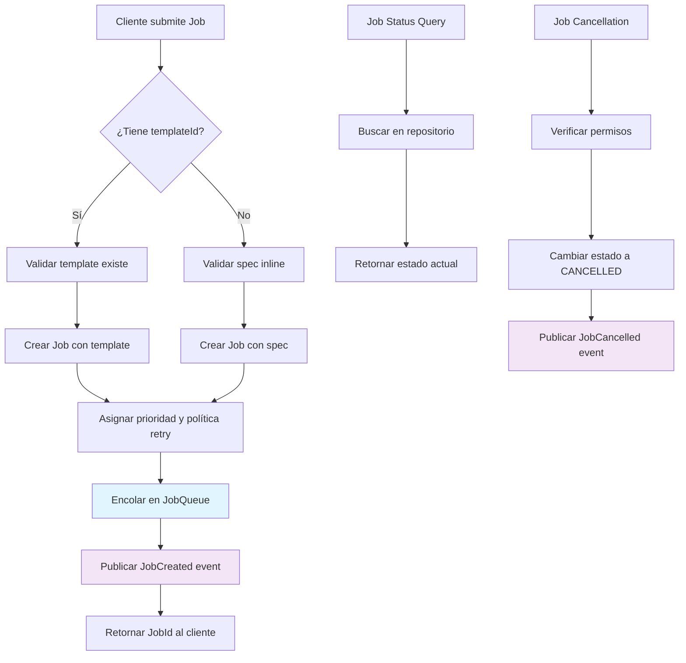

**Diagrama de Secuencia - Creación de Job:**
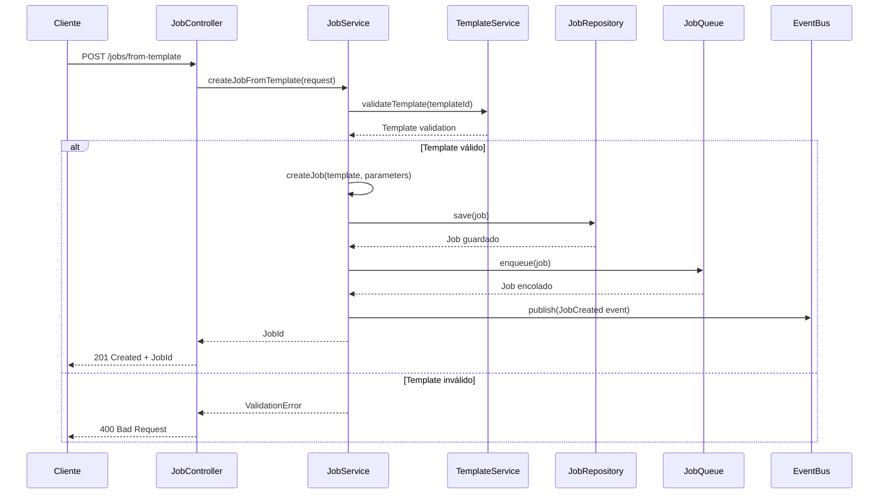

**Estructura del Paquete:**
```
dev.rubentxu.hodei.jobmanagement.
├── domain/
│   ├── job/ (Job, JobStatus, JobContent, RetryPolicy)
│   └── queue/ (JobQueue, QueuedJob, JobPriority)
├── application/
│   ├── JobLifecycleService.kt
│   └── JobOrchestratorService.kt
├── infrastructure/
│   ├── api/JobController.kt
│   └── persistence/JobRepository.kt
└── ports/
    └── JobEvents.kt
```

---

#### **2. Execution Context**
**Paquete:** `dev.rubentxu.hodei.execution.*`

**Responsabilidad:** Ejecución en tiempo real de jobs en workers con monitoreo y control completo.

**Entidades Principales:**
- Execution, ExecutionStatus, ExecutionEvent
- ExecutionLog, ExecutionStateMachine, ResourceUsage

**Casos de Uso Principales:**
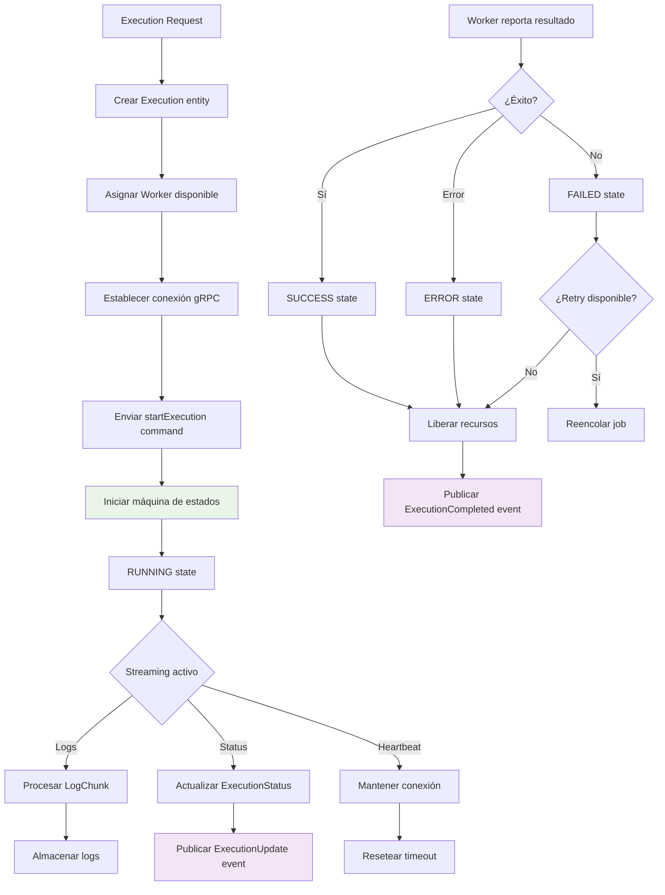

**Diagrama de Secuencia - Ejecución de Job:**
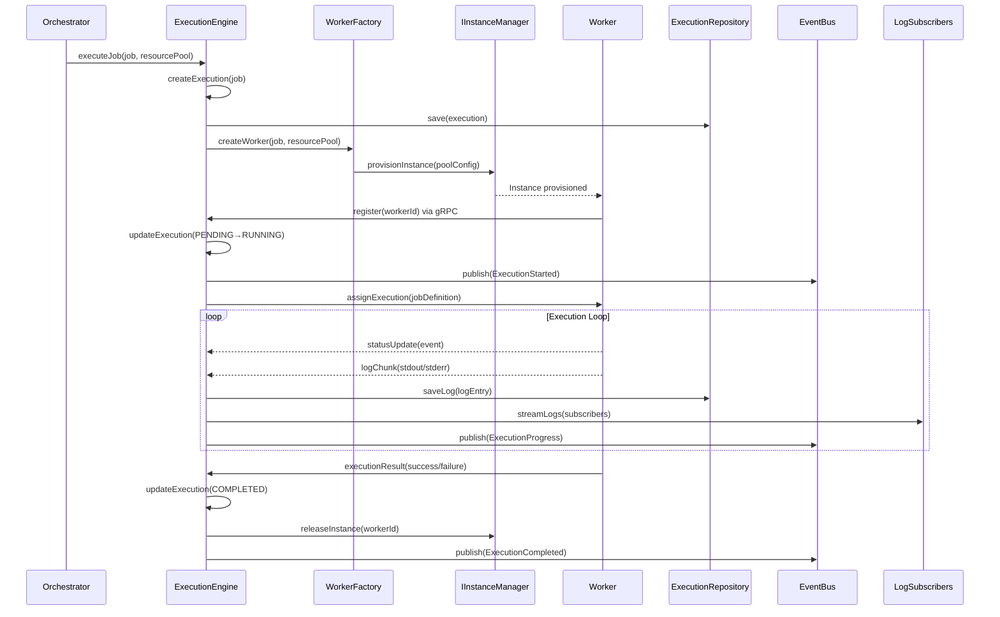

**Estructura del Paquete:**
```
dev.rubentxu.hodei.execution.
├── domain/
│   ├── execution/ (Execution, ExecutionStatus, ExecutionEvent)
│   └── monitoring/ (ExecutionLog, ResourceUsage)
├── application/
│   ├── ExecutionEngineService.kt
│   └── ExecutionMonitoringService.kt
├── infrastructure/
│   ├── api/ExecutionController.kt
│   ├── grpc/ExecutionGrpcService.kt
│   └── streaming/ExecutionStreamingController.kt
└── ports/
    └── ExecutionEvents.kt
```

---

#### **3. Resource Management Context**
**Paquete:** `dev.rubentxu.hodei.resources.*`

**Responsabilidad:** Gestión de infraestructura, pools, workers y capacidad de recursos.

**Entidades Principales:**
- ResourcePool, ResourceQuota, ResourceUtilization
- Worker, WorkerCapabilities, WorkerStatus
- PoolQuota, QuotaViolation

**Casos de Uso Principales:**
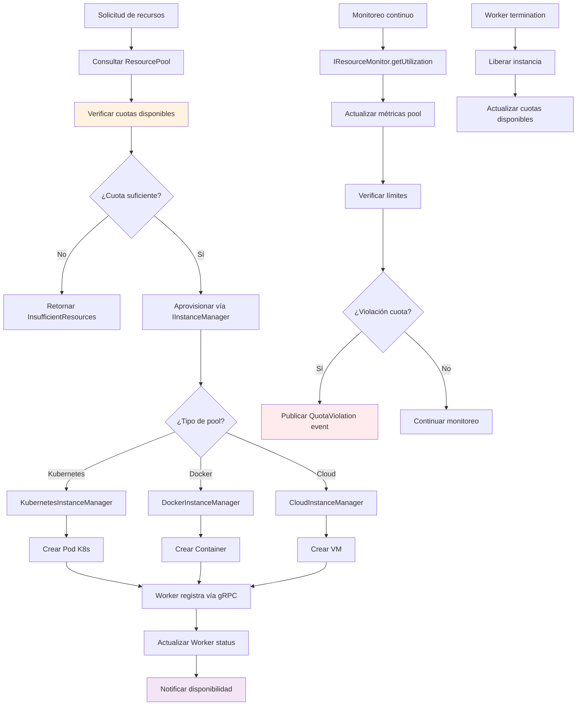

**Diagrama de Secuencia - Gestión de Recursos:**
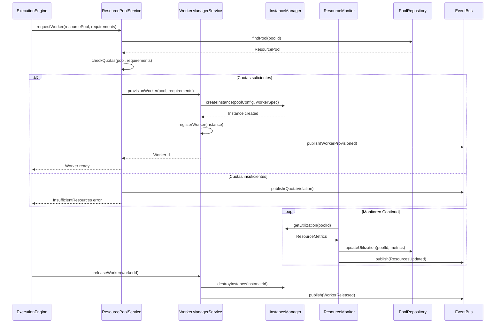

**Estructura del Paquete:**
```
dev.rubentxu.hodei.resources.
├── domain/
│   ├── pool/ (ResourcePool, ResourceQuota, ResourceUtilization)
│   ├── worker/ (Worker, WorkerCapabilities, WorkerStatus)
│   └── quota/ (QuotaViolation, ResourceUsage)
├── application/
│   ├── ResourcePoolService.kt
│   ├── WorkerManagerService.kt
│   └── ResourceMonitoringService.kt
├── infrastructure/
│   ├── api/ (ResourcePoolController.kt, WorkerController.kt)
│   ├── kubernetes/ (KubernetesInstanceManager.kt, KubernetesResourceMonitor.kt)
│   └── monitoring/
└── ports/
    ├── IInstanceManager.kt
    └── IResourceMonitor.kt
```

---

#### **4. Template Management Context**
**Paquete:** `dev.rubentxu.hodei.templates.*`

**Responsabilidad:** Definición, versionado y gestión del ciclo de vida de templates de pipeline.

**Entidades Principales:**
- Template, TemplateStatus, TemplateStatistics
- Pipeline, Version, Artifact

**Casos de Uso Principales:**
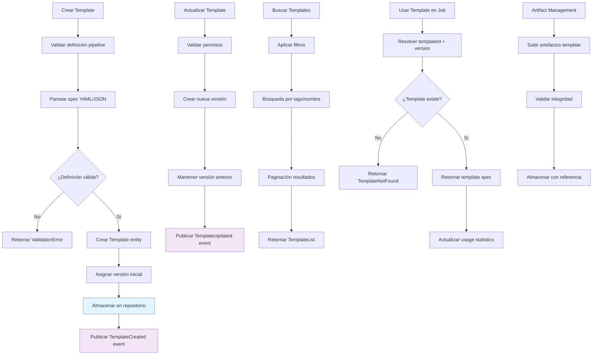

**Diagrama de Secuencia - Gestión de Templates:**
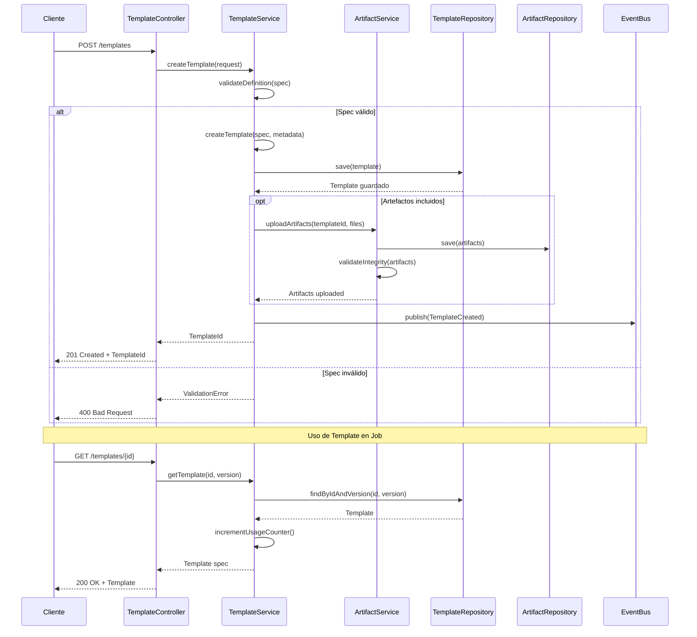

**Estructura del Paquete:**
```
dev.rubentxu.hodei.templates.
├── domain/
│   ├── template/ (Template, TemplateStatus, TemplateStatistics)
│   ├── artifact/ (Artifact)
│   └── versioning/ (Version, Pipeline)
├── application/
│   ├── TemplateService.kt
│   └── ArtifactService.kt
├── infrastructure/
│   ├── api/TemplateController.kt
│   └── persistence/TemplateRepository.kt
└── ports/
    └── TemplateEvents.kt
```

---

#### **5. Scheduling Context**
**Paquete:** `dev.rubentxu.hodei.scheduling.*`

**Responsabilidad:** Decisiones de placement óptimo y aplicación de estrategias de scheduling.

**Entidades Principales:**
- SchedulingStrategy, PoolCandidate
- PlacementDecision, EventType, GenericExecutionEvent

**Casos de Uso Principales:**
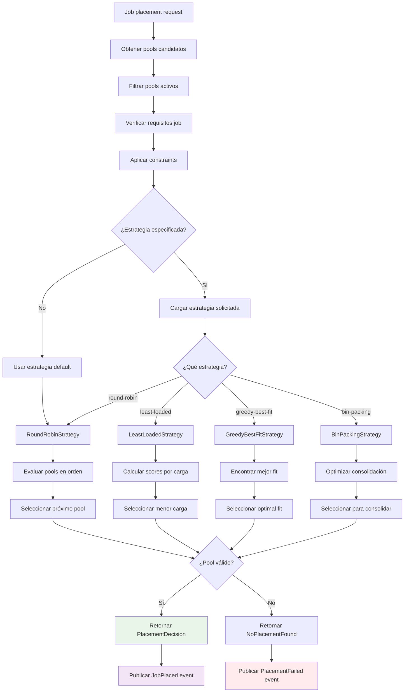

**Diagrama de Secuencia - Scheduling de Jobs:**
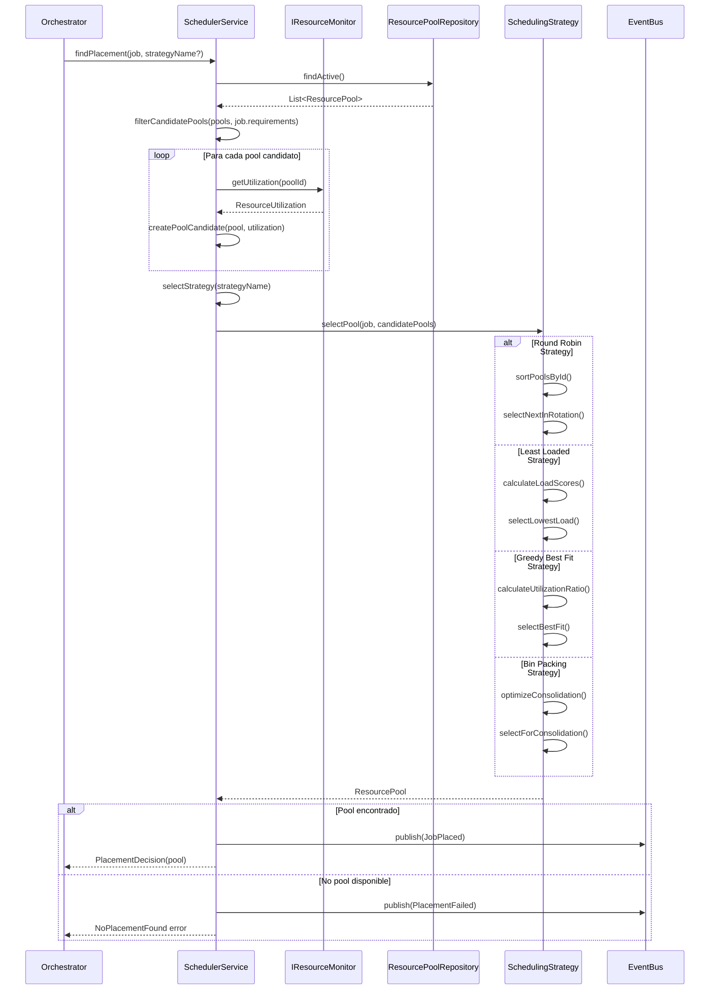

**Estructura del Paquete:**
```
dev.rubentxu.hodei.scheduling.
├── domain/
│   ├── strategy/ (SchedulingStrategy, PoolCandidate)
│   └── decision/ (PlacementDecision)
├── application/
│   └── SchedulerService.kt
├── infrastructure/
│   └── strategies/ (RoundRobinStrategy.kt, LeastLoadedStrategy.kt, etc.)
└── ports/
    └── SchedulingEvents.kt
```

---

#### **6. Security & Governance Context**
**Paquete:** `dev.rubentxu.hodei.security.*`

**Responsabilidad:** Autenticación, autorización, auditoría y compliance del sistema.

**Entidades Principales:**
- User, Role, Permission
- AuditLog, QuotaIntegration

**Casos de Uso Principales:**
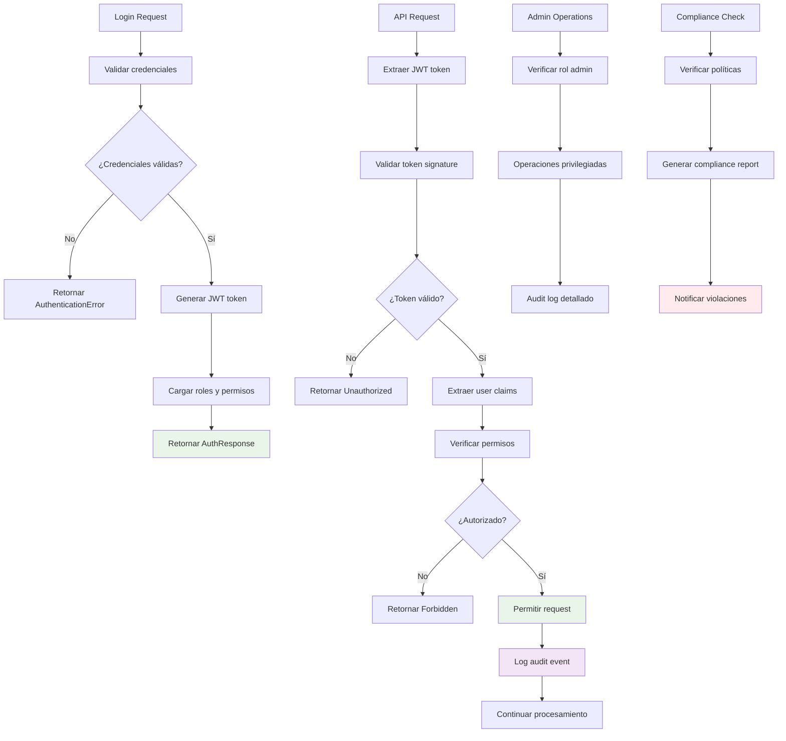

**Diagrama de Secuencia - Autenticación y Autorización:**
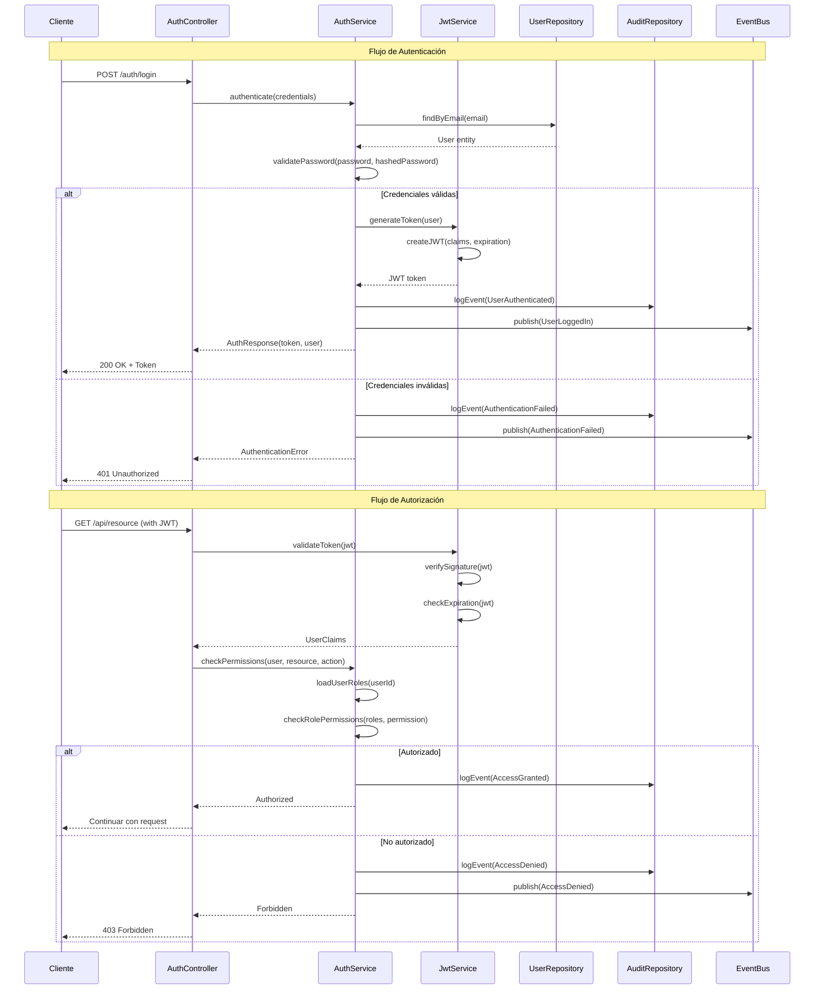

**Estructura del Paquete:**
```
dev.rubentxu.hodei.security.
├── domain/
│   ├── user/ (User, Role, Permission)
│   ├── audit/ (AuditLog)
│   └── compliance/ (QuotaIntegration)
├── application/
│   ├── AuthService.kt
│   ├── JwtService.kt
│   └── AuditService.kt
├── infrastructure/
│   ├── api/ (AuthController.kt, AdminController.kt)
│   └── persistence/
└── ports/
    └── SecurityEvents.kt
```

---

### B.3 Comunicación Entre Contextos

#### **Eventos de Dominio**
Cada bounded context comunica cambios de estado mediante eventos de dominio:

- **Job Management** → `JobCreated`, `JobCancelled`, `JobCompleted`
- **Execution** → `ExecutionStarted`, `ExecutionCompleted`, `ExecutionFailed`
- **Resources** → `ResourcesAllocated`, `ResourcesReleased`, `QuotaViolation`
- **Templates** → `TemplateCreated`, `TemplateUpdated`, `TemplateUsed`
- **Scheduling** → `JobPlaced`, `PlacementFailed`
- **Security** → `UserAuthenticated`, `PermissionDenied`, `AuditEvent`

#### **APIs Entre Contextos**
Las interacciones síncronas entre contextos se realizan a través de interfaces bien definidas:

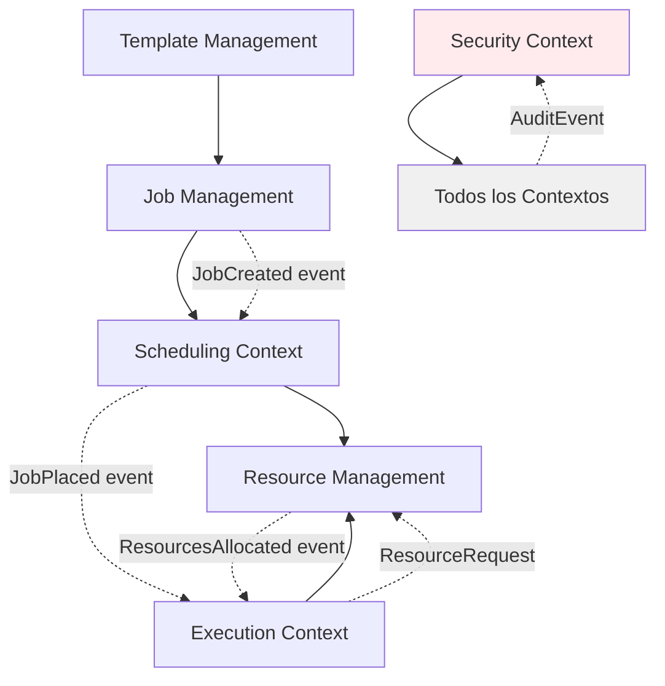

#### **Shared Kernel**
Elementos comunes compartidos entre todos los contextos:

- `DomainId` - Identificadores únicos del dominio
- `DomainError` - Jerarquía de errores del sistema
- `Priority` - Niveles de prioridad
- `Instant` - Manejo de tiempo
- Event publishing interfaces

### B.4 Ventajas de esta Arquitectura

1. **Desarrollo Independiente**: Cada equipo puede trabajar en su bounded context sin interferir con otros
2. **Escalabilidad Selectiva**: Cada contexto puede optimizarse según sus necesidades específicas
3. **Mantenibilidad**: Cambios en un contexto tienen impacto limitado en otros
4. **Testabilidad**: Cada contexto puede testearse en aislamiento
5. **Despliegue Flexible**: Preparado para eventual migración a microservicios
6. **Dominio Claro**: Cada contexto refleja un área de negocio bien definida

### B.5 Consideraciones de Implementación

- **Event Store**: Sistema centralizado para eventos de dominio
- **Consistency**: Eventual consistency entre contextos via eventos
- **Transactions**: Transacciones limitadas al boundary del contexto
- **APIs**: Interfaces REST/gRPC para comunicación síncrona
- **Monitoring**: Observabilidad específica por contexto
- **Security**: Autorización uniforme a través del Security Context
