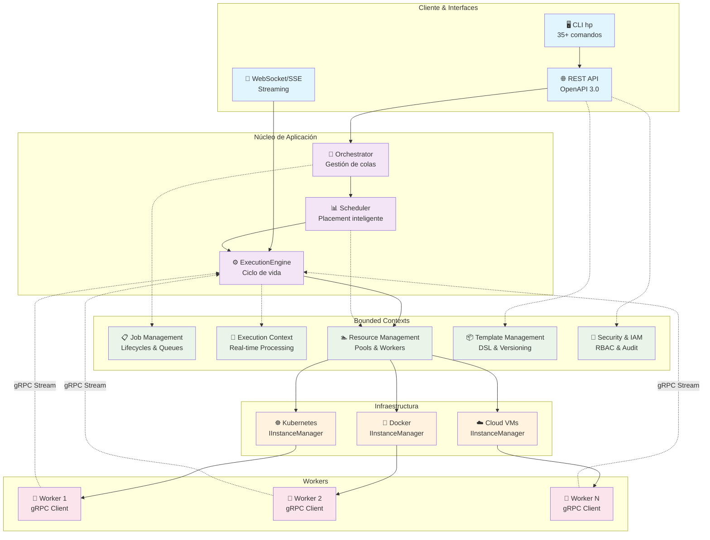
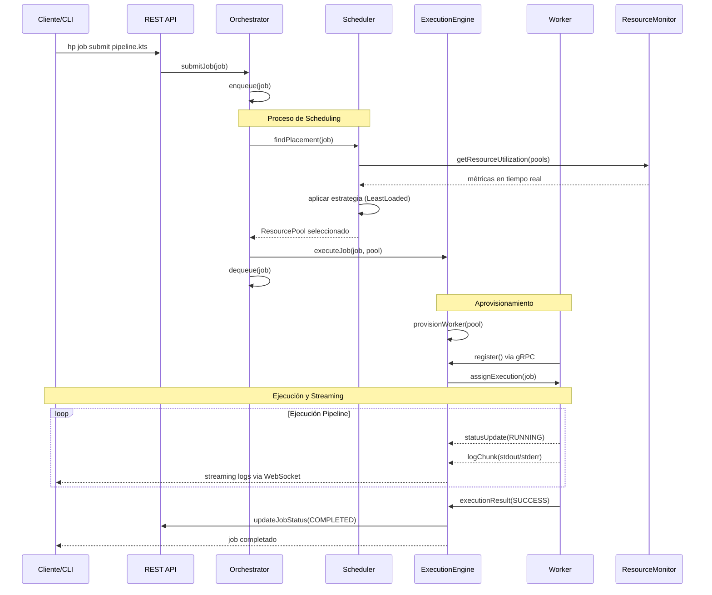

# 🚀 Hodei Pipelines

<div align="center">

**Orquestador de Pipelines Distribuidos de Nivel Empresarial**

[](https://kotlinlang.org)
[](https://grpc.io)
[](./LICENSE)
[](https://github.com/rubentxu/hodei-pipelines)
[](./docs/QUICK_START_DOCKER.es.md)

---

*Un sistema de orquestación de trabajos distribuidos moderno, escalable y empresarial construido con Kotlin, gRPC y arquitectura hexagonal.*

</div>

## 📋 Tabla de Contenidos

- [🌟 Características Principales](#-características-principales)
- [🏗️ Arquitectura](#️-arquitectura)
- [🚀 Inicio Rápido](#-inicio-rápido)
- [💻 CLI Empresarial](#-cli-empresarial)
- [📊 Flujo Principal](#-flujo-principal)
- [🔧 Tecnologías](#-tecnologías)
- [📚 Documentación](#-documentación)
- [🤝 Contribuir](#-contribuir)
- [📄 Licencia](#-licencia)

## 🌟 Características Principales

### 🎯 **Orquestación Empresarial**
- **Ejecución distribuida** de trabajos en pools de workers escalables
- **Arquitectura API-First** con especificación OpenAPI completa
- **Comunicación gRPC** eficiente y bidireccional con streams multiplexados
- **Estrategias de scheduling intercambiables** (Round Robin, Least Loaded, Bin Packing, Greedy Best Fit)

### 🔐 **Seguridad y Gobernanza**
- **Sistema IAM/RBAC completo** con roles, permisos y auditoría
- **Multi-tenancy** con namespaces y cuotas por proyecto
- **JWT y Service Accounts** para autenticación y autorización
- **Audit logs completos** para compliance y trazabilidad

### ⚡ **Alto Rendimiento**
- **Binario nativo** standalone sin dependencias de JVM (58MB)
- **Streaming en tiempo real** de logs y eventos vía WebSocket/SSE
- **Event Sourcing** para consistencia y recuperación ante fallos
- **Pool de workers dinámicos** con auto-scaling inteligente

### 🛠️ **Pipeline como Código**
- **DSL de Kotlin** potente para definir pipelines complejos
- **Ejecución paralela** de stages con sincronización avanzada
- **Templates reutilizables** con versionado y validación
- **Gestión de artefactos** con caché y transferencia optimizada

### 🌐 **Infraestructura Agnóstica**
- **Soporte multi-plataforma**: Kubernetes, Docker, Cloud VMs
- **Abstracciones IInstanceManager e IResourceMonitor** para cualquier proveedor
- **Depliegue flexible**: Monolito modular listo para microservicios
- **Monitoreo avanzado** con métricas Prometheus y OpenTelemetry

## 🏗️ Arquitectura

Hodei Pipelines sigue una **arquitectura hexagonal (puertos y adaptadores)** con **bounded contexts** inspirados en Domain-Driven Design:



### 🔄 Separación de Responsabilidades

- **Orchestrator**: Gestión de colas de jobs y decisiones de encolado
- **Scheduler**: Algoritmos de placement óptimo con estrategias intercambiables
- **ExecutionEngine**: Gestión completa del ciclo de vida de ejecución
- **ResourceManager**: Abstracción de infraestructura heterogénea
- **Workers**: Ejecución distribuida con comunicación bidireccional

## 🚀 Inicio Rápido

### 📋 Prerrequisitos

**Para ejecución estándar:**
- Java 17+ 
- Docker instalado y en funcionamiento
- Gradle (sin wrapper según configuración del proyecto)

**Para binario nativo (recomendado):**
- GraalVM 21+ (opcional - disponibles binarios pre-compilados)

### ⚡ Opción 1: Binario Nativo Standalone (Recomendado)

```bash
# Compilar binario nativo ultra-rápido
gradle :hodei-pipelines-cli:nativeCompile

# Crear distribución completa
gradle :hodei-pipelines-cli:createNativeDistributions

# Instalar globalmente
sudo cp hodei-pipelines-cli/build/distributions/native/linux-x64/hp /usr/local/bin/

# Verificar instalación - inicio instantáneo
hp version
```

**Beneficios del binario nativo:**
- ⚡ **Inicio ultra-rápido** (sin overhead de JVM)
- 📦 **58MB autocontenido** (no requiere Java)
- 🚀 **Distribución de un solo archivo**
- 🔧 **Todas las funciones CLI** (35+ comandos)

### 🐳 Opción 2: Inicio Rápido con Docker

```bash
# 1. Compilar proyecto
gradle clean build -x test

# 2. Iniciar orquestador
gradle :orchestrator:run
# Estará disponible en http://localhost:8080

# 3. Configurar CLI (en terminal separado)
gradle :hodei-pipelines-cli:assemble
cd hodei-pipelines-cli/build/distributions
tar -xf hodei-pipelines-cli.tar
./hodei-pipelines-cli/bin/hp login http://localhost:8080 -u admin -p admin123

# 4. Verificar estado del sistema
hp health && hp status
```

Para una guía completa paso a paso: **[📖 Guía de Inicio Rápido con Docker](./docs/QUICK_START_DOCKER.es.md)**

## 💻 CLI Empresarial

El CLI `hp` proporciona una interfaz completa para gestión de orquestación distribuida, comparable con herramientas empresariales como OpenShift CLI.

### 🎯 Comandos Principales

```bash
# 🔐 Autenticación y contextos
hp login http://orchestrator:8080 --username admin --password secret
hp whoami                                    # Ver usuario actual
hp config get-contexts                       # Listar contextos
hp config use-context production             # Cambiar contexto

# 📋 Gestión de Jobs
hp job submit pipeline.kts --name my-job     # Enviar trabajo
hp job status job-123                        # Estado del trabajo
hp job logs job-123 --follow                 # Logs en tiempo real
hp job describe job-123                      # Información detallada
hp job cancel job-123 --reason "timeout"     # Cancelar trabajo

# 🏊 Gestión de Pools de Recursos
hp pool list                                 # Listar pools
hp pool create --name gpu-pool --type k8s    # Crear pool
hp pool describe pool-123                    # Información detallada
hp pool delete pool-123 --force              # Eliminar pool

# 👷 Gestión de Workers
hp worker list --pool gpu-pool               # Listar workers
hp worker describe worker-456                # Estado del worker
hp worker exec worker-456 -- ps aux          # Ejecutar comando
hp worker shell worker-456                   # Shell interactivo

# 📦 Gestión de Templates
hp template list --type docker               # Listar templates
hp template create --file template.json      # Crear template
hp template describe template-789            # Ver detalles
hp template validate --file template.json    # Validar template

# 📊 Monitoreo y Salud
hp health                                    # Salud del orquestador
hp status                                    # Estado completo del sistema
hp version                                   # Información de versión
```

### 🔥 Ejemplo de Job Pesado Completo

Crear template personalizada y ejecutar job computacionalmente intensivo:

```bash
# 1. Crear template para computación pesada
cat > heavy-compute.json << 'EOF'
{
  "name": "heavy-compute-worker",
  "type": "docker",
  "config": {
    "image": "openjdk:17-jdk-slim",
    "cpus": 2.0,
    "memory": "4GB"
  }
}
EOF

hp template create --name heavy-compute --file heavy-compute.json

# 2. Crear pool dedicado
hp pool create --name compute-pool --type docker --max-workers 3

# 3. Enviar job intensivo
hp job submit heavy-pipeline.kts \
  --name "fibonacci-stress-test" \
  --priority high \
  --pool compute-pool \
  --timeout 600

# 4. Monitoreo en tiempo real (múltiples terminales)
hp job logs $JOB_ID --follow     # Terminal 1: Logs
watch "hp job status $JOB_ID"    # Terminal 2: Estado
watch "hp pool describe compute-pool"  # Terminal 3: Pool
```

**Ver ejemplo completo**: [🔥 Ejecución de Job Pesado con Monitoreo](./docs/QUICK_START_DOCKER.es.md#ejemplo-completo-ejecutar-un-job-pesado-con-monitoreo)

## 📊 Flujo Principal



### 🎯 Estrategias de Scheduling

| Estrategia | Descripción | Caso de Uso |
|------------|-------------|-------------|
| **🔄 Round Robin** | Distribución equitativa entre pools | Cargas homogéneas |
| **📊 Least Loaded** | Menor utilización general (CPU+Mem+Jobs) | Uso general óptimo |
| **🎯 Greedy Best Fit** | Mejor ajuste de recursos | Maximizar throughput |
| **📦 Bin Packing** | Consolidación en menos pools | Optimización de costos |

## 🔧 Tecnologías

### 🏗️ Stack Principal
- **[Kotlin 2.2.0](https://kotlinlang.org)** - Lenguaje principal con corrutinas
- **[gRPC 1.66.0](https://grpc.io)** - Comunicación eficiente bidireccional
- **[Ktor 3.2.0](https://ktor.io)** - Framework web y cliente HTTP
- **[GraalVM Native Image](https://www.graalvm.org)** - Compilación nativa
- **[Gradle](https://gradle.org)** - Sistema de construcción con Kotlin DSL

### 🔧 Infraestructura
- **Protocol Buffers** - Serialización eficiente
- **Kotlinx Serialization** - JSON/YAML processing  
- **Kotlinx Coroutines** - Programación asíncrona
- **Kotlinx DateTime** - Gestión de tiempo
- **WebSocket/SSE** - Streaming en tiempo real

### 📊 Observabilidad
- **OpenTelemetry** - Trazabilidad distribuida
- **Micrometer + Prometheus** - Métricas del sistema
- **Logback** - Logging estructurado
- **Event Sourcing** - Auditoría inmutable

### 🧪 Testing
- **Kotest** - Framework de testing
- **Mockk** - Mocking para Kotlin
- **TestContainers** - Testing de integración
- **Embedded gRPC** - Testing de comunicación

## 📚 Documentación

### 📖 Guías de Usuario
- **[🚀 Inicio Rápido con Docker](./docs/QUICK_START_DOCKER.es.md)** - Guía completa paso a paso
- **[💻 Referencia Completa del CLI](./docs/CLI_REFERENCE_HP.md)** - Todos los comandos `hp`
- **[🗺️ Roadmap del CLI](./docs/CLI_ROADMAP.md)** - Comparación con herramientas empresariales

### 🏗️ Documentación Técnica  
- **[📋 PRD del Proyecto](./PRD-proyecto.md)** - Requisitos y arquitectura completa
- **[🎯 Brief del Proyecto](./docs/projectbrief.md)** - Objetivos y contexto
- **[🏛️ Patrones del Sistema](./docs/systemPatterns.md)** - Arquitectura detallada
- **[🔧 Contexto Tecnológico](./docs/techContext.md)** - Stack y herramientas

### 🎨 DSL y Desarrollo
- **[📝 Guía del Pipeline DSL](./docs/pipeline-dsl-guide.md)** - Sintaxis y ejemplos
- **[📁 Estructura del Proyecto](./docs/project_structure.md)** - Organización del código
- **[⚡ Contexto Activo](./docs/activeContext.md)** - Estado actual y próximos pasos

## 🤝 Contribuir

¡Las contribuciones son bienvenidas! 

### 🛠️ Configuración de Desarrollo

```bash
# Clonar repositorio
git clone https://github.com/rubentxu/hodei-pipelines.git
cd hodei-pipelines

# Compilar y ejecutar tests
gradle clean build test

# Ejecutar tests de integración
gradle :orchestrator:test --tests "*IntegrationTest*"

# Verificar estilo de código
gradle detekt ktlintCheck
```

### 📋 Estándares de Contribución

- **🏗️ Arquitectura Hexagonal** - Respeta puertos y adaptadores
- **🧪 TDD** - Tests primero, implementación después  
- **📝 Conventional Commits** - `feat:`, `fix:`, `docs:`, etc.
- **🔧 SOLID + Clean Code** - Principios de diseño
- **📖 Documentación** - Actualiza docs relevantes

### 🎯 Áreas de Contribución

- 🌐 **Nuevos adaptadores de infraestructura** (AWS, Azure, GCP)
- 🔧 **Estrategias de scheduling** personalizadas
- 📊 **Métricas y dashboards** avanzados  
- 🔐 **Integraciones de seguridad** (LDAP, OAuth2)
- 🎨 **Mejoras del DSL** de pipelines
- 📱 **Interfaz web** (SPA con la API REST)

## 📄 Licencia

Este proyecto está licenciado bajo la **Licencia MIT**. Ver [LICENSE](./LICENSE) para detalles.

---

<div align="center">

**🚀 Hodei Pipelines** - *Orquestación distribuida moderna para el ecosistema cloud-native*

[Documentación](./docs/) • [CLI Reference](./docs/CLI_REFERENCE_HP.md) • [Quick Start](./docs/QUICK_START_DOCKER.es.md) • [Arquitectura](./PRD-proyecto.md)

</div>