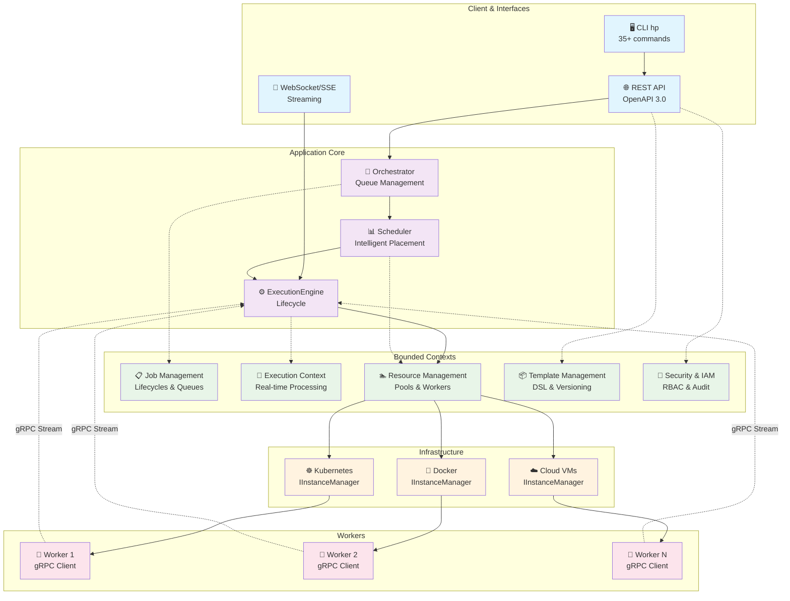
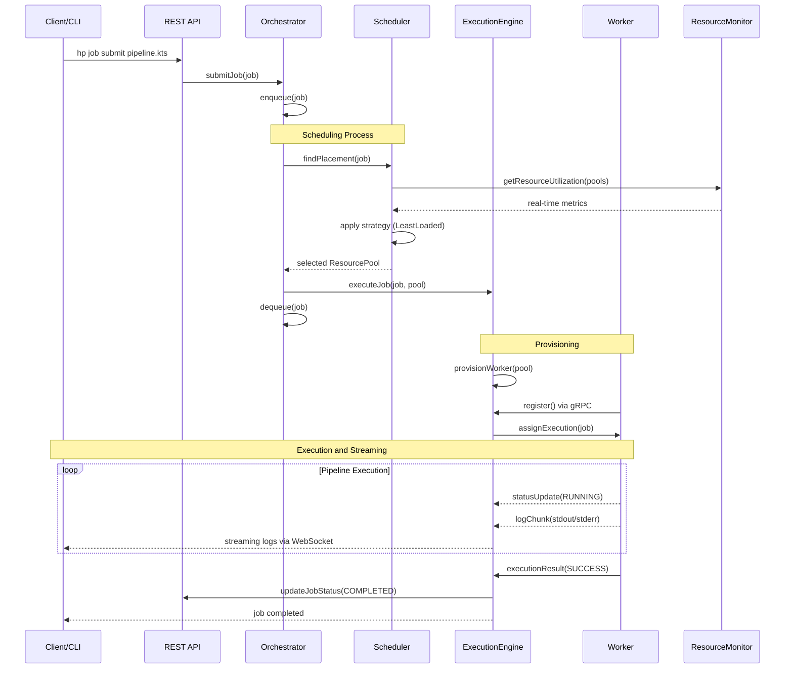

# 🚀 Hodei Pipelines

<div align="center">

**Enterprise-Grade Distributed Pipeline Orchestrator**

[](https://kotlinlang.org)
[](https://grpc.io)
[](./LICENSE)
[](https://github.com/rubentxu/hodei-pipelines)
[](./docs/QUICK_START_DOCKER.md)

---

*A modern, scalable, and enterprise-grade distributed job orchestration system built with Kotlin, gRPC, and hexagonal architecture.*

</div>

## 📋 Table of Contents

- [🌟 Key Features](#-key-features)
- [🏗️ Architecture](#️-architecture)
- [🚀 Quick Start](#-quick-start)
- [💻 Enterprise CLI](#-enterprise-cli)
- [📊 Main Flow](#-main-flow)
- [🔧 Technologies](#-technologies)
- [📚 Documentation](#-documentation)
- [🤝 Contributing](#-contributing)
- [📄 License](#-license)

## 🌟 Key Features

### 🎯 **Enterprise Orchestration**
- **Distributed execution** of jobs on scalable worker pools
- **API-First architecture** with complete OpenAPI specification
- **Efficient gRPC communication** with multiplexed bidirectional streams
- **Interchangeable scheduling strategies** (Round Robin, Least Loaded, Bin Packing, Greedy Best Fit)

### 🔐 **Security & Governance**
- **Complete IAM/RBAC system** with roles, permissions, and auditing
- **Multi-tenancy** with namespaces and per-project quotas
- **JWT and Service Accounts** for authentication and authorization
- **Complete audit logs** for compliance and traceability

### ⚡ **High Performance**
- **Native standalone binary** with no JVM dependencies (58MB)
- **Real-time streaming** of logs and events via WebSocket/SSE
- **Event Sourcing** for consistency and fault recovery
- **Dynamic worker pools** with intelligent auto-scaling

### 🛠️ **Pipeline as Code**
- **Powerful Kotlin DSL** for defining complex pipelines
- **Parallel stage execution** with advanced synchronization
- **Reusable templates** with versioning and validation
- **Artifact management** with caching and optimized transfer

### 🌐 **Infrastructure Agnostic**
- **Multi-platform support**: Kubernetes, Docker, Cloud VMs
- **IInstanceManager and IResourceMonitor abstractions** for any provider
- **Flexible deployment**: Modular monolith ready for microservices
- **Advanced monitoring** with Prometheus metrics and OpenTelemetry

## 🏗️ Architecture

Hodei Pipelines follows a **hexagonal architecture (ports and adapters)** with **bounded contexts** inspired by Domain-Driven Design:



### 🔄 Separation of Responsibilities

- **Orchestrator**: Job queue management and enqueuing decisions
- **Scheduler**: Optimal placement algorithms with interchangeable strategies
- **ExecutionEngine**: Complete execution lifecycle management
- **ResourceManager**: Heterogeneous infrastructure abstraction
- **Workers**: Distributed execution with bidirectional communication

## 🚀 Quick Start

### 📋 Prerequisites

**For standard execution:**
- Java 17+ 
- Docker installed and running
- Gradle (no wrapper as per project configuration)

**For native binary (recommended):**
- GraalVM 21+ (optional - pre-compiled binaries available)

### ⚡ Option 1: Native Standalone Binary (Recommended)

```bash
# Compile ultra-fast native binary
gradle :hodei-pipelines-cli:nativeCompile

# Create complete distribution
gradle :hodei-pipelines-cli:createNativeDistributions

# Install globally
sudo cp hodei-pipelines-cli/build/distributions/native/linux-x64/hp /usr/local/bin/

# Verify installation - instant startup
hp version
```

**Native binary benefits:**
- ⚡ **Ultra-fast startup** (no JVM overhead)
- 📦 **58MB self-contained** (no Java required)
- 🚀 **Single-file distribution**
- 🔧 **All CLI features** (35+ commands)

### 🐳 Option 2: Quick Start with Docker

```bash
# 1. Build project
gradle clean build -x test

# 2. Start orchestrator
gradle :orchestrator:run
# Available at http://localhost:8080

# 3. Configure CLI (in separate terminal)
gradle :hodei-pipelines-cli:assemble
cd hodei-pipelines-cli/build/distributions
tar -xf hodei-pipelines-cli.tar
./hodei-pipelines-cli/bin/hp login http://localhost:8080 -u admin -p admin123

# 4. Verify system status
hp health && hp status
```

For a complete step-by-step guide: **[📖 Docker Quick Start Guide](./docs/QUICK_START_DOCKER.md)**

## 💻 Enterprise CLI

The `hp` CLI provides a complete interface for distributed orchestration management, comparable to enterprise tools like OpenShift CLI.

### 🎯 Main Commands

```bash
# 🔐 Authentication and contexts
hp login http://orchestrator:8080 --username admin --password secret
hp whoami                                    # View current user
hp config get-contexts                       # List contexts
hp config use-context production             # Switch context

# 📋 Job Management
hp job submit pipeline.kts --name my-job     # Submit job
hp job status job-123                        # Job status
hp job logs job-123 --follow                 # Real-time logs
hp job describe job-123                      # Detailed information
hp job cancel job-123 --reason "timeout"     # Cancel job

# 🏊 Resource Pool Management
hp pool list                                 # List pools
hp pool create --name gpu-pool --type k8s    # Create pool
hp pool describe pool-123                    # Detailed information
hp pool delete pool-123 --force              # Delete pool

# 👷 Worker Management
hp worker list --pool gpu-pool               # List workers
hp worker describe worker-456                # Worker status
hp worker exec worker-456 -- ps aux          # Execute command
hp worker shell worker-456                   # Interactive shell

# 📦 Template Management
hp template list --type docker               # List templates
hp template create --file template.json      # Create template
hp template describe template-789            # View details
hp template validate --file template.json    # Validate template

# 📊 Monitoring and Health
hp health                                    # Orchestrator health
hp status                                    # Complete system status
hp version                                   # Version information
```

### 🔥 Complete Heavy Job Example

Create custom template and execute computationally intensive job:

```bash
# 1. Create template for heavy computation
cat > heavy-compute.json << 'EOF'
{
  "name": "heavy-compute-worker",
  "type": "docker",
  "config": {
    "image": "openjdk:17-jdk-slim",
    "cpus": 2.0,
    "memory": "4GB"
  }
}
EOF

hp template create --name heavy-compute --file heavy-compute.json

# 2. Create dedicated pool
hp pool create --name compute-pool --type docker --max-workers 3

# 3. Submit intensive job
hp job submit heavy-pipeline.kts \
  --name "fibonacci-stress-test" \
  --priority high \
  --pool compute-pool \
  --timeout 600

# 4. Real-time monitoring (multiple terminals)
hp job logs $JOB_ID --follow     # Terminal 1: Logs
watch "hp job status $JOB_ID"    # Terminal 2: Status
watch "hp pool describe compute-pool"  # Terminal 3: Pool
```

**See complete example**: [🔥 Heavy Job Execution with Monitoring](./docs/QUICK_START_DOCKER.md#complete-example-execute-a-heavy-job-with-monitoring)

## 📊 Main Flow



### 🎯 Scheduling Strategies

| Strategy | Description | Use Case |
|----------|-------------|----------|
| **🔄 Round Robin** | Equal distribution across pools | Homogeneous workloads |
| **📊 Least Loaded** | Lowest overall utilization (CPU+Mem+Jobs) | Optimal general usage |
| **🎯 Greedy Best Fit** | Best resource fit | Maximize throughput |
| **📦 Bin Packing** | Consolidation in fewer pools | Cost optimization |

## 🔧 Technologies

### 🏗️ Main Stack
- **[Kotlin 2.2.0](https://kotlinlang.org)** - Primary language with coroutines
- **[gRPC 1.66.0](https://grpc.io)** - Efficient bidirectional communication
- **[Ktor 3.2.0](https://ktor.io)** - Web framework and HTTP client
- **[GraalVM Native Image](https://www.graalvm.org)** - Native compilation
- **[Gradle](https://gradle.org)** - Build system with Kotlin DSL

### 🔧 Infrastructure
- **Protocol Buffers** - Efficient serialization
- **Kotlinx Serialization** - JSON/YAML processing  
- **Kotlinx Coroutines** - Asynchronous programming
- **Kotlinx DateTime** - Time management
- **WebSocket/SSE** - Real-time streaming

### 📊 Observability
- **OpenTelemetry** - Distributed tracing
- **Micrometer + Prometheus** - System metrics
- **Logback** - Structured logging
- **Event Sourcing** - Immutable auditing

### 🧪 Testing
- **Kotest** - Testing framework
- **Mockk** - Mocking for Kotlin
- **TestContainers** - Integration testing
- **Embedded gRPC** - Communication testing

## 📚 Documentation

### 📖 User Guides
- **[🚀 Docker Quick Start Guide](./docs/QUICK_START_DOCKER.md)** - Complete step-by-step guide
- **[💻 Complete CLI Reference](./docs/CLI_REFERENCE_HP.md)** - All `hp` commands
- **[🗺️ CLI Roadmap](./docs/CLI_ROADMAP.md)** - Comparison with enterprise tools

### 🏗️ Technical Documentation  
- **[📋 Project PRD](./PRD-proyecto.md)** - Requirements and complete architecture
- **[🎯 Project Brief](./docs/projectbrief.md)** - Objectives and context
- **[🏛️ System Patterns](./docs/systemPatterns.md)** - Detailed architecture
- **[🔧 Tech Context](./docs/techContext.md)** - Stack and tools

### 🎨 DSL and Development
- **[📝 Pipeline DSL Guide](./docs/pipeline-dsl-guide.md)** - Syntax and examples
- **[📁 Project Structure](./docs/project_structure.md)** - Code organization
- **[⚡ Active Context](./docs/activeContext.md)** - Current state and next steps

## 🤝 Contributing

Contributions are welcome! 

### 🛠️ Development Setup

```bash
# Clone repository
git clone https://github.com/rubentxu/hodei-pipelines.git
cd hodei-pipelines

# Build and run tests
gradle clean build test

# Run integration tests
gradle :orchestrator:test --tests "*IntegrationTest*"

# Verify code style
gradle detekt ktlintCheck
```

### 📋 Contribution Standards

- **🏗️ Hexagonal Architecture** - Respect ports and adapters
- **🧪 TDD** - Tests first, implementation after  
- **📝 Conventional Commits** - `feat:`, `fix:`, `docs:`, etc.
- **🔧 SOLID + Clean Code** - Design principles
- **📖 Documentation** - Update relevant docs

### 🎯 Contribution Areas

- 🌐 **New infrastructure adapters** (AWS, Azure, GCP)
- 🔧 **Custom scheduling strategies**
- 📊 **Advanced metrics and dashboards**  
- 🔐 **Security integrations** (LDAP, OAuth2)
- 🎨 **Pipeline DSL improvements**
- 📱 **Web interface** (SPA with REST API)

## 📄 License

This project is licensed under the **MIT License**. See [LICENSE](./LICENSE) for details.

---

<div align="center">

**🚀 Hodei Pipelines** - *Modern distributed orchestration for cloud-native ecosystems*

[Documentation](./docs/) • [CLI Reference](./docs/CLI_REFERENCE_HP.md) • [Quick Start](./docs/QUICK_START_DOCKER.md) • [Architecture](./PRD-proyecto.md)

</div>