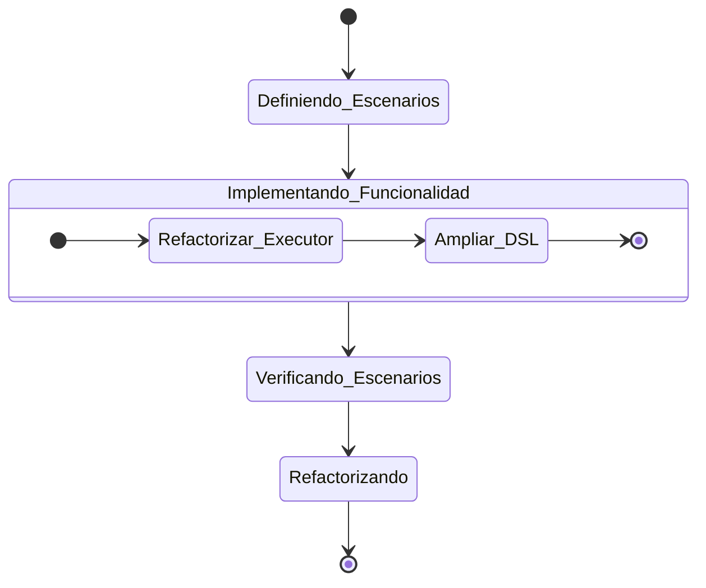

# Active Context: Mejora del Motor de Scripting

## Enfoque Actual

El trabajo actual se centra en refactorizar `PipelineScriptExecutor` para reemplazar la implementación basada en JSR-223 por una solución más robusta y nativa de Kotlin utilizando la API de `kotlin.script.experimental`.

## Estado BDD Actual: Implementando

Estamos en la fase de **Implementando Funcionalidad**. El objetivo es cambiar el mecanismo de ejecución de scripts para que sea más potente y flexible.

## Próximos Pasos

1.  **Refactorizar `PipelineScriptExecutor.kt`:** Cambiar la implementación a la API experimental de scripting.
2.  **Añadir paso `sh` al DSL:** Crear una función `sh` en `PipelineContext` que permita ejecutar comandos de shell.
3.  **Actualizar `PipelineScriptExecutorTest.kt`:** Modificar las pruebas para que reflejen la nueva implementación y añadir pruebas para el paso `sh`.
