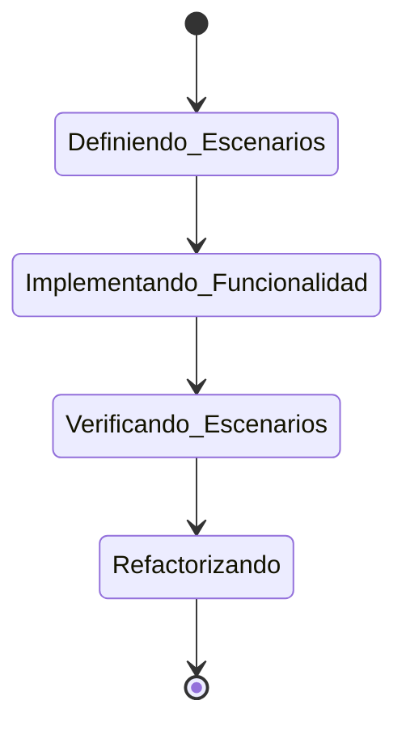

# Active Context

## Estado BDD Actual: Ciclo Completado, Listo para el Siguiente

Hemos completado un ciclo BDD completo para la funcionalidad de definición de pipelines.

El escenario de definición básica está **Verificado**. Estamos listos para comenzar un nuevo ciclo.

## Próximos Pasos

Con los bloques `post` implementados, nuestro motor de pipelines es ahora más robusto. El siguiente gran paso es mejorar su rendimiento introduciendo la ejecución en paralelo de las etapas.

1.  **Definir el paralelismo en el DSL**: Añadir una función `parallel` al `PipelineBuilder` que permita agrupar etapas para que se ejecuten concurrentemente.
2.  **Definir el escenario BDD**: Crear un nuevo escenario en `usecases.md` que describa la ejecución de un pipeline con etapas en paralelo y verifique que se completan correctamente.
3.  **Implementar la lógica en `PipelineRunner`**: Modificar el `PipelineRunner` para que utilice corrutinas de Kotlin o un `ExecutorService` para ejecutar en paralelo los grupos de etapas definidos con `parallel`.
4.  **Actualizar los tests**: Añadir tests que verifiquen que las etapas en paralelo se ejecutan concurrentemente y que el pipeline espera a que todas finalicen antes de continuar.