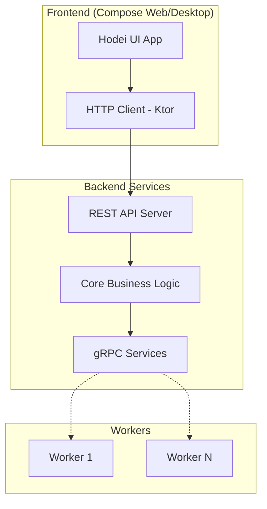
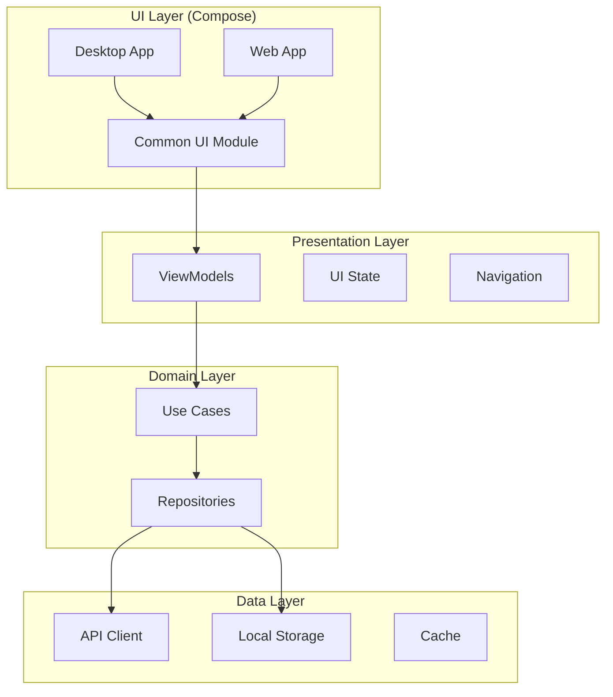

# 🎨 Plan: API REST + UI con Kotlin Compose Desktop/Web

## **Objetivo**
Crear una interfaz web/desktop moderna para Hodei Pipelines usando Kotlin Compose Multiplatform, con API REST para comunicación y design system consistente tipo Jenkins.

---

## **1. API REST DESIGN**

### **1.1 Arquitectura API REST**



### **1.2 REST API Endpoints**

#### **Jobs & Pipelines**
```http
# Job Management
GET    /api/v1/jobs                     # List all jobs
POST   /api/v1/jobs                     # Create new job
GET    /api/v1/jobs/{id}                # Get job details
PUT    /api/v1/jobs/{id}                # Update job
DELETE /api/v1/jobs/{id}                # Delete job
POST   /api/v1/jobs/{id}/execute        # Execute job
POST   /api/v1/jobs/{id}/cancel         # Cancel job
GET    /api/v1/jobs/{id}/output         # Get job output (SSE)
GET    /api/v1/jobs/{id}/logs           # Get job logs

# Pipeline Templates
GET    /api/v1/pipelines                # List pipeline templates
POST   /api/v1/pipelines                # Create pipeline template
GET    /api/v1/pipelines/{id}           # Get pipeline template
PUT    /api/v1/pipelines/{id}           # Update pipeline template
DELETE /api/v1/pipelines/{id}           # Delete pipeline template
POST   /api/v1/pipelines/{id}/validate  # Validate pipeline DSL

# Job History & Statistics
GET    /api/v1/jobs/{id}/history        # Job execution history
GET    /api/v1/jobs/statistics          # Job statistics dashboard
GET    /api/v1/jobs/recent              # Recent job executions
GET    /api/v1/jobs/favorites           # User's favorite jobs
POST   /api/v1/jobs/{id}/favorite       # Mark job as favorite
DELETE /api/v1/jobs/{id}/favorite       # Remove from favorites
```

#### **Workers & Resources**
```http
# Worker Management
GET    /api/v1/workers                  # List all workers
GET    /api/v1/workers/{id}             # Get worker details
POST   /api/v1/workers/{id}/shutdown    # Shutdown worker
GET    /api/v1/workers/statistics       # Worker statistics
GET    /api/v1/workers/templates        # Available worker templates

# Resource Management
GET    /api/v1/resources/availability   # Cluster resource availability
GET    /api/v1/resources/usage          # Resource usage statistics
GET    /api/v1/orchestrators            # Available orchestrators (K8s, Docker)
```

#### **System & Configuration**
```http
# System Management
GET    /api/v1/system/status            # System health status
GET    /api/v1/system/info              # System information
GET    /api/v1/system/metrics           # System metrics
GET    /api/v1/system/logs              # System logs

# Configuration
GET    /api/v1/config                   # Get system configuration
PUT    /api/v1/config                   # Update system configuration
GET    /api/v1/config/worker-templates  # Get worker templates config
PUT    /api/v1/config/worker-templates  # Update worker templates

# Authentication & Users
POST   /api/v1/auth/login               # User login
POST   /api/v1/auth/logout              # User logout
GET    /api/v1/auth/me                  # Current user info
GET    /api/v1/users                    # List users (admin)
POST   /api/v1/users                    # Create user (admin)
```

### **1.3 API Response Models**

```kotlin
// API Response DTOs
data class JobDto(
    val id: String,
    val name: String,
    val status: JobStatusDto,
    val definition: JobDefinitionDto,
    val assignedWorker: String?,
    val createdAt: Instant,
    val startedAt: Instant?,
    val completedAt: Instant?,
    val duration: Long?,
    val exitCode: Int?
)

data class JobDefinitionDto(
    val name: String,
    val pipeline: String, // Kotlin DSL content
    val requirements: WorkerRequirementsDto,
    val environment: Map<String, String>,
    val parameters: List<JobParameterDto>
)

data class WorkerDto(
    val id: String,
    val name: String,
    val status: WorkerStatusDto,
    val capabilities: Set<String>,
    val activeJobs: Int,
    val maxConcurrentJobs: Int,
    val lastHeartbeat: Instant,
    val resourceUsage: ResourceUsageDto?
)

data class WorkerTemplateDto(
    val id: String,
    val name: String,
    val description: String,
    val image: String,
    val capabilities: Set<String>,
    val resources: ResourceRequirementsDto
)

data class PipelineExecutionDto(
    val jobId: String,
    val stages: List<StageExecutionDto>,
    val startTime: Instant,
    val endTime: Instant?,
    val status: PipelineStatusDto
)

data class StageExecutionDto(
    val name: String,
    val status: StageStatusDto,
    val startTime: Instant?,
    val endTime: Instant?,
    val steps: List<StepExecutionDto>
)

// WebSocket/SSE Models
data class JobOutputEvent(
    val jobId: String,
    val timestamp: Instant,
    val data: String,
    val isError: Boolean
)

data class JobStatusUpdateEvent(
    val jobId: String,
    val status: JobStatusDto,
    val stage: String?,
    val message: String?
)
```

### **1.4 Real-time Communication**

```http
# Server-Sent Events (SSE) para real-time updates
GET /api/v1/events/jobs/{id}/output    # Real-time job output
GET /api/v1/events/jobs/status         # Job status updates
GET /api/v1/events/workers/status      # Worker status updates
GET /api/v1/events/system/metrics      # System metrics stream

# WebSocket alternativo
WS  /api/v1/ws/jobs/{id}               # Job-specific events
WS  /api/v1/ws/dashboard               # Dashboard events
```

---

## **2. KOTLIN COMPOSE MULTIPLATFORM UI**

### **2.1 Arquitectura de UI**



### **2.2 Módulos del Proyecto UI**

```
hodei-ui/
├── common/                          # Shared Compose code
│   ├── src/commonMain/kotlin/
│   │   ├── ui/
│   │   │   ├── components/          # Reusable UI components
│   │   │   ├── screens/             # App screens
│   │   │   ├── theme/               # Design system implementation
│   │   │   └── navigation/          # Navigation logic
│   │   ├── presentation/            # ViewModels & UI State
│   │   ├── domain/                  # Use cases
│   │   └── data/                    # Repositories & API clients
│   └── src/commonTest/kotlin/
├── desktop/                         # Desktop-specific code
│   └── src/jvmMain/kotlin/
│       └── Main.kt
├── web/                            # Web-specific code
│   └── src/jsMain/kotlin/
│       └── Main.kt
└── shared-resources/               # Common resources
    ├── images/
    ├── icons/
    └── fonts/
```

### **2.3 Design System Implementation**

```kotlin
// common/src/commonMain/kotlin/ui/theme/HodeiTheme.kt
object HodeiColors {
    val PrimaryBlue = Color(0xFF4A90E2)
    val SecondaryBlue = Color(0xFF3B86D6)
    val LightBlueBackground = Color(0xFFE6F0FA)
    val DarkText = Color(0xFF333333)
    val MediumText = Color(0xFF666666)
    val LightText = Color(0xFF999999)
    val White = Color(0xFFFFFFFF)
    val GreenSuccess = Color(0xFF7ED321)
    val RedError = Color(0xFFD0021B)
    val YellowWarning = Color(0xFFF5A623)
    val GreyBorder = Color(0xFFCCCCCC)
    val DarkGreyBackground = Color(0xFFF0F0F0)
    val CodeBackground = Color(0xFF333333)
    val CodeText = Color(0xFFFFFFFF)
    val CodeHighlight = Color(0xFFFFCC00)
}

object HodeiTypography {
    val H1 = TextStyle(
        fontSize = 28.sp,
        fontWeight = FontWeight.Medium,
        lineHeight = 1.2.em
    )
    val H2 = TextStyle(
        fontSize = 24.sp,
        fontWeight = FontWeight.Medium,
        lineHeight = 1.3.em
    )
    val H3 = TextStyle(
        fontSize = 20.sp,
        fontWeight = FontWeight.Medium,
        lineHeight = 1.4.em
    )
    val Body = TextStyle(
        fontSize = 14.sp,
        fontWeight = FontWeight.Normal,
        lineHeight = 1.5.em
    )
    val Small = TextStyle(
        fontSize = 12.sp,
        fontWeight = FontWeight.Normal,
        lineHeight = 1.4.em
    )
}

object HodeiSpacing {
    val XS = 4.dp
    val SM = 8.dp
    val MD = 16.dp
    val LG = 24.dp
    val XL = 32.dp
}

@Composable
fun HodeiTheme(
    content: @Composable () -> Unit
) {
    MaterialTheme(
        colorScheme = lightColorScheme(
            primary = HodeiColors.PrimaryBlue,
            secondary = HodeiColors.SecondaryBlue,
            background = HodeiColors.DarkGreyBackground,
            surface = HodeiColors.White,
            error = HodeiColors.RedError,
            onPrimary = HodeiColors.White,
            onSecondary = HodeiColors.White,
            onBackground = HodeiColors.DarkText,
            onSurface = HodeiColors.DarkText,
            onError = HodeiColors.White
        ),
        typography = Typography(
            headlineLarge = HodeiTypography.H1,
            headlineMedium = HodeiTypography.H2,
            headlineSmall = HodeiTypography.H3,
            bodyLarge = HodeiTypography.Body,
            bodySmall = HodeiTypography.Small
        ),
        content = content
    )
}
```

### **2.4 Common UI Components**

```kotlin
// Header Bar Component
@Composable
fun HodeiHeaderBar(
    title: String,
    onUserMenuClick: () -> Unit,
    navigationItems: List<NavigationItem> = emptyList()
) {
    Surface(
        modifier = Modifier
            .fillMaxWidth()
            .height(64.dp),
        color = HodeiColors.PrimaryBlue
    ) {
        Row(
            modifier = Modifier
                .fillMaxSize()
                .padding(horizontal = HodeiSpacing.LG),
            verticalAlignment = Alignment.CenterVertically
        ) {
            // Logo
            Row(verticalAlignment = Alignment.CenterVertically) {
                Icon(
                    imageVector = Icons.Default.Cloud,
                    contentDescription = "Hodei Logo",
                    tint = HodeiColors.White,
                    modifier = Modifier.size(32.dp)
                )
                Spacer(modifier = Modifier.width(HodeiSpacing.SM))
                Text(
                    text = title,
                    style = HodeiTypography.H3,
                    color = HodeiColors.White
                )
            }
            
            Spacer(modifier = Modifier.weight(1f))
            
            // Navigation Items
            navigationItems.forEach { item ->
                HodeiNavigationItem(
                    item = item,
                    isActive = item.isActive
                )
                Spacer(modifier = Modifier.width(HodeiSpacing.LG))
            }
            
            // User Profile
            HodeiUserProfile(onClick = onUserMenuClick)
        }
    }
}

// Data Table Component
@Composable
fun <T> HodeiDataTable(
    items: List<T>,
    columns: List<TableColumn<T>>,
    onItemClick: (T) -> Unit = {},
    modifier: Modifier = Modifier
) {
    LazyColumn(modifier = modifier) {
        // Header
        item {
            Row(
                modifier = Modifier
                    .fillMaxWidth()
                    .background(HodeiColors.LightBlueBackground)
                    .padding(vertical = 12.dp, horizontal = HodeiSpacing.MD)
            ) {
                columns.forEach { column ->
                    Text(
                        text = column.title,
                        style = HodeiTypography.Body.copy(fontWeight = FontWeight.Bold),
                        color = HodeiColors.DarkText,
                        modifier = Modifier.weight(column.weight)
                    )
                }
            }
        }
        
        // Rows
        itemsIndexed(items) { index, item ->
            val backgroundColor = if (index % 2 == 0) {
                HodeiColors.White
            } else {
                HodeiColors.DarkGreyBackground
            }
            
            Row(
                modifier = Modifier
                    .fillMaxWidth()
                    .background(backgroundColor)
                    .clickable { onItemClick(item) }
                    .padding(vertical = 12.dp, horizontal = HodeiSpacing.MD)
            ) {
                columns.forEach { column ->
                    column.content(item, Modifier.weight(column.weight))
                }
            }
        }
    }
}

// Status Badge Component
@Composable
fun StatusBadge(
    status: JobStatus,
    modifier: Modifier = Modifier
) {
    val (color, icon, text) = when (status) {
        JobStatus.QUEUED -> Triple(HodeiColors.MediumText, Icons.Default.Schedule, "Queued")
        JobStatus.RUNNING -> Triple(HodeiColors.PrimaryBlue, Icons.Default.PlayArrow, "Running")
        JobStatus.COMPLETED -> Triple(HodeiColors.GreenSuccess, Icons.Default.CheckCircle, "Success")
        JobStatus.FAILED -> Triple(HodeiColors.RedError, Icons.Default.Cancel, "Failed")
        JobStatus.CANCELLED -> Triple(HodeiColors.YellowWarning, Icons.Default.Warning, "Cancelled")
    }
    
    Row(
        verticalAlignment = Alignment.CenterVertically,
        modifier = modifier
    ) {
        Icon(
            imageVector = icon,
            contentDescription = text,
            tint = color,
            modifier = Modifier.size(20.dp)
        )
        Spacer(modifier = Modifier.width(HodeiSpacing.XS))
        Text(
            text = text,
            style = HodeiTypography.Small,
            color = color
        )
    }
}

// Pipeline Flow Visualization
@Composable
fun PipelineFlowVisualization(
    execution: PipelineExecution,
    modifier: Modifier = Modifier
) {
    LazyRow(
        modifier = modifier,
        horizontalArrangement = Arrangement.spacedBy(HodeiSpacing.MD)
    ) {
        itemsIndexed(execution.stages) { index, stage ->
            Column(horizontalAlignment = Alignment.CenterHorizontally) {
                // Stage Node
                Card(
                    modifier = Modifier
                        .widthIn(min = 80.dp)
                        .padding(HodeiSpacing.XS),
                    colors = CardDefaults.cardColors(
                        containerColor = when (stage.status) {
                            StageStatus.COMPLETED -> HodeiColors.GreenSuccess
                            StageStatus.FAILED -> HodeiColors.RedError
                            StageStatus.RUNNING -> HodeiColors.LightBlueBackground
                            else -> HodeiColors.White
                        }
                    ),
                    border = BorderStroke(1.dp, HodeiColors.GreyBorder)
                ) {
                    Column(
                        modifier = Modifier.padding(HodeiSpacing.SM),
                        horizontalAlignment = Alignment.CenterHorizontally
                    ) {
                        Icon(
                            imageVector = when (stage.status) {
                                StageStatus.COMPLETED -> Icons.Default.CheckCircle
                                StageStatus.FAILED -> Icons.Default.Cancel
                                StageStatus.RUNNING -> Icons.Default.PlayArrow
                                else -> Icons.Default.Schedule
                            },
                            contentDescription = stage.status.name,
                            modifier = Modifier.size(16.dp)
                        )
                        Spacer(modifier = Modifier.height(HodeiSpacing.XS))
                        Text(
                            text = stage.name,
                            style = HodeiTypography.Small,
                            textAlign = TextAlign.Center
                        )
                    }
                }
                
                // Connection Line to next stage
                if (index < execution.stages.size - 1) {
                    Box(
                        modifier = Modifier
                            .width(2.dp)
                            .height(HodeiSpacing.MD)
                            .background(HodeiColors.MediumText)
                    )
                }
            }
        }
    }
}

// Code Block Component
@Composable
fun CodeBlock(
    code: String,
    language: String = "kotlin",
    modifier: Modifier = Modifier
) {
    Card(
        modifier = modifier,
        colors = CardDefaults.cardColors(containerColor = HodeiColors.CodeBackground)
    ) {
        LazyColumn(
            modifier = Modifier.padding(HodeiSpacing.MD)
        ) {
            val lines = code.split('\n')
            itemsIndexed(lines) { index, line ->
                Row {
                    // Line numbers
                    Text(
                        text = "${index + 1}",
                        style = HodeiTypography.Small.copy(fontFamily = FontFamily.Monospace),
                        color = HodeiColors.LightText,
                        modifier = Modifier.width(40.dp)
                    )
                    Spacer(modifier = Modifier.width(HodeiSpacing.SM))
                    // Code content
                    Text(
                        text = line,
                        style = HodeiTypography.Small.copy(fontFamily = FontFamily.Monospace),
                        color = HodeiColors.CodeText
                    )
                }
            }
        }
    }
}
```

### **2.5 Principales Pantallas**

```kotlin
// Dashboard/Home Screen
@Composable
fun DashboardScreen(
    viewModel: DashboardViewModel
) {
    val uiState by viewModel.uiState.collectAsState()
    
    Column(modifier = Modifier.fillMaxSize()) {
        HodeiHeaderBar(
            title = "Hodei Pipelines",
            onUserMenuClick = { /* Handle user menu */ },
            navigationItems = listOf(
                NavigationItem("Dashboard", true),
                NavigationItem("Pipelines", false),
                NavigationItem("Workers", false)
            )
        )
        
        LazyColumn(
            modifier = Modifier
                .fillMaxSize()
                .padding(HodeiSpacing.LG),
            verticalArrangement = Arrangement.spacedBy(HodeiSpacing.LG)
        ) {
            // Favorites Section
            item {
                SectionHeader(title = "Favorites")
                LazyRow(
                    horizontalArrangement = Arrangement.spacedBy(HodeiSpacing.MD)
                ) {
                    items(uiState.favoriteJobs) { job ->
                        FavoriteJobCard(
                            job = job,
                            onClick = { viewModel.openJob(job.id) }
                        )
                    }
                }
            }
            
            // Recent Jobs Section
            item {
                SectionHeader(title = "Recent Jobs")
                HodeiDataTable(
                    items = uiState.recentJobs,
                    columns = listOf(
                        TableColumn("Name", 3f) { job, modifier ->
                            Text(job.name, modifier = modifier)
                        },
                        TableColumn("Status", 1f) { job, modifier ->
                            StatusBadge(job.status, modifier = modifier)
                        },
                        TableColumn("Duration", 1f) { job, modifier ->
                            Text(job.duration ?: "-", modifier = modifier)
                        },
                        TableColumn("Started", 2f) { job, modifier ->
                            Text(
                                job.startedAt?.let { formatRelativeTime(it) } ?: "-",
                                modifier = modifier
                            )
                        }
                    ),
                    onItemClick = { job -> viewModel.openJob(job.id) }
                )
            }
        }
    }
}

// Job Detail Screen
@Composable
fun JobDetailScreen(
    jobId: String,
    viewModel: JobDetailViewModel
) {
    val uiState by viewModel.uiState.collectAsState()
    
    Column(modifier = Modifier.fillMaxSize()) {
        // Header with job status
        JobDetailHeader(
            job = uiState.job,
            onRerunClick = { viewModel.rerunJob() },
            onCancelClick = { viewModel.cancelJob() }
        )
        
        // Tabs
        TabRow(
            selectedTabIndex = uiState.selectedTab,
            modifier = Modifier.fillMaxWidth()
        ) {
            Tab(
                selected = uiState.selectedTab == 0,
                onClick = { viewModel.selectTab(0) },
                text = { Text("Pipeline") }
            )
            Tab(
                selected = uiState.selectedTab == 1,
                onClick = { viewModel.selectTab(1) },
                text = { Text("Logs") }
            )
            Tab(
                selected = uiState.selectedTab == 2,
                onClick = { viewModel.selectTab(2) },
                text = { Text("Artifacts") }
            )
        }
        
        // Tab Content
        when (uiState.selectedTab) {
            0 -> PipelineFlowVisualization(
                execution = uiState.execution,
                modifier = Modifier.fillMaxSize().padding(HodeiSpacing.LG)
            )
            1 -> JobLogsViewer(
                logs = uiState.logs,
                isStreaming = uiState.job?.status == JobStatus.RUNNING,
                modifier = Modifier.fillMaxSize()
            )
            2 -> ArtifactsViewer(
                artifacts = uiState.artifacts,
                modifier = Modifier.fillMaxSize()
            )
        }
    }
}

// Pipeline Editor Screen  
@Composable
fun PipelineEditorScreen(
    pipelineId: String?,
    viewModel: PipelineEditorViewModel
) {
    val uiState by viewModel.uiState.collectAsState()
    
    Row(modifier = Modifier.fillMaxSize()) {
        // Visual Pipeline Editor (Left)
        Card(
            modifier = Modifier
                .weight(1f)
                .fillMaxHeight()
                .padding(HodeiSpacing.MD)
        ) {
            PipelineVisualEditor(
                pipeline = uiState.pipeline,
                onPipelineChange = { viewModel.updatePipeline(it) }
            )
        }
        
        // Script Editor (Right)
        Card(
            modifier = Modifier
                .weight(1f)
                .fillMaxHeight()
                .padding(HodeiSpacing.MD)
        ) {
            Column {
                // Toolbar
                Row(
                    modifier = Modifier
                        .fillMaxWidth()
                        .padding(HodeiSpacing.MD),
                    horizontalArrangement = Arrangement.SpaceBetween
                ) {
                    Text("Pipeline Script", style = HodeiTypography.H3)
                    Row {
                        Button(
                            onClick = { viewModel.validatePipeline() }
                        ) {
                            Text("Validate")
                        }
                        Spacer(modifier = Modifier.width(HodeiSpacing.SM))
                        Button(
                            onClick = { viewModel.savePipeline() },
                            colors = ButtonDefaults.buttonColors(
                                containerColor = HodeiColors.PrimaryBlue
                            )
                        ) {
                            Text("Save")
                        }
                    }
                }
                
                // Code Editor
                CodeEditor(
                    code = uiState.pipelineScript,
                    onCodeChange = { viewModel.updateScript(it) },
                    language = "kotlin",
                    modifier = Modifier.fillMaxSize()
                )
            }
        }
    }
}
```

---

## **3. IMPLEMENTACIÓN DEL PLAN**

### **FASE 1: API REST Backend** (2 semanas)

#### **3.1 Añadir Ktor REST Server**
```kotlin
// backend/rest-api/build.gradle.kts
dependencies {
    implementation("io.ktor:ktor-server-netty:$ktorVersion")
    implementation("io.ktor:ktor-server-content-negotiation:$ktorVersion")
    implementation("io.ktor:ktor-serialization-kotlinx-json:$ktorVersion")
    implementation("io.ktor:ktor-server-cors:$ktorVersion")
    implementation("io.ktor:ktor-server-auth:$ktorVersion")
    implementation("io.ktor:ktor-server-sse:$ktorVersion")
    implementation("io.ktor:ktor-server-websockets:$ktorVersion")
}
```

#### **3.2 REST API Implementation**
```kotlin
// backend/rest-api/src/main/kotlin/HodeiRestServer.kt
fun Application.configureRouting() {
    routing {
        route("/api/v1") {
            jobRoutes()
            workerRoutes()
            pipelineRoutes()
            systemRoutes()
            authRoutes()
        }
    }
}

fun Route.jobRoutes() {
    route("/jobs") {
        get {
            // List jobs with filtering and pagination
            val status = call.request.queryParameters["status"]
            val page = call.request.queryParameters["page"]?.toIntOrNull() ?: 0
            val size = call.request.queryParameters["size"]?.toIntOrNull() ?: 20
            
            // Call use case
            val jobs = createAndExecuteJobUseCase.listJobs(status, page, size)
            call.respond(jobs.map { it.toDto() })
        }
        
        post {
            val jobRequest = call.receive<CreateJobRequest>()
            val job = createAndExecuteJobUseCase.createJob(jobRequest.toDomain())
            call.respond(HttpStatusCode.Created, job.toDto())
        }
        
        route("/{id}") {
            get {
                val jobId = call.parameters["id"] ?: return@get call.respond(HttpStatusCode.BadRequest)
                val job = jobRepository.findById(JobId(jobId))
                job?.let { call.respond(it.toDto()) } 
                    ?: call.respond(HttpStatusCode.NotFound)
            }
            
            post("/execute") {
                val jobId = call.parameters["id"] ?: return@post call.respond(HttpStatusCode.BadRequest)
                createAndExecuteJobUseCase.executeJob(JobId(jobId))
                call.respond(HttpStatusCode.Accepted)
            }
            
            get("/output") {
                val jobId = call.parameters["id"] ?: return@get call.respond(HttpStatusCode.BadRequest)
                
                call.respondSse {
                    // Stream job output using SSE
                    jobExecutor.streamOutput(JobId(jobId)).collect { event ->
                        send(SseEvent(
                            data = Json.encodeToString(event),
                            event = "job-output"
                        ))
                    }
                }
            }
        }
    }
}
```

### **FASE 2: Compose Multiplatform Setup** (1 semana)

#### **3.3 Project Structure Setup**
```kotlin
// hodei-ui/build.gradle.kts
plugins {
    alias(libs.plugins.kotlin.multiplatform)
    alias(libs.plugins.jetbrains.compose)
    alias(libs.plugins.compose.compiler)
}

kotlin {
    jvm("desktop") {
        jvmToolchain(17)
    }
    
    js(IR) {
        browser {
            commonWebpackConfig {
                outputFileName = "hodei-ui.js"
            }
        }
        binaries.executable()
    }
    
    sourceSets {
        val commonMain by getting {
            dependencies {
                implementation(compose.runtime)
                implementation(compose.foundation)
                implementation(compose.material3)
                implementation(compose.ui)
                implementation(compose.components.resources)
                implementation(compose.components.uiToolingPreview)
                
                // HTTP Client
                implementation("io.ktor:ktor-client-core:$ktorVersion")
                implementation("io.ktor:ktor-client-content-negotiation:$ktorVersion")
                implementation("io.ktor:ktor-serialization-kotlinx-json:$ktorVersion")
                
                // Navigation
                implementation("cafe.adriel.voyager:voyager-navigator:$voyagerVersion")
                implementation("cafe.adriel.voyager:voyager-screenmodel:$voyagerVersion")
                
                // State Management
                implementation("org.jetbrains.androidx.lifecycle:lifecycle-viewmodel-compose:$lifecycleVersion")
            }
        }
        
        val desktopMain by getting {
            dependencies {
                implementation(compose.desktop.currentOs)
                implementation("io.ktor:ktor-client-cio:$ktorVersion")
            }
        }
        
        val jsMain by getting {
            dependencies {
                implementation(compose.html.core)
                implementation("io.ktor:ktor-client-js:$ktorVersion")
            }
        }
    }
}
```

### **FASE 3: UI Components & Screens** (2-3 semanas)

#### **3.4 Complete Implementation**
- Implementar todos los componentes del design system
- Crear todas las pantallas principales
- Integrar con API REST usando Ktor client
- Testing de UI components

### **FASE 4: Integration & Polish** (1 semana)
- Integración completa frontend-backend
- Real-time updates via SSE/WebSocket
- Error handling y loading states
- Performance optimization

---

## **🎯 RESULTADO FINAL**

### ✅ **Características Implementadas**
- **REST API Completo**: Endpoints para jobs, workers, pipelines, system
- **Real-time Updates**: SSE/WebSocket para job output y status
- **Compose Multiplatform**: UI que funciona en Desktop y Web
- **Design System**: Implementación completa del design Jenkins-like
- **Dashboard**: Vista general con favorites y recent jobs
- **Pipeline Editor**: Editor visual + script editor
- **Job Details**: Flow visualization, logs, artifacts
- **Worker Management**: Vista de workers y templates

### ✅ **Stack Tecnológico**
- **Backend REST**: Ktor Server
- **Frontend**: Kotlin Compose Multiplatform
- **API Client**: Ktor Client
- **Navigation**: Voyager
- **State Management**: ViewModel + StateFlow
- **Real-time**: Server-Sent Events

### **Timeline Total**: **6-8 semanas** para UI completa production-ready

**¿Empezamos con la implementación del REST API?**