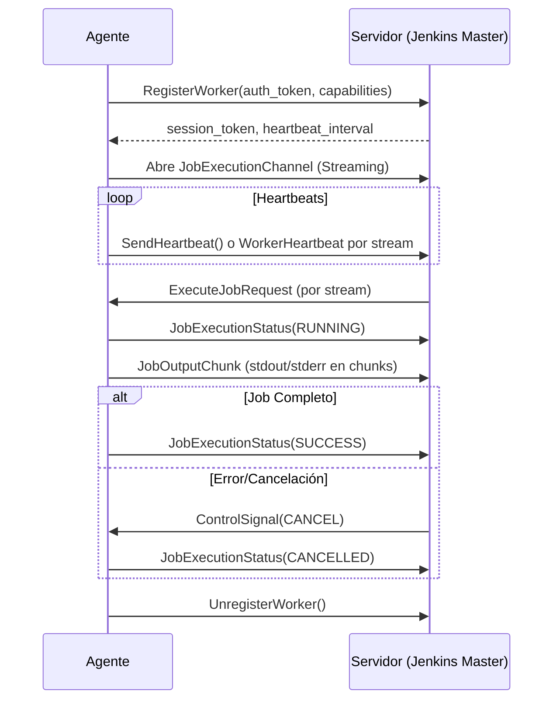

### Comparación con Jenkins y Agentes Efímeros JNLP

El protocolo propuesto **cumple con los mismos principios fundamentales** que Jenkins para agentes efímeros JNLP, pero con un enfoque más moderno y eficiente gracias a gRPC/HTTP2. Aquí el análisis detallado:

---

#### **1. Similitudes Clave con Jenkins JNLP**
| **Funcionalidad**          | **Jenkins JNLP**                          | **Este Protocolo**                     |
|----------------------------|-------------------------------------------|----------------------------------------|
| **Conexión Inicial**       | Agente inicia conexión con maestro        | `RegisterWorker` (handshake inicial)   |
| **Autenticación**          | Token secreto compartido                  | `auth_token` en registro               |
| **Heartbeats**             | Paquetes de keep-alive periódicos         | `SendHeartbeat` RPC                    |
| **Canal de Comandos**      | Conexión persistente bidireccional (TCP)  | `JobExecutionChannel` (stream gRPC)    |
| **Ejecución de Tareas**    | Maestro envía jobs a agentes              | `ExecuteJobRequest` en streaming       |
| **Salida en Tiempo Real**  | Stream de stdout/stderr                   | `JobOutputChunk` en streaming          |
| **Control Remoto**         | Señales de interrupción (kill)            | `ControlSignal` (cancelar/pausar)      |
| **Agentes Efímeros**       | Desconexión automática al finalizar       | `UnregisterWorker` RPC                 |

---

#### **2. Ventajas sobre Jenkins JNLP**
- **Protocolo Moderno**:
    - Usa **gRPC/HTTP2** (multiplexación sobre 1 conexión) vs. protocolo propietario de Jenkins.
    - Soporte nativo para **streaming bidireccional** sin reiniciar conexiones.

- **Tipado Fuerte**:
    - Estructuras bien definidas con Protobuf (vs. serialización ad-hoc en Jenkins).

- **Parámetros Enriquecidos**:
    - Soporta tipos complejos (archivos, JSON, contraseñas) directamente en el protocolo.

- **Control Granular**:
    - Señales específicas para `CANCELAR`, `PAUSAR` o `REANUDAR` jobs (Jenkins solo tiene kill).

- **Monitoreo Incorporado**:
    - Servicios para listar workers (`ListWorkers`) y ver estado detallado (`GetWorkerInfo`).

---

#### **3. Flujo de Agente Efímero (Como Jenkins)**

---

#### **4. Conexiones por Worker**
1. **1 Conexión Persistente**:
    - HTTP/2 para `JobExecutionChannel` (multiplexa todo el tráfico).
    - Transporta: jobs, output, señales de control y heartbeats.

2. **Conexiones Cortas**:
    - `RegisterWorker` (1 vez al inicio).
    - `UnregisterWorker` (1 vez al final).
    - `SendHeartbeat` (opcional, puede usarse sobre el stream principal).

**Total**: Máximo **2-3 conexiones simultáneas** por worker (vs. múltiples conexiones ad-hoc en Jenkins).

---

#### **5. Mejoras Recomendadas para Equiparar Jenkins**
Para cumplir al 100% con el modelo Jenkins, agregaría:
1. **Reconexión Automática**:
    - Mecanismo para restablecer `JobExecutionChannel` si se cae.

2. **Descarga de Artefactos**:
    - Servicio RPC para subir/descargar archivos post-ejecución.

3. **Labels/Etiquetas**:
    - Extender `capabilities` en workers para soportar etiquetas estilo Jenkins (`linux`, `docker`, etc).

4. **Retry Policies**:
    - Configuración de reintentos para jobs fallidos en el servidor.

---

### Conclusión
**Sí, cumple con el modelo de agentes efímeros de Jenkins**, pero con ventajas técnicas significativas:
- ✔️ Más eficiente (1 conexión persistente vs. múltiples en Jenkins).
- ✔️ Mejor tipado y estructura.
- ✔️ Control más granular de jobs.
- ✔️ Extensible para entornos cloud-native (Kubernetes, serverless).

