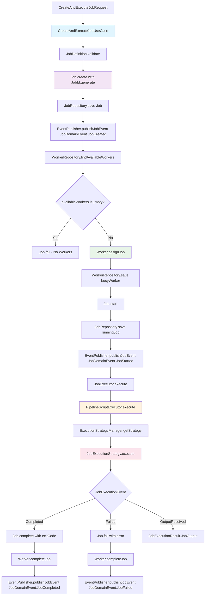
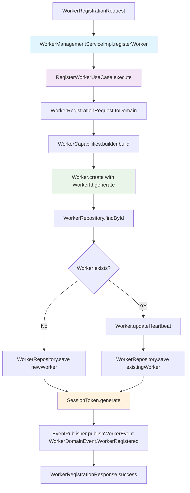
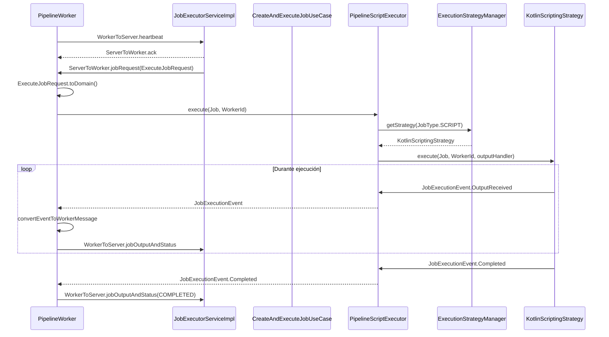
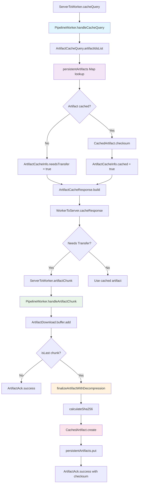
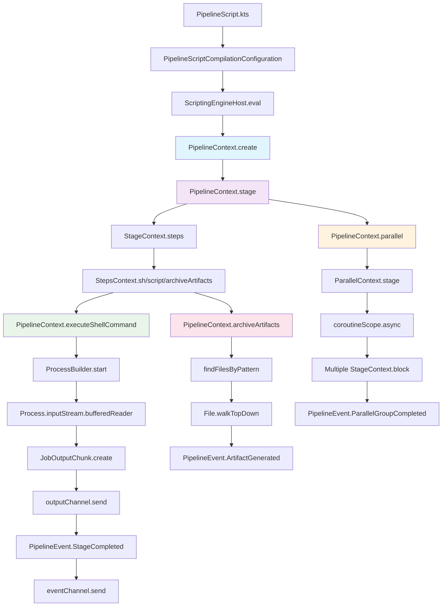
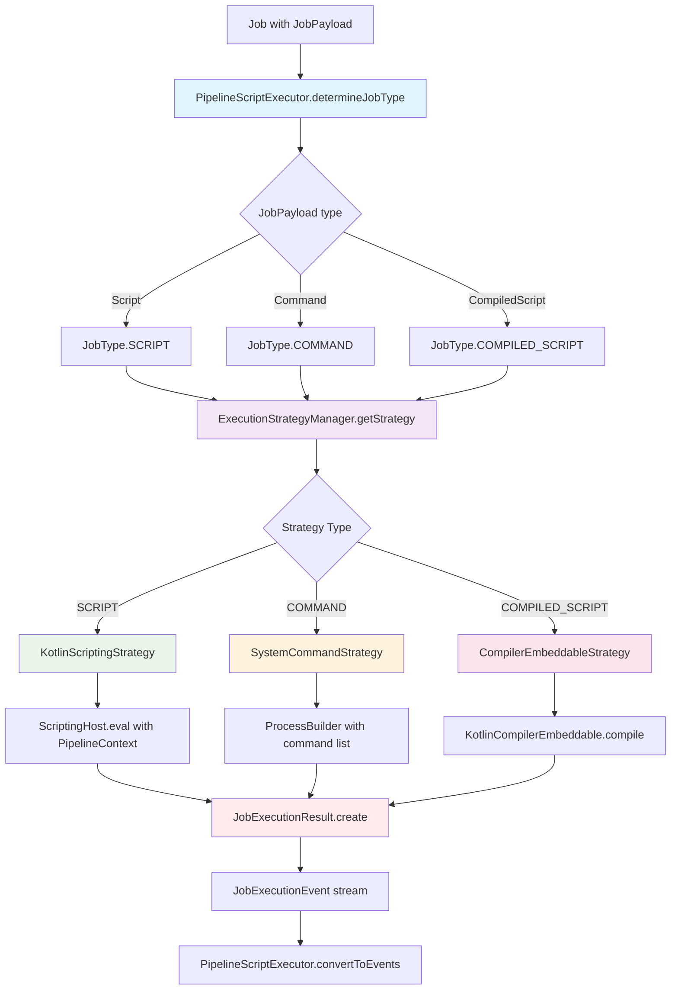
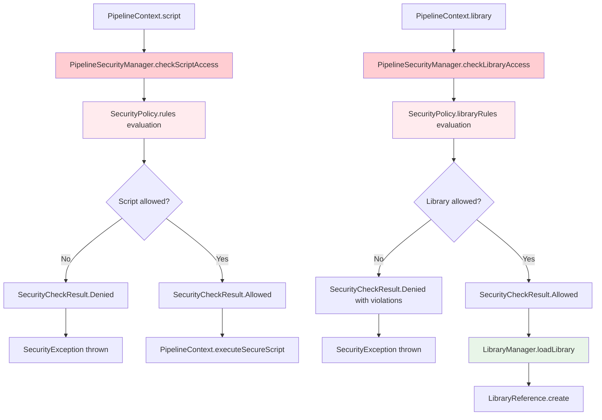
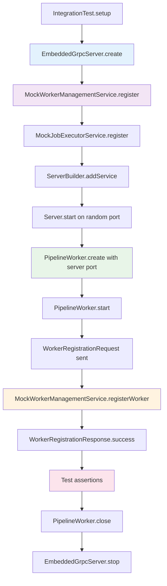

# Diagramas de Flujo Detallados - Hodei Pipelines

## 1. Flujo Completo de Creación y Ejecución de Job

## 2. Flujo de Registro de Worker

## 3. Flujo de Comunicación Worker-Server

## 4. Flujo del Sistema de Cache de Artefactos

## 5. Flujo de Ejecución de DSL Pipeline

## 6. Flujo de Estrategias de Ejecución

## 7. Flujo de Gestión de Seguridad

## 8. Flujo de Testing con Embedded gRPC

## Clases Principales por Módulo

### Core Domain
- `Job`, `JobId`, `JobDefinition`, `JobStatus`, `JobExecution`
- `Worker`, `WorkerId`, `WorkerCapabilities`, `WorkerStatus`
- `JobScheduler`, `WorkerPool`, `ScalingPolicy`

### Core Application
- `CreateAndExecuteJobUseCase`
- `RegisterWorkerUseCase`
- `JobExecutionResult`, `CreateAndExecuteJobRequest`

### Core Infrastructure
- `InMemoryJobRepository`, `InMemoryWorkerRepository`
- `InMemoryEventPublisher`, `InMemoryJobExecutionService`
- `InMemoryConfiguration`

### Backend Infrastructure
- `JobExecutorServiceImpl`, `WorkerManagementServiceImpl`
- `JobMappers`, `WorkerMappers`
- `SimpleKubernetesOrchestrator`, `WorkerPoolManagerImpl`

### Worker Domain
- `PipelineContext`, `StageContext`, `DSLDefinition`
- `Library`, `LibraryManager`, `SecurityPolicy`
- `JobExecutionStrategy`, `ExecutionStrategyManager`

### Worker Infrastructure
- `PipelineWorker`, `PipelineScriptExecutor`
- `KotlinScriptingStrategy`, `SystemCommandStrategy`, `CompilerEmbeddableStrategy`
- `DefaultExecutionStrategyManager`, `PipelineSecurityManager`

### Worker Application
- `PipelineWorkerApp`, `WorkerConfiguration`
- `DefaultLibraryManager`, `DockerExtension`, `GitExtension`

Estos diagramas muestran exactamente qué clases se utilizan en cada paso del flujo y cómo interactúan entre sí.