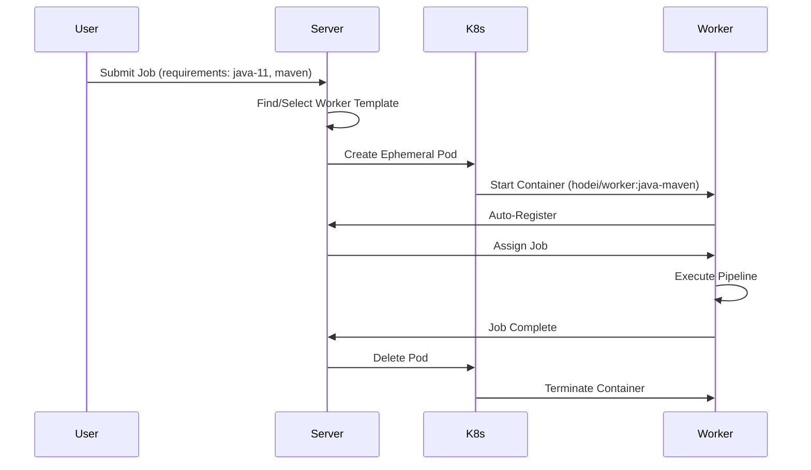

# 🎯 Roadmap: Workers Efímeros Jenkins-Like

## **Objetivo**
Implementar workers efímeros que se crean dinámicamente por job y se destruyen automáticamente, igual que los agentes efímeros de Jenkins en Kubernetes/Docker.

---

## **Estado Actual vs. Objetivo**

### ✅ **LO QUE TENEMOS**
- **PipelineWorker**: Cliente gRPC completo 
- **Worker Registration**: Auto-registro con capacidades
- **Job Execution**: Ejecución de pipeline DSL
- **SimpleKubernetesOrchestrator**: Mock funcional

### ❌ **LO QUE FALTA**
- **Dynamic Worker Creation**: Workers creados on-demand por job
- **Real Kubernetes Integration**: Client real para crear/destruir Pods
- **Worker Templates**: Especialización por tecnología 
- **Auto-Destroy**: Cleanup automático post-ejecución
- **Smart Worker Selection**: Matching job requirements → worker capabilities

---

## **Arquitectura Objetivo**



---

## **🚀 IMPLEMENTACIÓN POR FASES**

### **FASE 1: Real Kubernetes Integration** (1 semana)

#### **1.1 Añadir Kubernetes Client**
```toml
# libs.versions.toml
kubernetes-client = "18.0.0"
```

```kotlin
# backend/infrastructure/build.gradle.kts
implementation("io.kubernetes:client-java:${libs.versions.kubernetes.client}")
```

#### **1.2 Implementar RealKubernetesOrchestrator**
```kotlin
// backend/infrastructure/src/main/kotlin/.../orchestration/RealKubernetesOrchestrator.kt
class RealKubernetesOrchestrator(
    private val kubernetesClient: KubernetesClient,
    private val namespace: String = "hodei-workers"
) : WorkerOrchestrator {
    
    override suspend fun createWorker(template: WorkerTemplate, poolId: WorkerPoolId): WorkerCreationResult {
        val podName = "hodei-worker-${UUID.randomUUID()}"
        
        val pod = V1Pod().apply {
            metadata = V1ObjectMeta().apply {
                name = podName
                namespace = this@RealKubernetesOrchestrator.namespace
                labels = mapOf(
                    "app" to "hodei-ephemeral-worker",
                    "template-id" to template.id.value,
                    "pool-id" to poolId.value,
                    "managed-by" to "hodei-server"
                )
            }
            spec = V1PodSpec().apply {
                containers = listOf(V1Container().apply {
                    name = "worker"
                    image = template.image
                    env = listOf(
                        V1EnvVar().name("SERVER_HOST").value("hodei-server.hodei-system"),
                        V1EnvVar().name("SERVER_PORT").value("9090"),
                        V1EnvVar().name("EPHEMERAL_MODE").value("true"),
                        V1EnvVar().name("WORKER_NAME").value(podName),
                        V1EnvVar().name("WORKER_CAPABILITIES").value(template.capabilities.joinToString(","))
                    )
                    resources = V1ResourceRequirements().apply {
                        requests = mapOf(
                            "cpu" to Quantity(template.resources.cpu),
                            "memory" to Quantity(template.resources.memory)
                        )
                        limits = mapOf(
                            "cpu" to Quantity(template.resources.cpuLimit ?: template.resources.cpu),
                            "memory" to Quantity(template.resources.memoryLimit ?: template.resources.memory)
                        )
                    }
                })
                restartPolicy = "Never"
                ttlSecondsAfterFinished = 300 // Auto-cleanup 5 min
                serviceAccountName = "hodei-worker"
            }
        }
        
        return try {
            val createdPod = kubernetesClient.core().v1().pods()
                .inNamespace(namespace)
                .create(pod)
            
            logger.info { "Created ephemeral worker pod: $podName" }
            WorkerCreationResult.Success(podToWorker(createdPod, template))
        } catch (e: Exception) {
            logger.error(e) { "Failed to create worker pod: $podName" }
            WorkerCreationResult.Failed("K8s pod creation failed: ${e.message}", e)
        }
    }
    
    override suspend fun deleteWorker(workerId: WorkerId): WorkerDeletionResult {
        return try {
            kubernetesClient.core().v1().pods()
                .inNamespace(namespace)
                .withLabel("worker-id", workerId.value)
                .delete()
            
            logger.info { "Deleted ephemeral worker: ${workerId.value}" }
            WorkerDeletionResult.Success
        } catch (e: Exception) {
            logger.error(e) { "Failed to delete worker: ${workerId.value}" }
            WorkerDeletionResult.Failed("K8s pod deletion failed: ${e.message}", e)
        }
    }
}
```

#### **1.3 Kubernetes RBAC Setup**
```yaml
# k8s/rbac.yaml
apiVersion: v1
kind: ServiceAccount
metadata:
  name: hodei-server
  namespace: hodei-system
---
apiVersion: rbac.authorization.k8s.io/v1
kind: ClusterRole
metadata:
  name: hodei-worker-manager
rules:
- apiGroups: [""]
  resources: ["pods"]
  verbs: ["create", "delete", "get", "list", "watch"]
- apiGroups: [""]
  resources: ["pods/log"]
  verbs: ["get"]
---
apiVersion: rbac.authorization.k8s.io/v1
kind: ClusterRoleBinding
metadata:
  name: hodei-server-worker-manager
roleRef:
  apiGroup: rbac.authorization.k8s.io
  kind: ClusterRole
  name: hodei-worker-manager
subjects:
- kind: ServiceAccount
  name: hodei-server
  namespace: hodei-system
```

---

### **FASE 2: Worker Templates System** (1 semana)

#### **2.1 Domain Models**
```kotlin
// core/domain/src/main/kotlin/.../orchestration/WorkerTemplate.kt
@JvmInline
value class WorkerTemplateId(val value: String)

data class WorkerTemplate(
    val id: WorkerTemplateId,
    val name: String,
    val description: String,
    val image: String,
    val capabilities: Set<String>,
    val resources: ResourceRequirements,
    val environment: Map<String, String> = emptyMap(),
    val timeoutMinutes: Int = 30,
    val maxConcurrentJobs: Int = 5
) {
    fun matches(requirements: WorkerRequirements): Boolean {
        return requirements.labels.all { label ->
            capabilities.contains(label)
        }
    }
    
    fun generateWorkerName(): String {
        return "hodei-${id.value}-${System.currentTimeMillis()}"
    }
}

data class ResourceRequirements(
    val cpu: String,
    val memory: String,
    val cpuLimit: String? = null,
    val memoryLimit: String? = null,
    val storage: String? = null
)

data class WorkerRequirements(
    val labels: Set<String> = emptySet(),
    val minCpu: String = "500m",
    val minMemory: String = "1Gi",
    val preferredTemplate: WorkerTemplateId? = null,
    val maxWaitTime: Duration = Duration.ofMinutes(5)
)
```

#### **2.2 Built-in Templates**
```kotlin
// core/domain/src/main/kotlin/.../orchestration/BuiltInWorkerTemplates.kt
object BuiltInWorkerTemplates {
    val JAVA_MAVEN = WorkerTemplate(
        id = WorkerTemplateId("java-maven"),
        name = "Java Maven Worker",
        description = "Java 17 + Maven 3.8 + Git",
        image = "hodei/worker:java-maven-latest",
        capabilities = setOf("java-17", "maven-3.8", "git", "linux"),
        resources = ResourceRequirements(
            cpu = "1",
            memory = "2Gi",
            cpuLimit = "2",
            memoryLimit = "4Gi"
        )
    )
    
    val NODE_NPM = WorkerTemplate(
        id = WorkerTemplateId("node-npm"),
        name = "Node.js NPM Worker",
        description = "Node.js 18 + NPM + Yarn + Git",
        image = "hodei/worker:node-18-latest",
        capabilities = setOf("node-18", "npm", "yarn", "git", "linux"),
        resources = ResourceRequirements(
            cpu = "500m",
            memory = "1Gi",
            cpuLimit = "1",
            memoryLimit = "2Gi"
        )
    )
    
    val DOCKER_IN_DOCKER = WorkerTemplate(
        id = WorkerTemplateId("docker-dind"),
        name = "Docker-in-Docker Worker", 
        description = "Docker + Kubernetes CLI + Helm + Git",
        image = "hodei/worker:docker-dind-latest",
        capabilities = setOf("docker", "kubernetes", "helm", "git", "linux"),
        resources = ResourceRequirements(
            cpu = "2",
            memory = "4Gi",
            cpuLimit = "4",
            memoryLimit = "8Gi"
        ),
        environment = mapOf(
            "DOCKER_TLS_CERTDIR" to "/certs",
            "DOCKER_DRIVER" to "overlay2"
        )
    )
    
    val PYTHON_PIP = WorkerTemplate(
        id = WorkerTemplateId("python-pip"),
        name = "Python Worker",
        description = "Python 3.11 + Pip + Poetry + Git",
        image = "hodei/worker:python-3.11-latest",
        capabilities = setOf("python-3.11", "pip", "poetry", "git", "linux"),
        resources = ResourceRequirements(
            cpu = "500m",
            memory = "1Gi"
        )
    )
    
    val GO_BUILD = WorkerTemplate(
        id = WorkerTemplateId("go-build"),
        name = "Go Build Worker",
        description = "Go 1.21 + Git + Docker",
        image = "hodei/worker:go-1.21-latest", 
        capabilities = setOf("go-1.21", "git", "docker", "linux"),
        resources = ResourceRequirements(
            cpu = "1",
            memory = "2Gi"
        )
    )
    
    fun getAll(): List<WorkerTemplate> = listOf(
        JAVA_MAVEN, NODE_NPM, DOCKER_IN_DOCKER, PYTHON_PIP, GO_BUILD
    )
    
    fun findById(id: WorkerTemplateId): WorkerTemplate? {
        return getAll().find { it.id == id }
    }
    
    fun findByCapabilities(capabilities: Set<String>): List<WorkerTemplate> {
        return getAll().filter { template ->
            capabilities.all { cap -> template.capabilities.contains(cap) }
        }
    }
}
```

#### **2.3 Template Repository**
```kotlin
// core/infrastructure/src/main/kotlin/.../repository/InMemoryWorkerTemplateRepository.kt
interface WorkerTemplateRepository {
    suspend fun findById(id: WorkerTemplateId): WorkerTemplate?
    suspend fun findByCapabilities(capabilities: Set<String>): List<WorkerTemplate>
    suspend fun findAll(): List<WorkerTemplate>
    suspend fun save(template: WorkerTemplate): Result<WorkerTemplate>
    suspend fun delete(id: WorkerTemplateId): Result<Unit>
}

class InMemoryWorkerTemplateRepository : WorkerTemplateRepository {
    private val templates = ConcurrentHashMap<WorkerTemplateId, WorkerTemplate>()
    
    init {
        // Load built-in templates
        BuiltInWorkerTemplates.getAll().forEach { template ->
            templates[template.id] = template
        }
    }
    
    override suspend fun findById(id: WorkerTemplateId): WorkerTemplate? {
        return templates[id]
    }
    
    override suspend fun findByCapabilities(capabilities: Set<String>): List<WorkerTemplate> {
        return templates.values.filter { template ->
            capabilities.all { cap -> template.capabilities.contains(cap) }
        }
    }
    
    override suspend fun findAll(): List<WorkerTemplate> {
        return templates.values.toList()
    }
    
    override suspend fun save(template: WorkerTemplate): Result<WorkerTemplate> {
        return try {
            templates[template.id] = template
            Result.success(template)
        } catch (e: Exception) {
            Result.failure(e)
        }
    }
    
    override suspend fun delete(id: WorkerTemplateId): Result<Unit> {
        return try {
            templates.remove(id)
            Result.success(Unit)
        } catch (e: Exception) {
            Result.failure(e)
        }
    }
}
```

---

### **FASE 3: Ephemeral Worker Manager** (1 semana)

#### **3.1 Dynamic Worker Provisioning**
```kotlin
// core/application/src/main/kotlin/.../EphemeralWorkerManager.kt
class EphemeralWorkerManager(
    private val workerOrchestrator: WorkerOrchestrator,
    private val workerRepository: WorkerRepository,
    private val templateRepository: WorkerTemplateRepository,
    private val eventPublisher: EventPublisher
) {
    private val logger = KotlinLogging.logger {}
    private val activeEphemeralWorkers = ConcurrentHashMap<WorkerId, EphemeralWorkerInfo>()
    
    data class EphemeralWorkerInfo(
        val workerId: WorkerId,
        val templateId: WorkerTemplateId,
        val jobId: JobId?,
        val createdAt: Instant,
        val autoDestroyAfterJob: Boolean = true,
        val maxIdleTimeMinutes: Int = 10
    )
    
    suspend fun createWorkerForJob(job: Job): WorkerCreationResult {
        logger.info { "Creating ephemeral worker for job ${job.id.value}" }
        
        try {
            // 1. Find best template for job requirements
            val template = selectBestTemplate(job.definition.requirements)
                ?: return WorkerCreationResult.NoSuitableTemplate(job.definition.requirements)
            
            logger.debug { "Selected template ${template.id.value} for job ${job.id.value}" }
            
            // 2. Create worker using orchestrator
            val result = workerOrchestrator.createWorker(template, WorkerPoolId("ephemeral"))
            
            return when (result) {
                is WorkerCreationResult.Success -> {
                    val worker = result.worker
                    
                    // 3. Register as ephemeral worker
                    registerEphemeralWorker(worker.id, template.id, job.id)
                    
                    // 4. Save to repository
                    workerRepository.save(worker)
                    
                    // 5. Schedule auto-destroy
                    scheduleAutoDestroy(worker.id, template.timeoutMinutes)
                    
                    // 6. Emit event
                    eventPublisher.publishWorkerEvent(
                        WorkerDomainEvent.EphemeralWorkerCreated(worker, job.id, template.id)
                    )
                    
                    logger.info { "Ephemeral worker ${worker.id.value} created successfully for job ${job.id.value}" }
                    result
                }
                else -> result
            }
        } catch (e: Exception) {
            logger.error(e) { "Failed to create ephemeral worker for job ${job.id.value}" }
            return WorkerCreationResult.Failed("Ephemeral worker creation failed: ${e.message}", e)
        }
    }
    
    private suspend fun selectBestTemplate(requirements: WorkerRequirements): WorkerTemplate? {
        // 1. Try preferred template first
        requirements.preferredTemplate?.let { templateId ->
            val template = templateRepository.findById(templateId)
            if (template?.matches(requirements) == true) {
                return template
            }
        }
        
        // 2. Find templates that match all required labels
        val candidateTemplates = templateRepository.findByCapabilities(requirements.labels)
        
        // 3. Score and select best template
        return candidateTemplates.maxByOrNull { template ->
            var score = 0
            
            // Score by capability match (more is better)
            score += requirements.labels.count { template.capabilities.contains(it) } * 10
            
            // Score by resource efficiency (prefer smaller resources if sufficient)
            if (parseResourceValue(template.resources.cpu) >= parseResourceValue(requirements.minCpu)) {
                score += 5
            }
            if (parseResourceValue(template.resources.memory) >= parseResourceValue(requirements.minMemory)) {
                score += 5
            }
            
            // Prefer templates with exact capability matches
            if (template.capabilities.size == requirements.labels.size) {
                score += 20
            }
            
            score
        }
    }
    
    suspend fun destroyWorkerAfterJob(workerId: WorkerId, jobId: JobId) {
        val ephemeralInfo = activeEphemeralWorkers[workerId]
        if (ephemeralInfo?.autoDestroyAfterJob == true && ephemeralInfo.jobId == jobId) {
            destroyWorker(workerId, "job completed")
        }
    }
    
    private suspend fun destroyWorker(workerId: WorkerId, reason: String) {
        try {
            logger.info { "Destroying ephemeral worker ${workerId.value}: $reason" }
            
            // 1. Remove from tracking
            val ephemeralInfo = activeEphemeralWorkers.remove(workerId)
            
            // 2. Signal graceful shutdown to worker
            try {
                // Give worker 30 seconds to finish current operations
                workerRepository.findById(workerId)?.let { worker ->
                    eventPublisher.publishWorkerEvent(
                        WorkerDomainEvent.WorkerShutdownRequested(worker, reason)
                    )
                }
                delay(30.seconds)
            } catch (e: Exception) {
                logger.warn(e) { "Failed to signal graceful shutdown to worker ${workerId.value}" }
            }
            
            // 3. Force destroy via orchestrator
            val result = workerOrchestrator.deleteWorker(workerId)
            when (result) {
                is WorkerDeletionResult.Success -> {
                    logger.info { "Ephemeral worker ${workerId.value} destroyed successfully" }
                }
                is WorkerDeletionResult.Failed -> {
                    logger.error { "Failed to destroy ephemeral worker ${workerId.value}: ${result.error}" }
                }
                is WorkerDeletionResult.NotFound -> {
                    logger.warn { "Ephemeral worker ${workerId.value} not found during destruction" }
                }
            }
            
            // 4. Cleanup from repository
            workerRepository.delete(workerId)
            
            // 5. Emit event
            ephemeralInfo?.let { info ->
                eventPublisher.publishWorkerEvent(
                    WorkerDomainEvent.EphemeralWorkerDestroyed(workerId, info.templateId, reason)
                )
            }
            
        } catch (e: Exception) {
            logger.error(e) { "Error destroying ephemeral worker ${workerId.value}" }
        }
    }
    
    private fun registerEphemeralWorker(workerId: WorkerId, templateId: WorkerTemplateId, jobId: JobId?) {
        activeEphemeralWorkers[workerId] = EphemeralWorkerInfo(
            workerId = workerId,
            templateId = templateId,
            jobId = jobId,
            createdAt = Instant.now()
        )
    }
    
    private fun scheduleAutoDestroy(workerId: WorkerId, timeoutMinutes: Int) {
        CoroutineScope(Dispatchers.Default).launch {
            delay(timeoutMinutes.minutes)
            if (activeEphemeralWorkers.containsKey(workerId)) {
                destroyWorker(workerId, "timeout after ${timeoutMinutes} minutes")
            }
        }
    }
    
    private fun parseResourceValue(resource: String): Double {
        return when {
            resource.endsWith("m") -> resource.dropLast(1).toDouble() / 1000
            resource.endsWith("Mi") -> resource.dropLast(2).toDouble() * 1024 * 1024
            resource.endsWith("Gi") -> resource.dropLast(2).toDouble() * 1024 * 1024 * 1024
            else -> resource.toDoubleOrNull() ?: 0.0
        }
    }
}
```

#### **3.2 Integration con Job Execution**
```kotlin
// Modificar CreateAndExecuteJobUseCase para usar ephemeral workers
class CreateAndExecuteJobUseCase(
    private val jobRepository: JobRepository,
    private val workerRepository: WorkerRepository,
    private val jobExecutor: JobExecutor,
    private val eventPublisher: EventPublisher,
    private val ephemeralWorkerManager: EphemeralWorkerManager // ❗ Nuevo
) {
    
    suspend fun execute(request: CreateAndExecuteJobRequest): Flow<JobExecutionResult> = flow {
        // ... existing job creation logic ...
        
        // 2. Find or create worker
        logger.debug { "Finding or creating worker for job: ${job.id.value}" }
        
        // Try to find existing available worker first
        val existingWorker = findAvailableWorker(job.definition.requirements)
        
        val selectedWorker = if (existingWorker != null) {
            logger.info { "Using existing worker ${existingWorker.id.value} for job: ${job.id.value}" }
            existingWorker
        } else {
            // Create ephemeral worker
            logger.info { "Creating ephemeral worker for job: ${job.id.value}" }
            val creationResult = ephemeralWorkerManager.createWorkerForJob(job)
            
            when (creationResult) {
                is WorkerCreationResult.Success -> creationResult.worker
                is WorkerCreationResult.Failed -> {
                    val failedJob = job.fail("Failed to create worker: ${creationResult.error}", -1)
                    jobRepository.save(failedJob)
                    eventPublisher.publishJobEvent(JobDomainEvent.JobFailed(failedJob))
                    emit(JobExecutionResult.JobFailed(job.id, "Failed to create worker"))
                    return@flow
                }
                else -> {
                    val failedJob = job.fail("No suitable worker available", -1)
                    jobRepository.save(failedJob)
                    eventPublisher.publishJobEvent(JobDomainEvent.JobFailed(failedJob))
                    emit(JobExecutionResult.JobFailed(job.id, "No suitable worker available"))
                    return@flow
                }
            }
        }
        
        // ... rest of existing execution logic ...
        
        // At the end, handle ephemeral worker cleanup
        jobExecutor.execute(runningJob, selectedWorker.id).collect { event ->
            when (event) {
                is JobExecutionEvent.Completed -> {
                    // ... existing completion logic ...
                    
                    // Destroy ephemeral worker after job completion
                    ephemeralWorkerManager.destroyWorkerAfterJob(selectedWorker.id, job.id)
                }
                is JobExecutionEvent.Failed -> {
                    // ... existing failure logic ...
                    
                    // Destroy ephemeral worker after job failure
                    ephemeralWorkerManager.destroyWorkerAfterJob(selectedWorker.id, job.id)
                }
                // ... other events ...
            }
        }
    }
    
    private suspend fun findAvailableWorker(requirements: WorkerRequirements): Worker? {
        val availableWorkers = workerRepository.findAvailableWorkers().getOrNull() ?: emptyList()
        
        return availableWorkers.find { worker ->
            // Check if worker capabilities match requirements
            requirements.labels.all { label ->
                worker.capabilities.hasLabel(label) || 
                worker.capabilities.toMap().containsValue(label)
            }
        }
    }
}
```

---

### **FASE 4: Enhanced Pipeline DSL** (1 semana)

#### **4.1 Agent Specification DSL**
```kotlin
// worker/domain/src/main/kotlin/.../dsl/AgentSpec.kt
sealed class AgentSpec {
    data class Label(val expression: String) : AgentSpec()
    data class Template(val templateId: WorkerTemplateId) : AgentSpec()
    data class Docker(
        val image: String,
        val args: List<String> = emptyList(),
        val reuseNode: Boolean = false
    ) : AgentSpec()
    data class Kubernetes(
        val yaml: String? = null,
        val template: WorkerTemplateId? = null
    ) : AgentSpec()
    object Any : AgentSpec()
    object None : AgentSpec()
}

// Enhanced DSL context
class PipelineContext {
    var agent: AgentSpec = AgentSpec.Any
    
    fun agent(spec: AgentSpec) {
        this.agent = spec
    }
    
    fun agent(block: AgentBuilder.() -> AgentSpec) {
        this.agent = AgentBuilder().block()
    }
}

class AgentBuilder {
    fun label(expression: String) = AgentSpec.Label(expression)
    fun template(templateId: String) = AgentSpec.Template(WorkerTemplateId(templateId))
    fun docker(image: String, args: List<String> = emptyList()) = AgentSpec.Docker(image, args)
    fun kubernetes(yaml: String) = AgentSpec.Kubernetes(yaml = yaml)
    fun any() = AgentSpec.Any
    fun none() = AgentSpec.None
}
```

#### **4.2 Label Expression Parser**
```kotlin
// worker/infrastructure/src/main/kotlin/.../dsl/LabelExpressionParser.kt
class LabelExpressionParser {
    
    fun parseExpression(expression: String): Set<String> {
        // Parse Jenkins-style label expressions like "linux && java-11 && !windows"
        // For MVP, implement simple AND logic
        return expression
            .split("&&")
            .map { it.trim() }
            .filter { !it.startsWith("!") } // Ignore negations for MVP
            .toSet()
    }
    
    fun evaluateExpression(expression: String, workerCapabilities: Set<String>): Boolean {
        val requiredLabels = parseExpression(expression)
        return requiredLabels.all { label ->
            workerCapabilities.contains(label)
        }
    }
}
```

#### **4.3 DSL Integration**
```kotlin
// Usage examples in pipeline scripts
pipeline {
    agent { 
        label("linux && java-11 && maven") 
    }
    
    stages {
        stage("Build") {
            steps {
                sh("./mvn clean package")
            }
        }
        
        stage("Docker Build") {
            agent { 
                template("docker-dind") 
            }
            steps {
                sh("docker build -t myapp .")
            }
        }
        
        stage("Integration Tests") {
            agent {
                docker("postgres:13") 
            }
            steps {
                sh("./run-integration-tests.sh")
            }
        }
    }
}
```

---

### **FASE 5: Container Images** (1 semana)

#### **5.1 Base Worker Image**
```dockerfile
# docker/base/Dockerfile
FROM openjdk:17-jdk-slim

# Install common utilities
RUN apt-get update && apt-get install -y \
    git \
    curl \
    wget \
    unzip \
    ca-certificates \
    && rm -rf /var/lib/apt/lists/*

# Create worker user
RUN useradd -m -s /bin/bash worker

# Copy worker application
COPY hodei-worker.jar /app/
COPY entrypoint.sh /usr/local/bin/
RUN chmod +x /usr/local/bin/entrypoint.sh

USER worker
WORKDIR /home/worker

ENTRYPOINT ["/usr/local/bin/entrypoint.sh"]
```

```bash
#!/bin/bash
# docker/base/entrypoint.sh
set -e

# Set default values if not provided
export WORKER_ID=${WORKER_ID:-${HOSTNAME}}
export WORKER_NAME=${WORKER_NAME:-"Worker-${HOSTNAME}"}
export SERVER_HOST=${SERVER_HOST:-hodei-server}
export SERVER_PORT=${SERVER_PORT:-9090}

# Parse capabilities from environment
if [ -n "$WORKER_CAPABILITIES" ]; then
    export WORKER_LABELS="$WORKER_CAPABILITIES"
fi

echo "Starting Hodei Worker..."
echo "  Worker ID: $WORKER_ID"
echo "  Worker Name: $WORKER_NAME"
echo "  Server: $SERVER_HOST:$SERVER_PORT"
echo "  Capabilities: $WORKER_CAPABILITIES"

# Start worker
exec java -jar /app/hodei-worker.jar \
    --worker-id "$WORKER_ID" \
    --worker-name "$WORKER_NAME" \
    --server-host "$SERVER_HOST" \
    --server-port "$SERVER_PORT"
```

#### **5.2 Specialized Worker Images**
```dockerfile
# docker/java-maven/Dockerfile
FROM hodei/worker:base

USER root

# Install Java build tools
RUN apt-get update && apt-get install -y \
    maven \
    gradle \
    && rm -rf /var/lib/apt/lists/*

# Install specific Java versions if needed
RUN curl -s "https://get.sdkman.io" | bash && \
    bash -c "source /root/.sdkman/bin/sdkman-init.sh && \
    sdk install java 11.0.21-amzn && \
    sdk install java 17.0.9-amzn"

USER worker

ENV WORKER_CAPABILITIES="java-17,java-11,maven-3.8,gradle,git,linux"
ENV JAVA_HOME="/usr/lib/jvm/java-17-openjdk-amd64"
ENV PATH="$JAVA_HOME/bin:$PATH"
```

```dockerfile
# docker/node-npm/Dockerfile  
FROM node:18-slim

# Install Java for worker runtime
RUN apt-get update && apt-get install -y \
    openjdk-17-jre-headless \
    git \
    curl \
    && rm -rf /var/lib/apt/lists/*

# Install Yarn
RUN npm install -g yarn

# Copy worker application
COPY hodei-worker.jar /app/
COPY entrypoint.sh /usr/local/bin/
RUN chmod +x /usr/local/bin/entrypoint.sh

ENV WORKER_CAPABILITIES="node-18,npm,yarn,git,linux"

USER node
WORKDIR /home/node

ENTRYPOINT ["/usr/local/bin/entrypoint.sh"]
```

```dockerfile
# docker/docker-dind/Dockerfile
FROM docker:24-dind

# Install Java for worker runtime
RUN apk add --no-cache \
    openjdk17-jre \
    git \
    curl \
    bash

# Install kubectl
RUN curl -LO "https://dl.k8s.io/release/$(curl -L -s https://dl.k8s.io/release/stable.txt)/bin/linux/amd64/kubectl" && \
    install -o root -g root -m 0755 kubectl /usr/local/bin/kubectl

# Install Helm
RUN curl https://raw.githubusercontent.com/helm/helm/main/scripts/get-helm-3 | bash

# Copy worker application
COPY hodei-worker.jar /app/
COPY entrypoint.sh /usr/local/bin/
RUN chmod +x /usr/local/bin/entrypoint.sh

ENV WORKER_CAPABILITIES="docker,kubernetes,helm,git,linux"

ENTRYPOINT ["/usr/local/bin/entrypoint.sh"]
```

#### **5.3 Build Script**
```bash
#!/bin/bash
# scripts/build-images.sh

set -e

REGISTRY=${REGISTRY:-"hodei"}
VERSION=${VERSION:-"latest"}

echo "Building Hodei Worker Images..."

# Build base image
echo "Building base worker image..."
docker build -t $REGISTRY/worker:base-$VERSION docker/base/
docker tag $REGISTRY/worker:base-$VERSION $REGISTRY/worker:base

# Build specialized images
echo "Building Java Maven worker image..."
docker build -t $REGISTRY/worker:java-maven-$VERSION docker/java-maven/
docker tag $REGISTRY/worker:java-maven-$VERSION $REGISTRY/worker:java-maven-latest

echo "Building Node.js worker image..."
docker build -t $REGISTRY/worker:node-18-$VERSION docker/node-npm/
docker tag $REGISTRY/worker:node-18-$VERSION $REGISTRY/worker:node-18-latest

echo "Building Docker-in-Docker worker image..."
docker build -t $REGISTRY/worker:docker-dind-$VERSION docker/docker-dind/
docker tag $REGISTRY/worker:docker-dind-$VERSION $REGISTRY/worker:docker-dind-latest

echo "All images built successfully!"

# Optional: Push to registry
if [ "$PUSH" = "true" ]; then
    echo "Pushing images to registry..."
    docker push $REGISTRY/worker:base-$VERSION
    docker push $REGISTRY/worker:base
    docker push $REGISTRY/worker:java-maven-$VERSION  
    docker push $REGISTRY/worker:java-maven-latest
    docker push $REGISTRY/worker:node-18-$VERSION
    docker push $REGISTRY/worker:node-18-latest
    docker push $REGISTRY/worker:docker-dind-$VERSION
    docker push $REGISTRY/worker:docker-dind-latest
    echo "Images pushed successfully!"
fi
```

---

## **🎯 RESULTADO FINAL**

Con esta implementación tendremos un sistema completamente Jenkins-compatible:

### ✅ **Funcionalidades Implementadas**
- **Dynamic Worker Creation**: Workers creados automáticamente por job
- **Template-based Workers**: Especialización por tecnología (Java, Node, Docker, Python, Go)
- **Smart Worker Selection**: Matching automático job requirements → worker capabilities
- **Auto-Destroy**: Cleanup automático después de completar jobs
- **Jenkins-like DSL**: Agent selection con labels y templates
- **Real Kubernetes Integration**: Pods efímeros en cluster real
- **Container Images**: Imágenes especializadas para diferentes stacks

### ✅ **Ejemplo de Uso Final**
```kotlin
pipeline {
    agent { label("linux && java-11 && maven") }
    
    stages {
        stage("Build") {
            steps {
                sh("./mvn clean package")
            }
        }
        
        stage("Docker Build") {
            agent { template("docker-dind") }
            steps {
                sh("docker build -t myapp:${BUILD_NUMBER} .")
                sh("docker push myapp:${BUILD_NUMBER}")
            }
        }
        
        stage("Deploy") {
            agent { template("kubernetes-deploy") }
            steps {
                sh("helm upgrade --install myapp ./helm-chart")
            }
        }
    }
    
    post {
        always {
            // Workers se destruyen automáticamente
        }
    }
}
```

**Timeline Total**: **4-6 semanas** para workers efímeros completamente funcionales.

**Próximo Paso Recomendado**: Comenzar con **FASE 1** - Real Kubernetes Integration, ya que es la base para todo lo demás.