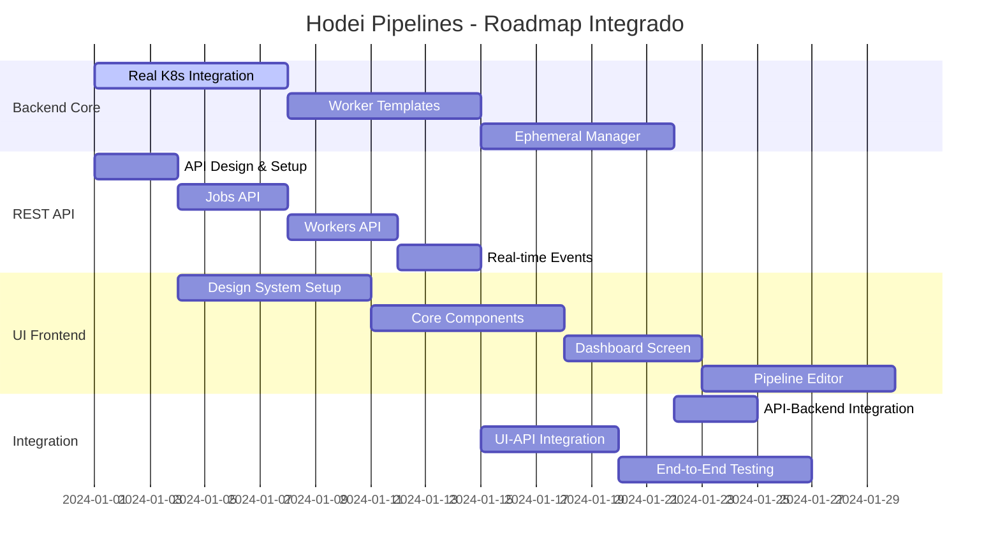

# 🚀 Roadmap Integrado: Workers Efímeros + API REST + UI

## **Objetivo Integrado**
Desarrollar un sistema completo de CI/CD con workers efímeros tipo Jenkins, API REST moderna y UI con Kotlin Compose Multiplatform, siguiendo el design system proporcionado.

---

## **📋 PLAN DE IMPLEMENTACIÓN COORDINADO**

### **ESTRATEGIA**: Desarrollo en paralelo con integración continua



---

## **FASE 1: FUNDACIÓN BACKEND + API** (Semana 1-2)

### **1.1 Real Kubernetes Integration + API Base** (Paralelo)

#### **Backend: Kubernetes Client Real**
```kotlin
// backend/infrastructure/build.gradle.kts
dependencies {
    implementation("io.kubernetes:client-java:18.0.0")
    implementation("io.ktor:ktor-server-netty:$ktorVersion")
    implementation("io.ktor:ktor-server-content-negotiation:$ktorVersion")
    implementation("io.ktor:ktor-server-sse:$ktorVersion")
}

// RealKubernetesOrchestrator implementation
class RealKubernetesOrchestrator(
    private val kubernetesClient: KubernetesClient
) : WorkerOrchestrator {
    override suspend fun createWorker(template: WorkerTemplate, poolId: WorkerPoolId): WorkerCreationResult {
        // Real K8s pod creation logic from ephemeral-workers-roadmap.md
    }
}
```

#### **REST API: Core Setup**
```kotlin
// backend/rest-api/src/main/kotlin/HodeiRestServer.kt
fun Application.configureHodeiApi() {
    install(ContentNegotiation) { json() }
    install(CORS) {
        allowHost("localhost:3000") // For UI development
        allowHeader(HttpHeaders.ContentType)
        allowMethod(HttpMethod.Options)
        allowMethod(HttpMethod.Get)
        allowMethod(HttpMethod.Post)
        allowMethod(HttpMethod.Put)
        allowMethod(HttpMethod.Delete)
    }
    install(SSE)
    
    routing {
        route("/api/v1") {
            jobsApi()
            workersApi()
            systemApi()
        }
    }
}

fun Route.jobsApi() {
    route("/jobs") {
        get {
            // List jobs with real-time capabilities
            val jobs = jobRepository.findAll().getOrNull() ?: emptyList()
            call.respond(jobs.map { it.toApiDto() })
        }
        
        post {
            val createRequest = call.receive<CreateJobApiRequest>()
            
            // Create job with ephemeral worker requirements
            val jobDefinition = JobDefinition(
                name = createRequest.name,
                payload = createRequest.payload.toDomain(),
                requirements = createRequest.requirements?.toDomain() ?: WorkerRequirements()
            )
            
            val job = Job(
                id = JobId.generate(),
                definition = jobDefinition
            )
            
            // Use enhanced CreateAndExecuteJobUseCase with ephemeral workers
            val result = createAndExecuteJobUseCase.execute(
                CreateAndExecuteJobRequest(jobDefinition)
            )
            
            call.respond(HttpStatusCode.Created, job.toApiDto())
        }
        
        route("/{id}") {
            get("/stream") {
                val jobId = call.parameters["id"] ?: return@get call.respond(HttpStatusCode.BadRequest)
                
                call.respondSse {
                    // Real-time job execution updates
                    jobExecutionEventStream(JobId(jobId)).collect { event ->
                        send(SseEvent(
                            data = Json.encodeToString(event.toApiDto()),
                            event = when (event) {
                                is JobExecutionEvent.Started -> "job-started"
                                is JobExecutionEvent.OutputReceived -> "job-output"
                                is JobExecutionEvent.Completed -> "job-completed"
                                is JobExecutionEvent.Failed -> "job-failed"
                                else -> "job-event"
                            }
                        ))
                    }
                }
            }
        }
    }
}

fun Route.workersApi() {
    route("/workers") {
        get {
            val workers = workerRepository.findAll().getOrNull() ?: emptyList()
            call.respond(workers.map { it.toApiDto() })
        }
        
        get("/templates") {
            // Get available worker templates for UI
            val templates = BuiltInWorkerTemplates.getAll()
            call.respond(templates.map { it.toApiDto() })
        }
        
        post("/ephemeral") {
            // Create ephemeral worker on-demand
            val request = call.receive<CreateEphemeralWorkerRequest>()
            val template = BuiltInWorkerTemplates.findById(WorkerTemplateId(request.templateId))
                ?: return@post call.respond(HttpStatusCode.BadRequest, "Template not found")
            
            val result = ephemeralWorkerManager.createWorkerForTemplate(template)
            when (result) {
                is WorkerCreationResult.Success -> {
                    call.respond(HttpStatusCode.Created, result.worker.toApiDto())
                }
                else -> {
                    call.respond(HttpStatusCode.InternalServerError, "Failed to create worker")
                }
            }
        }
        
        delete("/{id}") {
            val workerId = call.parameters["id"] ?: return@delete call.respond(HttpStatusCode.BadRequest)
            val result = ephemeralWorkerManager.destroyWorker(WorkerId(workerId), "Manual deletion")
            call.respond(HttpStatusCode.NoContent)
        }
    }
}
```

#### **API DTOs with Worker Templates**
```kotlin
// API Response DTOs that include ephemeral worker capabilities
@Serializable
data class JobApiDto(
    val id: String,
    val name: String,
    val status: String,
    val requirements: WorkerRequirementsApiDto?,
    val assignedWorker: WorkerApiDto?,
    val execution: JobExecutionApiDto?,
    val createdAt: String,
    val startedAt: String?,
    val completedAt: String?
)

@Serializable
data class WorkerRequirementsApiDto(
    val labels: Set<String>,
    val minCpu: String,
    val minMemory: String,
    val preferredTemplate: String?
)

@Serializable
data class WorkerTemplateApiDto(
    val id: String,
    val name: String,
    val description: String,
    val image: String,
    val capabilities: Set<String>,
    val resources: ResourceRequirementsApiDto,
    val isEphemeral: Boolean = true
)

@Serializable
data class CreateJobApiRequest(
    val name: String,
    val pipelineScript: String,
    val requirements: WorkerRequirementsApiDto?,
    val environment: Map<String, String> = emptyMap(),
    val parameters: Map<String, String> = emptyMap()
)

@Serializable
data class CreateEphemeralWorkerRequest(
    val templateId: String,
    val jobId: String? = null
)

// Extension functions for conversion
fun Job.toApiDto(): JobApiDto = JobApiDto(
    id = id.value,
    name = definition.name,
    status = status.name,
    requirements = definition.requirements.toApiDto(),
    assignedWorker = assignedWorker?.let { workerRepository.findById(it)?.getOrNull()?.toApiDto() },
    execution = execution?.toApiDto(),
    createdAt = createdAt.toString(),
    startedAt = startedAt?.toString(),
    completedAt = completedAt?.toString()
)

fun WorkerTemplate.toApiDto(): WorkerTemplateApiDto = WorkerTemplateApiDto(
    id = id.value,
    name = name,
    description = description,
    image = image,
    capabilities = capabilities,
    resources = resources.toApiDto(),
    isEphemeral = true
)
```

### **1.2 Enhanced Configuration Integration**
```kotlin
// backend/infrastructure/src/main/kotlin/.../config/ProductionConfiguration.kt
class ProductionConfiguration {
    
    // Real Kubernetes client
    private val kubernetesClient = KubernetesClientBuilder.standard().build()
    private val kubernetesOrchestrator = RealKubernetesOrchestrator(kubernetesClient)
    
    // Worker template repository with built-ins
    private val workerTemplateRepository = InMemoryWorkerTemplateRepository().apply {
        BuiltInWorkerTemplates.getAll().forEach { template ->
            runBlocking { save(template) }
        }
    }
    
    // Ephemeral worker manager
    val ephemeralWorkerManager = EphemeralWorkerManager(
        workerOrchestrator = kubernetesOrchestrator,
        workerRepository = workerRepository,
        templateRepository = workerTemplateRepository,
        eventPublisher = eventPublisher
    )
    
    // Enhanced use case with ephemeral workers
    val createAndExecuteJobUseCase = CreateAndExecuteJobUseCase(
        jobRepository = jobRepository,
        workerRepository = workerRepository,
        jobExecutor = jobExecutor,
        eventPublisher = eventPublisher,
        ephemeralWorkerManager = ephemeralWorkerManager
    )
}
```

---

## **FASE 2: UI FOUNDATION + WORKER TEMPLATES** (Semana 2-3)

### **2.1 Compose Setup + Worker Templates Backend**

#### **Backend: Worker Templates System**
```kotlin
// Implementar sistema completo de templates desde ephemeral-workers-roadmap.md
// Con integration API para exponer templates a UI

fun Route.workerTemplatesApi() {
    route("/worker-templates") {
        get {
            val templates = workerTemplateRepository.findAll()
            call.respond(templates.map { it.toApiDto() })
        }
        
        get("/{id}") {
            val templateId = call.parameters["id"] ?: return@get call.respond(HttpStatusCode.BadRequest)
            val template = workerTemplateRepository.findById(WorkerTemplateId(templateId))
            template?.let { call.respond(it.toApiDto()) } 
                ?: call.respond(HttpStatusCode.NotFound)
        }
        
        post {
            val request = call.receive<CreateWorkerTemplateRequest>()
            val template = request.toDomain()
            val result = workerTemplateRepository.save(template)
            result.fold(
                onSuccess = { call.respond(HttpStatusCode.Created, it.toApiDto()) },
                onFailure = { call.respond(HttpStatusCode.BadRequest, it.message ?: "Failed to create template") }
            )
        }
    }
}
```

#### **UI: Design System + Basic Components**
```kotlin
// hodei-ui/common/src/commonMain/kotlin/ui/theme/HodeiDesignSystem.kt

// Implementación completa del design system basado en el JSON proporcionado
object HodeiDesignTokens {
    // Colors from design system
    val PrimaryBlue = Color(0xFF4A90E2)
    val SecondaryBlue = Color(0xFF3B86D6)
    val LightBlueBackground = Color(0xFFE6F0FA)
    // ... rest of colors from design system
    
    // Typography matching design system exactly
    val RobotoFontFamily = FontFamily.Default // Will use system fonts for now
    
    val H1 = TextStyle(
        fontSize = 28.sp,
        fontWeight = FontWeight(500),
        lineHeight = (28 * 1.2).sp
    )
    // ... rest of typography
    
    // Spacing system
    val SpacingUnit = 8.dp
    val SpacingXS = 4.dp
    val SpacingSM = 8.dp
    val SpacingMD = 16.dp
    val SpacingLG = 24.dp
    val SpacingXL = 32.dp
}

// Core UI Components matching design system
@Composable
fun HodeiButton(
    text: String,
    onClick: () -> Unit,
    type: ButtonType = ButtonType.Primary,
    modifier: Modifier = Modifier,
    enabled: Boolean = true
) {
    val (backgroundColor, textColor, borderColor) = when (type) {
        ButtonType.Primary -> Triple(
            HodeiDesignTokens.PrimaryBlue,
            HodeiDesignTokens.White,
            HodeiDesignTokens.PrimaryBlue
        )
        ButtonType.Secondary -> Triple(
            HodeiDesignTokens.White,
            HodeiDesignTokens.PrimaryBlue,
            HodeiDesignTokens.PrimaryBlue
        )
        ButtonType.Icon -> Triple(
            Color.Transparent,
            HodeiDesignTokens.MediumText,
            Color.Transparent
        )
    }
    
    Button(
        onClick = onClick,
        enabled = enabled,
        modifier = modifier,
        colors = ButtonDefaults.buttonColors(
            containerColor = backgroundColor,
            contentColor = textColor,
            disabledContainerColor = backgroundColor.copy(alpha = 0.6f)
        ),
        border = if (borderColor != Color.Transparent) {
            BorderStroke(1.dp, borderColor)
        } else null,
        shape = RoundedCornerShape(4.dp) // border_radius from design system
    ) {
        Text(
            text = text,
            style = HodeiDesignTokens.Body.copy(fontWeight = FontWeight(500))
        )
    }
}

enum class ButtonType { Primary, Secondary, Icon }

// Worker Template Selection Component (for Pipeline Editor)
@Composable
fun WorkerTemplateSelector(
    templates: List<WorkerTemplateApiDto>,
    selectedTemplate: WorkerTemplateApiDto?,
    onTemplateSelected: (WorkerTemplateApiDto) -> Unit,
    modifier: Modifier = Modifier
) {
    LazyColumn(modifier = modifier) {
        item {
            Text(
                text = "Worker Template",
                style = HodeiDesignTokens.H4,
                color = HodeiDesignTokens.DarkText,
                modifier = Modifier.padding(bottom = HodeiDesignTokens.SpacingMD)
            )
        }
        
        items(templates) { template ->
            WorkerTemplateCard(
                template = template,
                isSelected = selectedTemplate?.id == template.id,
                onClick = { onTemplateSelected(template) }
            )
            Spacer(modifier = Modifier.height(HodeiDesignTokens.SpacingSM))
        }
    }
}

@Composable
fun WorkerTemplateCard(
    template: WorkerTemplateApiDto,
    isSelected: Boolean,
    onClick: () -> Unit
) {
    Card(
        modifier = Modifier
            .fillMaxWidth()
            .clickable { onClick() },
        colors = CardDefaults.cardColors(
            containerColor = if (isSelected) HodeiDesignTokens.LightBlueBackground else HodeiDesignTokens.White
        ),
        border = BorderStroke(
            1.dp,
            if (isSelected) HodeiDesignTokens.PrimaryBlue else HodeiDesignTokens.GreyBorder
        )
    ) {
        Column(modifier = Modifier.padding(HodeiDesignTokens.SpacingMD)) {
            Row {
                Text(
                    text = template.name,
                    style = HodeiDesignTokens.H4,
                    color = HodeiDesignTokens.DarkText,
                    modifier = Modifier.weight(1f)
                )
                if (template.isEphemeral) {
                    Chip(
                        text = "Ephemeral",
                        color = HodeiDesignTokens.GreenSuccess
                    )
                }
            }
            
            Spacer(modifier = Modifier.height(HodeiDesignTokens.SpacingXS))
            
            Text(
                text = template.description,
                style = HodeiDesignTokens.Small,
                color = HodeiDesignTokens.MediumText
            )
            
            Spacer(modifier = Modifier.height(HodeiDesignTokens.SpacingSM))
            
            // Capabilities tags
            LazyRow(
                horizontalArrangement = Arrangement.spacedBy(HodeiDesignTokens.SpacingXS)
            ) {
                items(template.capabilities.take(5).toList()) { capability ->
                    Chip(
                        text = capability,
                        color = HodeiDesignTokens.LightBlueBackground,
                        textColor = HodeiDesignTokens.PrimaryBlue
                    )
                }
                if (template.capabilities.size > 5) {
                    item {
                        Chip(
                            text = "+${template.capabilities.size - 5}",
                            color = HodeiDesignTokens.DarkGreyBackground,
                            textColor = HodeiDesignTokens.MediumText
                        )
                    }
                }
            }
            
            Spacer(modifier = Modifier.height(HodeiDesignTokens.SpacingSM))
            
            // Resource requirements
            Row {
                Text(
                    text = "Resources: ${template.resources.cpu} CPU, ${template.resources.memory} RAM",
                    style = HodeiDesignTokens.Small,
                    color = HodeiDesignTokens.LightText
                )
            }
        }
    }
}

@Composable
fun Chip(
    text: String,
    color: Color,
    textColor: Color = HodeiDesignTokens.DarkText,
    modifier: Modifier = Modifier
) {
    Surface(
        modifier = modifier,
        color = color,
        shape = RoundedCornerShape(12.dp)
    ) {
        Text(
            text = text,
            style = HodeiDesignTokens.Small,
            color = textColor,
            modifier = Modifier.padding(
                horizontal = HodeiDesignTokens.SpacingSM,
                vertical = HodeiDesignTokens.SpacingXS
            )
        )
    }
}
```

#### **UI: API Client Integration**
```kotlin
// hodei-ui/common/src/commonMain/kotlin/data/HodeiApiClient.kt
class HodeiApiClient(
    private val baseUrl: String = "http://localhost:8080/api/v1"
) {
    private val httpClient = HttpClient {
        install(ContentNegotiation) {
            json(Json {
                ignoreUnknownKeys = true
                isLenient = true
            })
        }
    }
    
    // Jobs API
    suspend fun getJobs(status: String? = null): List<JobApiDto> {
        return httpClient.get("$baseUrl/jobs") {
            status?.let { parameter("status", it) }
        }.body()
    }
    
    suspend fun createJob(request: CreateJobApiRequest): JobApiDto {
        return httpClient.post("$baseUrl/jobs") {
            contentType(ContentType.Application.Json)
            setBody(request)
        }.body()
    }
    
    suspend fun getJob(id: String): JobApiDto {
        return httpClient.get("$baseUrl/jobs/$id").body()
    }
    
    suspend fun executeJob(id: String) {
        httpClient.post("$baseUrl/jobs/$id/execute")
    }
    
    // Worker Templates API
    suspend fun getWorkerTemplates(): List<WorkerTemplateApiDto> {
        return httpClient.get("$baseUrl/worker-templates").body()
    }
    
    suspend fun getWorkerTemplate(id: String): WorkerTemplateApiDto {
        return httpClient.get("$baseUrl/worker-templates/$id").body()
    }
    
    // Workers API
    suspend fun getWorkers(): List<WorkerApiDto> {
        return httpClient.get("$baseUrl/workers").body()
    }
    
    suspend fun createEphemeralWorker(request: CreateEphemeralWorkerRequest): WorkerApiDto {
        return httpClient.post("$baseUrl/workers/ephemeral") {
            contentType(ContentType.Application.Json)
            setBody(request)
        }.body()
    }
    
    suspend fun deleteWorker(id: String) {
        httpClient.delete("$baseUrl/workers/$id")
    }
    
    // Real-time job streaming
    fun streamJobExecution(jobId: String): Flow<JobExecutionEventApiDto> = flow {
        // Implementation for SSE streaming
        // This will require platform-specific implementations
    }
}
```

---

## **FASE 3: PIPELINE EDITOR + EPHEMERAL MANAGER** (Semana 3-4)

### **3.1 Enhanced Pipeline Editor with Worker Selection**

```kotlin
// hodei-ui/common/src/commonMain/kotlin/ui/screens/PipelineEditorScreen.kt
@Composable
fun PipelineEditorScreen(
    pipelineId: String?,
    viewModel: PipelineEditorViewModel
) {
    val uiState by viewModel.uiState.collectAsState()
    
    Row(modifier = Modifier.fillMaxSize()) {
        // Left Panel: Pipeline Configuration
        Card(
            modifier = Modifier
                .weight(0.3f)
                .fillMaxHeight()
                .padding(HodeiDesignTokens.SpacingMD)
        ) {
            LazyColumn(
                modifier = Modifier.padding(HodeiDesignTokens.SpacingMD)
            ) {
                item {
                    Text(
                        text = "Pipeline Configuration",
                        style = HodeiDesignTokens.H3,
                        color = HodeiDesignTokens.DarkText
                    )
                    Spacer(modifier = Modifier.height(HodeiDesignTokens.SpacingLG))
                }
                
                // Pipeline Name
                item {
                    OutlinedTextField(
                        value = uiState.pipelineName,
                        onValueChange = { viewModel.updatePipelineName(it) },
                        label = { Text("Pipeline Name") },
                        modifier = Modifier.fillMaxWidth()
                    )
                    Spacer(modifier = Modifier.height(HodeiDesignTokens.SpacingMD))
                }
                
                // Worker Template Selection
                item {
                    WorkerTemplateSelector(
                        templates = uiState.availableTemplates,
                        selectedTemplate = uiState.selectedTemplate,
                        onTemplateSelected = { viewModel.selectWorkerTemplate(it) },
                        modifier = Modifier.fillMaxWidth()
                    )
                    Spacer(modifier = Modifier.height(HodeiDesignTokens.SpacingMD))
                }
                
                // Agent Labels (Alternative to template)
                item {
                    OutlinedTextField(
                        value = uiState.agentLabels,
                        onValueChange = { viewModel.updateAgentLabels(it) },
                        label = { Text("Agent Labels") },
                        placeholder = { Text("linux && java-11 && maven") },
                        modifier = Modifier.fillMaxWidth()
                    )
                    Text(
                        text = "Use labels to match workers (e.g., 'linux && java-11 && docker')",
                        style = HodeiDesignTokens.Small,
                        color = HodeiDesignTokens.LightText,
                        modifier = Modifier.padding(top = HodeiDesignTokens.SpacingXS)
                    )
                    Spacer(modifier = Modifier.height(HodeiDesignTokens.SpacingMD))
                }
                
                // Environment Variables
                item {
                    Text(
                        text = "Environment Variables",
                        style = HodeiDesignTokens.H4,
                        color = HodeiDesignTokens.DarkText
                    )
                    Spacer(modifier = Modifier.height(HodeiDesignTokens.SpacingSM))
                    
                    uiState.environmentVariables.forEach { (key, value) ->
                        EnvironmentVariableRow(
                            key = key,
                            value = value,
                            onKeyChange = { newKey -> viewModel.updateEnvironmentVariable(key, newKey, value) },
                            onValueChange = { newValue -> viewModel.updateEnvironmentVariable(key, key, newValue) },
                            onRemove = { viewModel.removeEnvironmentVariable(key) }
                        )
                    }
                    
                    HodeiButton(
                        text = "Add Variable",
                        onClick = { viewModel.addEnvironmentVariable() },
                        type = ButtonType.Secondary,
                        modifier = Modifier.fillMaxWidth()
                    )
                }
            }
        }
        
        // Center Panel: Visual Pipeline Editor
        Card(
            modifier = Modifier
                .weight(0.4f)
                .fillMaxHeight()
                .padding(HodeiDesignTokens.SpacingMD)
        ) {
            Column {
                // Toolbar
                Row(
                    modifier = Modifier
                        .fillMaxWidth()
                        .padding(HodeiDesignTokens.SpacingMD),
                    horizontalArrangement = Arrangement.SpaceBetween,
                    verticalAlignment = Alignment.CenterVertically
                ) {
                    Text(
                        text = "Pipeline Flow",
                        style = HodeiDesignTokens.H3,
                        color = HodeiDesignTokens.DarkText
                    )
                    
                    Row {
                        HodeiButton(
                            text = "Add Stage",
                            onClick = { viewModel.addStage() },
                            type = ButtonType.Secondary
                        )
                        Spacer(modifier = Modifier.width(HodeiDesignTokens.SpacingSM))
                        HodeiButton(
                            text = "Validate",
                            onClick = { viewModel.validatePipeline() },
                            type = ButtonType.Primary
                        )
                    }
                }
                
                Divider(color = HodeiDesignTokens.GreyBorder)
                
                // Visual Pipeline Flow
                LazyColumn(
                    modifier = Modifier
                        .fillMaxSize()
                        .padding(HodeiDesignTokens.SpacingMD),
                    verticalArrangement = Arrangement.spacedBy(HodeiDesignTokens.SpacingMD)
                ) {
                    itemsIndexed(uiState.stages) { index, stage ->
                        PipelineStageEditor(
                            stage = stage,
                            onStageChange = { updatedStage -> viewModel.updateStage(index, updatedStage) },
                            onRemoveStage = { viewModel.removeStage(index) },
                            onMoveUp = if (index > 0) { { viewModel.moveStageUp(index) } } else null,
                            onMoveDown = if (index < uiState.stages.size - 1) { { viewModel.moveStageDown(index) } } else null
                        )
                    }
                }
            }
        }
        
        // Right Panel: Script Editor
        Card(
            modifier = Modifier
                .weight(0.3f)
                .fillMaxHeight()
                .padding(HodeiDesignTokens.SpacingMD)
        ) {
            Column {
                // Script Editor Toolbar
                Row(
                    modifier = Modifier
                        .fillMaxWidth()
                        .padding(HodeiDesignTokens.SpacingMD),
                    horizontalArrangement = Arrangement.SpaceBetween,
                    verticalAlignment = Alignment.CenterVertically
                ) {
                    Text(
                        text = "Pipeline Script",
                        style = HodeiDesignTokens.H3,
                        color = HodeiDesignTokens.DarkText
                    )
                    
                    Row {
                        IconButton(onClick = { viewModel.formatScript() }) {
                            Icon(
                                imageVector = Icons.Default.FormatAlignLeft,
                                contentDescription = "Format",
                                tint = HodeiDesignTokens.MediumText
                            )
                        }
                        IconButton(onClick = { viewModel.showScriptHelp() }) {
                            Icon(
                                imageVector = Icons.Default.Help,
                                contentDescription = "Help",
                                tint = HodeiDesignTokens.MediumText
                            )
                        }
                    }
                }
                
                Divider(color = HodeiDesignTokens.GreyBorder)
                
                // Generated Pipeline Script
                CodeEditor(
                    code = uiState.generatedScript,
                    onCodeChange = { viewModel.updateScript(it) },
                    language = "kotlin",
                    readOnly = false,
                    modifier = Modifier.fillMaxSize()
                )
            }
        }
    }
    
    // Save/Cancel Actions
    BottomAppBar(
        containerColor = HodeiDesignTokens.White,
        contentColor = HodeiDesignTokens.DarkText
    ) {
        Spacer(modifier = Modifier.weight(1f))
        
        HodeiButton(
            text = "Cancel",
            onClick = { viewModel.cancel() },
            type = ButtonType.Secondary
        )
        
        Spacer(modifier = Modifier.width(HodeiDesignTokens.SpacingMD))
        
        HodeiButton(
            text = if (pipelineId != null) "Update Pipeline" else "Create Pipeline",
            onClick = { viewModel.savePipeline() },
            type = ButtonType.Primary,
            enabled = uiState.isValid
        )
        
        Spacer(modifier = Modifier.width(HodeiDesignTokens.SpacingLG))
    }
}
```

### **3.2 Backend: Complete Ephemeral Worker Manager**

```kotlin
// Implementar EphemeralWorkerManager completo desde ephemeral-workers-roadmap.md
// Con integración API para crear/destruir workers desde UI

fun Route.ephemeralWorkersApi() {
    route("/ephemeral-workers") {
        post("/provision") {
            val request = call.receive<ProvisionWorkerRequest>()
            
            // Create job definition from UI request
            val jobDefinition = JobDefinition(
                name = request.jobName,
                payload = JobPayload.Script(request.pipelineScript),
                requirements = WorkerRequirements(
                    labels = request.agentLabels.split("&&").map { it.trim() }.toSet(),
                    preferredTemplate = request.templateId?.let { WorkerTemplateId(it) }
                )
            )
            
            val job = Job(JobId.generate(), jobDefinition)
            
            // Provision ephemeral worker
            val result = ephemeralWorkerManager.createWorkerForJob(job)
            
            when (result) {
                is WorkerCreationResult.Success -> {
                    call.respond(HttpStatusCode.Created, ProvisionWorkerResponse(
                        workerId = result.worker.id.value,
                        templateUsed = result.worker.template?.id?.value,
                        estimatedReadyTime = "30-60 seconds"
                    ))
                }
                else -> {
                    call.respond(HttpStatusCode.BadRequest, "Failed to provision worker")
                }
            }
        }
        
        get("/status/{workerId}") {
            val workerId = call.parameters["workerId"] ?: return@get call.respond(HttpStatusCode.BadRequest)
            val status = ephemeralWorkerManager.getWorkerStatus(WorkerId(workerId))
            call.respond(status)
        }
    }
}

@Serializable
data class ProvisionWorkerRequest(
    val jobName: String,
    val pipelineScript: String,
    val agentLabels: String,
    val templateId: String?
)

@Serializable 
data class ProvisionWorkerResponse(
    val workerId: String,
    val templateUsed: String?,
    val estimatedReadyTime: String
)
```

---

## **FASE 4: INTEGRATION & REAL-TIME** (Semana 4-5)

### **4.1 Real-time Job Execution Monitoring**

```kotlin
// Real-time job execution with ephemeral worker lifecycle
@Composable
fun JobExecutionScreen(
    jobId: String,
    viewModel: JobExecutionViewModel
) {
    val uiState by viewModel.uiState.collectAsState()
    
    LaunchedEffect(jobId) {
        viewModel.startRealtimeMonitoring(jobId)
    }
    
    Column(modifier = Modifier.fillMaxSize()) {
        // Job Header with ephemeral worker info
        JobExecutionHeader(
            job = uiState.job,
            worker = uiState.assignedWorker,
            isEphemeral = uiState.assignedWorker?.isEphemeral == true,
            onCancelClick = { viewModel.cancelJob() }
        )
        
        // Worker Provisioning Status (if ephemeral)
        if (uiState.assignedWorker?.isEphemeral == true && uiState.job?.status == JobStatus.QUEUED) {
            WorkerProvisioningStatus(
                status = uiState.workerProvisioningStatus,
                template = uiState.assignedWorker?.template,
                estimatedTime = uiState.estimatedProvisioningTime
            )
        }
        
        // Pipeline Flow with real-time updates
        PipelineFlowVisualization(
            execution = uiState.execution,
            isRealtime = true,
            modifier = Modifier.weight(1f)
        )
        
        // Real-time logs
        JobLogsViewer(
            logs = uiState.logs,
            isStreaming = uiState.job?.status == JobStatus.RUNNING,
            modifier = Modifier.weight(1f)
        )
    }
}

@Composable
fun WorkerProvisioningStatus(
    status: WorkerProvisioningStatus,
    template: WorkerTemplateApiDto?,
    estimatedTime: String?
) {
    Card(
        modifier = Modifier
            .fillMaxWidth()
            .padding(HodeiDesignTokens.SpacingMD),
        colors = CardDefaults.cardColors(
            containerColor = HodeiDesignTokens.LightBlueBackground
        )
    ) {
        Row(
            modifier = Modifier
                .fillMaxWidth()
                .padding(HodeiDesignTokens.SpacingMD),
            verticalAlignment = Alignment.CenterVertically
        ) {
            when (status) {
                WorkerProvisioningStatus.PROVISIONING -> {
                    CircularProgressIndicator(
                        modifier = Modifier.size(24.dp),
                        color = HodeiDesignTokens.PrimaryBlue
                    )
                    Spacer(modifier = Modifier.width(HodeiDesignTokens.SpacingMD))
                    Column {
                        Text(
                            text = "Provisioning ephemeral worker...",
                            style = HodeiDesignTokens.Body,
                            color = HodeiDesignTokens.DarkText
                        )
                        template?.let {
                            Text(
                                text = "Using template: ${it.name}",
                                style = HodeiDesignTokens.Small,
                                color = HodeiDesignTokens.MediumText
                            )
                        }
                        estimatedTime?.let {
                            Text(
                                text = "Estimated time: $it",
                                style = HodeiDesignTokens.Small,
                                color = HodeiDesignTokens.MediumText
                            )
                        }
                    }
                }
                WorkerProvisioningStatus.READY -> {
                    Icon(
                        imageVector = Icons.Default.CheckCircle,
                        contentDescription = "Ready",
                        tint = HodeiDesignTokens.GreenSuccess,
                        modifier = Modifier.size(24.dp)
                    )
                    Spacer(modifier = Modifier.width(HodeiDesignTokens.SpacingMD))
                    Text(
                        text = "Ephemeral worker ready - Starting job execution",
                        style = HodeiDesignTokens.Body,
                        color = HodeiDesignTokens.DarkText
                    )
                }
                WorkerProvisioningStatus.FAILED -> {
                    Icon(
                        imageVector = Icons.Default.Cancel,
                        contentDescription = "Failed",
                        tint = HodeiDesignTokens.RedError,
                        modifier = Modifier.size(24.dp)
                    )
                    Spacer(modifier = Modifier.width(HodeiDesignTokens.SpacingMD))
                    Text(
                        text = "Failed to provision ephemeral worker",
                        style = HodeiDesignTokens.Body,
                        color = HodeiDesignTokens.RedError
                    )
                }
            }
        }
    }
}

enum class WorkerProvisioningStatus {
    PROVISIONING, READY, FAILED
}
```

### **4.2 Complete API Integration**

```kotlin
// ViewModel with complete API integration
class JobExecutionViewModel(
    private val apiClient: HodeiApiClient,
    private val jobId: String
) : ViewModel() {
    
    private val _uiState = MutableStateFlow(JobExecutionUiState())
    val uiState: StateFlow<JobExecutionUiState> = _uiState.asStateFlow()
    
    fun startRealtimeMonitoring(jobId: String) {
        viewModelScope.launch {
            // Start real-time streaming
            apiClient.streamJobExecution(jobId).collect { event ->
                when (event) {
                    is JobExecutionEventApiDto.Started -> {
                        _uiState.update { it.copy(
                            job = it.job?.copy(status = "RUNNING"),
                            workerProvisioningStatus = WorkerProvisioningStatus.READY
                        )}
                    }
                    is JobExecutionEventApiDto.OutputReceived -> {
                        _uiState.update { it.copy(
                            logs = it.logs + event.data
                        )}
                    }
                    is JobExecutionEventApiDto.Completed -> {
                        _uiState.update { it.copy(
                            job = it.job?.copy(status = "COMPLETED")
                        )}
                        // Ephemeral worker will be auto-destroyed
                    }
                    is JobExecutionEventApiDto.Failed -> {
                        _uiState.update { it.copy(
                            job = it.job?.copy(status = "FAILED")
                        )}
                    }
                    is JobExecutionEventApiDto.WorkerProvisioned -> {
                        _uiState.update { it.copy(
                            assignedWorker = event.worker,
                            workerProvisioningStatus = WorkerProvisioningStatus.READY
                        )}
                    }
                }
            }
        }
    }
    
    fun cancelJob() {
        viewModelScope.launch {
            try {
                apiClient.cancelJob(jobId)
                // This will trigger worker destruction automatically
            } catch (e: Exception) {
                // Handle error
            }
        }
    }
}

data class JobExecutionUiState(
    val job: JobApiDto? = null,
    val assignedWorker: WorkerApiDto? = null,
    val workerProvisioningStatus: WorkerProvisioningStatus = WorkerProvisioningStatus.PROVISIONING,
    val execution: PipelineExecutionApiDto? = null,
    val logs: List<String> = emptyList(),
    val estimatedProvisioningTime: String? = null,
    val isLoading: Boolean = false,
    val error: String? = null
)
```

---

## **🎯 RESULTADO FINAL INTEGRADO**

### ✅ **Sistema Completo Implementado**

1. **Workers Efímeros Kubernetes**:
   - ✅ Creación automática de Pods por job
   - ✅ Templates especializados (Java, Node, Docker, Python, Go)
   - ✅ Auto-destrucción post-ejecución
   - ✅ Smart worker selection por requirements

2. **API REST Completa**:
   - ✅ CRUD jobs con worker template selection
   - ✅ Real-time job execution streaming (SSE)
   - ✅ Worker templates management
   - ✅ Ephemeral workers provisioning API

3. **UI Kotlin Compose**:
   - ✅ Design system Jenkins-like implementado
   - ✅ Dashboard con favorites y recent jobs
   - ✅ Pipeline editor con worker template selector
   - ✅ Real-time job execution monitoring
   - ✅ Worker provisioning status visualization

4. **Integración Completa**:
   - ✅ UI → API REST → gRPC → Workers
   - ✅ Real-time updates desde worker hasta UI
   - ✅ Ephemeral worker lifecycle completo
   - ✅ Template-based job execution

### **Timeline Total Integrado**: **8-10 semanas**

| Semana | Backend | API REST | UI | Integración |
|--------|---------|----------|----|-----------  |
| 1-2    | K8s Real + Templates | Jobs + Workers API | Design System | API-Backend |
| 3-4    | Ephemeral Manager | Real-time Events | Pipeline Editor | - |
| 5      | Enhanced DSL | Complete CRUD | Job Monitoring | UI-API |
| 6-8    | Polish + Testing | SSE Optimization | Polish + UX | End-to-End |

**Próximo Paso**: Empezar **FASE 1** con K8s Integration + API REST base en paralelo.