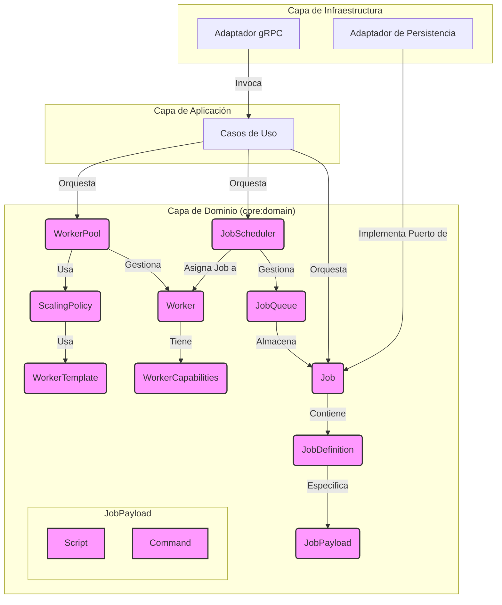
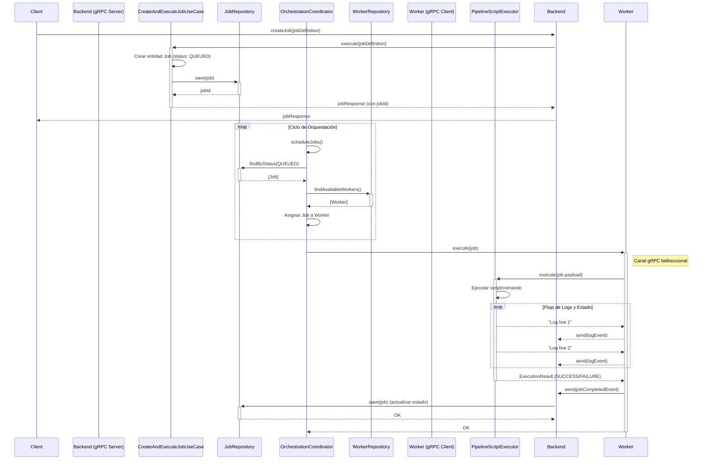

# Patrones de Sistema: hodei-pipelines

## 1. Arquitectura Principal: Arquitectura Hexagonal

El proyecto `hodei-pipelines` está diseñado siguiendo los principios de la **Arquitectura Hexagonal (o Arquitectura de Puertos y Adaptadores)**. Esta decisión arquitectónica es fundamental para lograr un bajo acoplamiento, alta cohesión y una excelente testabilidad del sistema.

La estructura de módulos de Gradle refleja esta separación:

- **Dominio (`core:domain`)**: Es el núcleo del sistema. Contiene las entidades, eventos de dominio y la lógica de negocio más pura. No conoce detalles de infraestructura.
- **Aplicación (`core:application`, `backend:application`, `worker:application`)**: Contiene los casos de uso que orquestan la lógica de dominio. Define los *puertos* (interfaces) que necesita para interactuar con el mundo exterior (p. ej., `JobRepository`, `EventPublisher`).
- **Infraestructura (`core:infrastructure`, `backend:infrastructure`, `worker:infrastructure`)**: Implementa los *adaptadores* que conectan los puertos de la capa de aplicación con tecnologías concretas. Por ejemplo, un adaptador gRPC para la API, o un adaptador de base de datos para la persistencia.

## 2. Principios de Diseño

- **SOLID**: Los principios SOLID son una guía fundamental para el diseño de clases y componentes dentro de cada capa, buscando crear un código mantenible y extensible.
- **Clean Code**: Se busca activamente escribir un código limpio, legible y expresivo.

## 3. Patrones de Diseño Clave

- **Inyección de Dependencias (DI)**: Se utiliza para desacoplar los componentes, especialmente para inyectar las implementaciones de los adaptadores en los casos de uso.
- **Repositorio**: Para abstraer el acceso a los datos de las entidades del dominio.
- **Caso de Uso (Servicio de Aplicación)**: Para encapsular y orquestar la lógica de negocio de la aplicación.

## 4. Flujo de Ejecución de un Trabajo (Diagrama de Secuencia)

El siguiente diagrama de secuencia ilustra el flujo completo de un trabajo, desde su creación hasta su ejecución en un worker.

