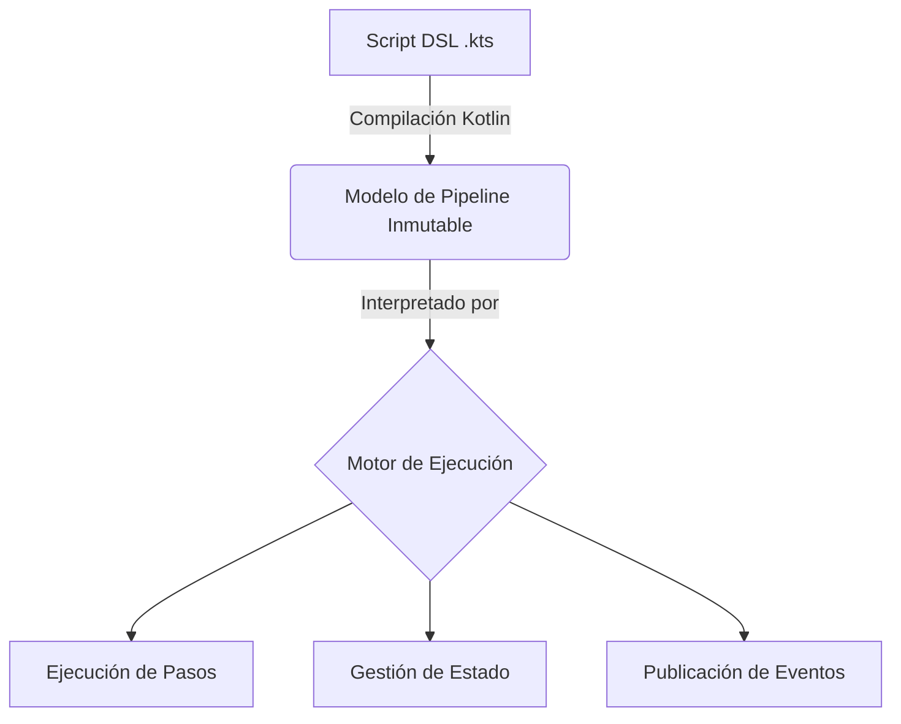

# System Patterns and Architecture

## Arquitectura Principal: Arquitectura Hexagonal

Se adoptará una Arquitectura Hexagonal para separar claramente el dominio del pipeline (el core) de la infraestructura (agentes de ejecución, sistemas de notificación, etc.). Esto promueve la testabilidad, mantenibilidad y el desacoplamiento.

- **Core (Dominio)**: Contendrá la lógica de negocio del pipeline, el modelo de datos (pipeline, stages, steps) y los servicios de aplicación.
- **Adaptadores**: Implementaciones concretas para interactuar con el mundo exterior (ej. un adaptador para ejecutar comandos en Docker, un adaptador para notificar en Slack).

## Principios de Diseño

- **SOLID**: Los principios SOLID serán la guía para el diseño de clases y componentes.
- **Clean Code**: El código será legible, simple y mantenible.

## Patrones de Diseño de DSL

El DSL se implementará utilizando patrones idiomáticos de Kotlin:

- **Lambdas con Receptor**: Para crear bloques de configuración anidados y contextuales (ej. `pipeline { ... }`).
- **Patrón Builder**: Para la construcción fluida de la estructura del pipeline.
- **Funciones de Extensión**: Para añadir nuevos `steps` al DSL de forma modular.
- **@DslMarker**: Para garantizar un control de ámbito estricto y prevenir el uso incorrecto de constructores del DSL.

## Modelo de Ejecución

Se separará la definición del pipeline de su ejecución en dos fases distintas:

1.  **Fase de Configuración/Compilación**: El script `.kts` se compila y ejecuta para construir un modelo de datos inmutable del pipeline en memoria.
2.  **Fase de Ejecución**: Un motor de ejecución interpreta este modelo de datos para orquestar la ejecución de los pasos, gestionar el estado y manejar los eventos.

## Estrategias de Extensibilidad

- **Funciones de Extensión (Principal)**: El mecanismo preferido para añadir nuevos pasos.
- **Procesamiento de Anotaciones (KSP)**: Para generar código boilerplate y reducir la carga de implementación de nuevos pasos complejos.
- **Java ServiceLoader (SPI)**: Para el descubrimiento dinámico de plugins o proveedores (ej. proveedores de agentes).
- **Kotlin Compiler Plugins (Avanzado)**: Se investigará su viabilidad para transformaciones profundas y optimizaciones, similar a Jetpack Compose, pero se usará con cautela debido a su complejidad.