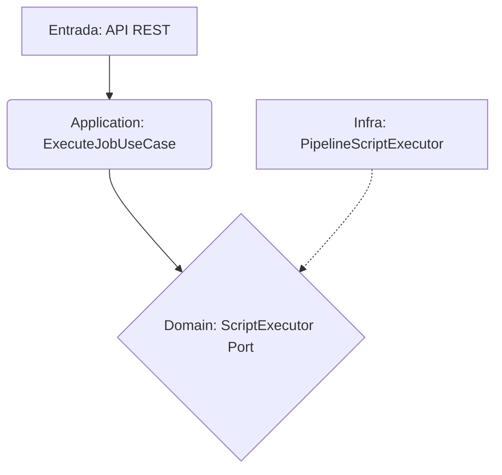

# System Patterns: Hodei Pipelines

## Arquitectura Hexagonal

El sistema sigue estrictamente la Arquitectura Hexagonal para asegurar un bajo acoplamiento y alta cohesión. Las capas se definen de la siguiente manera:

- **Dominio (core/domain):** Contiene la lógica y los modelos de negocio puros (ej. `Job`, `Worker`, `Pipeline`). No tiene dependencias con otras capas.
- **Aplicación (application):** Orquesta los flujos de trabajo. Contiene los casos de uso (ej. `ExecuteJobUseCase`) que son invocados por los adaptadores de entrada.
- **Infraestructura (infrastructure):** Contiene las implementaciones concretas de las interfaces definidas en el dominio o la aplicación. Esto incluye adaptadores de entrada (ej. API REST) y adaptadores de salida (ej. `PipelineScriptExecutor`, repositorios).

## Principios SOLID

- **SRP:** Cada clase tiene una única responsabilidad. Por ejemplo, `PipelineScriptExecutor` solo se encarga de ejecutar scripts.
- **OCP:** El sistema es abierto a la extensión pero cerrado a la modificación. El DSL se puede extender con nuevos pasos sin modificar el ejecutor principal.
- **LSP:** Los subtipos son sustituibles por sus tipos base.
- **ISP:** Se definen interfaces pequeñas y específicas (puertos) en la capa de dominio/aplicación.
- **DIP:** Las capas de alto nivel no dependen de las de bajo nivel, sino de abstracciones.
